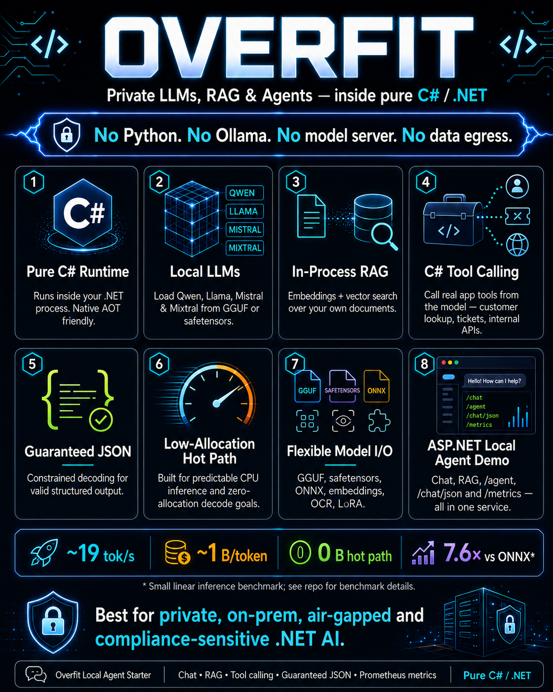

# Overfit

**Private LLMs, voice, RAG and agents — entirely in your .NET app. No Python, no cloud, no model server.**

<p align="center">
  
</p>

Overfit lets .NET teams add local AI features — chat, RAG, agents, and even **voice** (speech-to-text *and*
text-to-speech) — without Python, Ollama, a model server, native binaries, or data leaving the process. It can
also **serve an OpenAI-compatible API** from a tiny Native-AOT binary or a ~34 MB container.

Use it when you need AI inside an existing ASP.NET, WPF, Blazor, desktop, on-prem
or air-gapped .NET product — especially when external LLM APIs are blocked by
security, compliance, latency, deployment, or supply-chain constraints.

```bash
dotnet add package DevOnBike.Overfit            # the library
dotnet tool install -g DevOnBike.Overfit.Cli    # the CLI + OpenAI-compatible server (overfit serve)
```

---

## Where Overfit wins

**The missing quadrant: .NET-native · on-prem · trainable · testable · auditable.** Almost every LLM tool assumes
Python, a GPU, a separate server, and data leaving your process. Overfit is the opposite — and that intersection
is nearly empty on the market.

1. **Private RAG & agents inside .NET** — chat, RAG, tool-calling and schema-constrained JSON in-process; nothing leaves the box.
2. **Replace a Python / Ollama / model-server sidecar** — same capabilities, one .NET process, one deploy, one security surface.
3. **Testable, auditable RAG for regulated teams** — gate retrieval quality in CI, cite sources, reproduce answers bit-for-bit.
4. **CPU QLoRA fine-tuning** *(advanced moat)* — teach a model your private data on a CPU, no GPU, no Python.

→ Full market analysis and ten buyer cases: [`docs/use-cases-2026.md`](docs/use-cases-2026.md).

---

## Start here: run the ASP.NET local agent demo

The fastest way to understand Overfit is to run the local ASP.NET agent demo.

```bash
dotnet run -c Release --project Demo/LocalAgentAspNetDemo
```

It exposes a private AI agent over HTTP:

| Endpoint | What it shows |
|---|---|
| `GET /health` | Model/service health |
| `POST /chat` | Local chat over a GGUF or safetensors model |
| `POST /documents/index` | In-process document indexing |
| `POST /rag/query` | RAG over local documents |
| `POST /agent` | C# tool calling with constrained JSON |
| `POST /chat/json` | Guaranteed-valid JSON output |
| `POST /decision/refund` | A business decision as guaranteed, typed JSON |
| `GET /metrics` | Prometheus-style runtime metrics |

The demo shows the full path:

```text
local model file
  -> memory-mapped load
  -> RAG over local documents
  -> C# tool call
  -> guaranteed JSON
  -> metrics
```

No Python. No Ollama. No model server. No network call. The model is a file on
disk; the agent is a singleton inside ASP.NET.

See [`Demo/LocalAgentAspNetDemo`](Demo/LocalAgentAspNetDemo/README.md).

### Run Bielik (a Polish LLM) in pure .NET

The demo ships a **Polish preset** that runs [Bielik](https://huggingface.co/speakleash/Bielik-4.5B-v3.0-Instruct-GGUF) over Polish documents — Polish chat, RAG, C# tool calling and guaranteed JSON, one .NET process, no Python / Ollama / model server / data egress:

```bash
cd Demo/LocalAgentAspNetDemo
./download-bielik.cmd      # the LLM   (~4.8 GB GGUF -> C:\bielik)
./download-embedder.cmd    # the RAG embedder (~90 MB -> C:\minilm)
./run-bielik.cmd           # = dotnet run -c Release --launch-profile bielik
```

Bielik's tokenizer and ChatML template are read straight from the GGUF (no side-loaded files), and the constrained tool-calling / JSON paths work on its SentencePiece tokenizer:

```
/rag/query        -> "Klient z UE ma 14 dni na odstąpienie od umowy..."        (Polish, grounded, cited)
/agent            -> create_ticket { customerEmail, subject, priority }        (Polish request -> C# tool)
/decision/refund  -> { "eligible": true, "reason": "...", "requiredAction": "accept_refund", "confidence": 0.95 }
```

---

## What Overfit gives you

### 1. Private local LLMs in .NET

Load Qwen, Llama, Mistral, Mixtral and related GGUF / safetensors models directly
from C#. The model runs inside your process, not behind a server.

```csharp
using DevOnBike.Overfit.LanguageModels;

using var client = OverfitClient.LoadGguf(@"C:\models\qwen2.5-3b-instruct-q4_k_m.gguf");

client.AddSystem("You are concise.");
var reply = client.Send("Explain zero-allocation decode in one sentence.");

Console.WriteLine(reply);
```

### 2. In-process RAG

Embed documents, store vectors in-process, retrieve context and answer from your
own data without an external vector database, embedding API, Python service, or
sidecar process.

Supported embedding paths include MiniLM, BGE and E5-style BERT encoders, with
vectors validated against HuggingFace / PyTorch reference outputs.

### 3. C# tool calling and guaranteed JSON

Constrained decoding forces valid JSON and valid tool-call envelopes, then
dispatches the call to your C# delegate.

No regex parsing of free text. No retry-on-bad-JSON loop. No prompt-and-pray.

```json
{
  "name": "create_ticket",
  "arguments": {
    "customerEmail": "sam@brightlabs.example",
    "subject": "Failed SSO login",
    "priority": "high"
  }
}
```

### 4. Zero-allocation inference hot paths

Overfit is built around predictable CPU inference, Native AOT compatibility,
explicit memory ownership and near-zero per-token allocations on the decode path.

The goal is not to beat hand-tuned native GPU/AVX runtimes on raw throughput.
The goal is to make local AI deployable as a normal .NET library in environments
where Python, native binaries, sidecars, external APIs and hidden allocations are
not acceptable.

### 5. Speech-to-text in the same process

Transcribe speech with **Whisper** in pure C# on the CPU — load a whisper.cpp ggml
model directly and turn audio into text without a GPU, Python or a native binary.
The pipeline is log-mel (Bluestein FFT) → multi-threaded encoder → KV-cache greedy
decode, and it reads **WAV and MP3** (the MP3 decoder is from-scratch managed code,
zero per-frame allocation). On a dev CPU, whisper-tiny runs ~60× real-time;
validated English and Polish on the real model. So voice → transcription → RAG /
agent / tool call all stay in one .NET process, with no audio leaving the machine.
See `Demo/WhisperDemo`, `Demo/MicDemo` (live mic) and
[docs/mp3-decoding.md](docs/mp3-decoding.md).

### 6. OpenAI-compatible API + drop-in .NET integration

Point your existing tooling at Overfit by changing **one line** — no rewrite, same in-process engine behind the
standard interface.

**Already on `Microsoft.Extensions.AI`?** One call gives you a standard `IChatClient` / `IEmbeddingGenerator`
that drops straight into Semantic Kernel and any M.E.AI pipeline (caching, telemetry, function-invocation, DI) —
including **`Microsoft.Extensions.AI.Evaluation` running fully locally with an Overfit model as the LLM judge**
(no Azure, no key, no egress — see [`docs/meai-evaluation.md`](docs/meai-evaluation.md)):

```csharp
using DevOnBike.Overfit.Extensions.AI;          // NuGet: DevOnBike.Overfit.Extensions.AI

IChatClient chat = OverfitClient.LoadGguf(@"C:\models\qwen2.5-3b.gguf").AsChatClient();
var reply = await chat.GetResponseAsync("Summarize this ticket in one line.");
```

**Have OpenAI clients / LangChain / a UI / a test harness?** Serve an **OpenAI-compatible HTTP API** in one
command — just change the base URL. SSE streaming, `/v1/chat/completions`, `/v1/embeddings`, `/v1/models`, plus
JSON-Schema `response_format` and llama.cpp-style `min_p` sampling. Dependency-free (no ASP.NET), Native-AOT-clean —
and the decode worker pool **parks when idle**, so a serving container at rest sits at ~0% CPU:

```powershell
overfit serve qwen2.5-3b --port 11434           # one self-contained binary; nothing leaves the box
```

Call it and print the **raw response, pretty-formatted**:

```bash
# bash / Linux / macOS — pipe to jq
curl -s http://localhost:11434/v1/chat/completions \
  -H "Content-Type: application/json" \
  -d '{"model":"overfit","messages":[{"role":"user","content":"Capital of France?"}],"max_tokens":200}' | jq
```

```powershell
# PowerShell — keep the JSON body on ONE line in SINGLE quotes, then format the response.
# curl.exe (raw bytes) re-formatted:
curl.exe -s http://localhost:11434/v1/chat/completions -H "Content-Type: application/json" `
  -d '{"model":"overfit","messages":[{"role":"user","content":"Capital of France?"}],"max_tokens":200}' |
  ConvertFrom-Json | ConvertTo-Json -Depth 10

# or Invoke-RestMethod piped back through ConvertTo-Json (Invoke-RestMethod alone hides nested fields):
Invoke-RestMethod http://localhost:11434/v1/chat/completions -Method Post -ContentType 'application/json' `
  -Body '{"model":"overfit","messages":[{"role":"user","content":"Capital of France?"}],"max_tokens":200}' |
  ConvertTo-Json -Depth 10
```

> Just the answer text? In PowerShell drill into `.choices[0].message.content`; in bash use `jq -r '.choices[0].message.content'`.

Host the same API from your own code with the `DevOnBike.Overfit.Server` package — your stack doesn't change,
only the endpoint does.

**Use Claude Code / Claude Desktop?** The same binary is an **MCP server** — one command plugs local,
zero-egress tools into your AI host: `ask` a local model, `rag_query` your private documents (with citations),
`transcribe` audio with Whisper:

```bash
claude mcp add overfit -- overfit mcp C:\models\model.gguf --rag-dir C:\docs --whisper-model C:\whisper\ggml-tiny.bin
```

Dependency-free MCP — typed contracts + source-gen `System.Text.Json`, no SDK, AOT-verified — see [`docs/mcp.md`](docs/mcp.md).

**Get the `overfit` command three ways:**

```bash
dotnet tool install -g DevOnBike.Overfit.Cli      # .NET global tool (cross-platform; needs the .NET runtime)
```

```bash
# or a ~34 MB Native-AOT Docker image — no .NET runtime, model mounted at runtime (not baked in):
docker run -p 8080:8080 -v /host/models:/models <your-dockerhub-user>/overfit /models/model.gguf
```

…or publish the self-contained **Native-AOT binary** yourself
(`dotnet publish Sources/Cli -r <rid> -p:PublishAot=true`). See [`docs/docker.md`](docs/docker.md) for the image,
free-hosting options, and model-on-boot.

---

## What you can build today

### Private AI assistant inside your app

Add a local assistant to a desktop, WPF, Blazor, ASP.NET, console or internal
enterprise app. Use a local Qwen/Llama/Mistral model and keep all prompts,
documents and outputs inside your process.

### Document Q&A and semantic search

Index support tickets, policy documents, product docs, invoices or internal
notes. Query them by meaning with in-process embeddings and vector search.

### Action-taking agents

Register C# tools such as:

- `lookup_customer`
- `create_ticket`
- `send_invoice`
- `summarize_document`
- `classify_case`
- `extract_fields`

The model chooses the tool and emits a constrained JSON call. Your C# code
executes the action.

### Structured extraction

Use guaranteed-valid JSON to extract intent, fields, summaries, routing metadata
or decision records without post-hoc repair loops.

### Audit-friendly local AI

Run deterministic greedy decoding, file-versioned weights, local decision logs,
input/output records, model hashes and timestamps. This fits teams that need
controlled deployment boundaries and explainable operational records.

---

## Why teams use Overfit

| If this is your problem... | Overfit's value |
|---|---|
| You have a .NET product and cannot send data to OpenAI/Anthropic | Run the model locally inside your process |
| You do not want to operate Python, Ollama or a model server | Ship a NuGet package and a model file |
| Your environment blocks native binaries or sidecars | Pure C# runtime, Native AOT compatible |
| You need RAG, tool calls and JSON, not just raw token generation | Built-in agentic stack |
| You already use OpenAI clients, Semantic Kernel or Microsoft.Extensions.AI | Point them at Overfit by changing one line — OpenAI-compatible server (`overfit serve`) + `IChatClient` / `IEmbeddingGenerator` adapter |
| You care about allocations, P99 latency and GC behavior | Explicit memory ownership and zero-allocation hot paths |
| You need a commercial path for closed-source products | Dual licensing: AGPLv3 or commercial |

**→ The 2026 niche & buyer scenarios:** [`docs/use-cases-2026.md`](docs/use-cases-2026.md) — the underserved
market Overfit fills (regulated / on-prem .NET, CPU fine-tuning, testable RAG, air-gapped single-binary deploy),
the "empty quadrant" vs Python / Ollama / cloud APIs, and ten concrete cases mapped to buyers.

---

## Quick start

Install the package:

```bash
dotnet add package DevOnBike.Overfit
```

Run a local GGUF model:

```csharp
using DevOnBike.Overfit.LanguageModels;

using var client = OverfitClient.LoadGguf(@"C:\models\qwen2.5-3b-instruct-q4_k_m.gguf");

client.AddSystem("You are a concise assistant.");
var reply = client.Send("What is Overfit useful for?");

Console.WriteLine(reply);
```

Run the full ASP.NET local-agent demo:

```bash
dotnet run -c Release --project Demo/LocalAgentAspNetDemo
```

Run the console walkthrough:

```bash
dotnet run -c Release --project Demo/AgentDemo
```

Or skip the SDK entirely — install the CLI and serve an OpenAI-compatible endpoint:

```bash
dotnet tool install -g DevOnBike.Overfit.Cli
overfit pull Qwen/Qwen2.5-0.5B-Instruct-GGUF      # or point serve at any local .gguf
overfit serve qwen2.5-0.5b-instruct --port 8080
```

More details:

- [`Demo/LocalAgentAspNetDemo`](Demo/LocalAgentAspNetDemo/README.md) — ASP.NET local agent
- [`Demo/AgentDemo`](Demo/AgentDemo/README.md) — console walkthrough: load -> RAG -> tool call -> JSON
- [`docs/TECHNICAL.md`](docs/TECHNICAL.md) — architecture, benchmarks, import pipelines
- [`ROADMAP.md`](ROADMAP.md) — current engineering priorities

---

## Benchmarks: honest headline

Test machine for current headline numbers: AMD Ryzen 9 9950X3D, Windows 11,
.NET 10, BenchmarkDotNet 0.15.8.

| Workload | Result | Allocation |
|---|---:|---:|
| Single inference `Linear(784 -> 10)` | ~7.6x faster than ONNX Runtime | 0 B |
| GPT-2 Small KV-cache decode | ~6.5x faster than naive O(N²), parity vs PyTorch | 0 B/token |
| Qwen2.5-3B Q4_K_M decode | ~19 tok/s default, **~24 tok/s** with opt-in repacked GEMV (`OVERFIT_REPACK_GEMV=1` + `OVERFIT_DECODE_WORKERS=16`) | ~1 B/token |
| Bielik-4.5B Q4_K_M decode | ~17 tok/s, −36% working set vs same-file llama.cpp | ~1 B/token |
| MNIST CNN training, 60k × 5 epochs | ~2.1 s (data-parallel ×8 + AVX2 MaxPool; was ~6.1 s) — [audit](docs/mnist-cnn-training-audit.md) | ~4 KB/batch |
| Concurrent inference, 8 threads | ~3.6x faster than ONNX Runtime | 0 B |

Honest positioning:

- llama.cpp / LLamaSharp are still faster for raw CPU LLM decode (~1.2× same-file vs a current AVX-512 llama.cpp build with our repacked-GEMV flag on, narrowed from ~1.6× — single-stream CPU decode is DRAM-bandwidth-bound).
- PyTorch CPU is faster for large-scale training.
- ONNX Runtime is mature and fast if native dependencies are acceptable.
- Overfit's axis is pure-managed .NET, in-process deployment, Native AOT,
  low allocation pressure and no native model server.

Full benchmark tables and caveats live in [`docs/TECHNICAL.md`](docs/TECHNICAL.md).

---

## Supported model families

Overfit loads by **architecture**, not by model name — so most `llama` / `qwen2` / `qwen3` / `qwen2moe` /
`mistral` / `phi3` / `gemma2` GGUFs on Ollama and HuggingFace work, including their thousands of community
fine-tunes (and the DeepSeek-R1 *distills*, which are Qwen/Llama architecture).
**→ Full popular-models matrix: [`docs/supported-models.md`](docs/supported-models.md)** — exactly which models
load today (Llama 3.x, Qwen2.5, Qwen3, Mistral, Phi-3.5, Gemma 2, Mixtral, Bielik, R1-distills, MiniLM/BGE/E5,
Whisper…) and which don't yet (Gemma 1/3, Qwen3-MoE, Command-R, native DeepSeek-MoE, multilingual XLM-R embedders).

### Language models

| Family | Verified sizes / variants | Loader | Quantization / dtype |
|---|---|---|---|
| Qwen2.5 | 0.5B / 3B / 7B / 14B / 32B | GGUF, HF safetensors, `.bin` | F32, F16, BF16, Q8_0, Q4_K_M, Q6_K |
| Qwen3 (dense) | 0.6B verified (0.6B–32B) | GGUF | Q8_0, Q4_K_M, Q6_K |
| Llama-2 / Llama-3.x | Llama-3.2-1B onwards | GGUF, HF safetensors | F32, F16, BF16, Q8_0, Q4_K_M, Q6_K |
| Mistral 7B | 7B | GGUF | F32, F16, BF16, Q8_0, Q4_K_M |
| Phi-3.5-mini / Phi-4 | 3.8B / 14B verified | GGUF | Q8_0, Q4_K_M, Q6_K |
| Gemma 2 | 2B verified (2B / 9B / 27B; ctx ≤ 4096) | GGUF | Q8_0, Q4_K_M, Q6_K |
| Qwen1.5-MoE A2.7B | 14B total / 2.7B active | GGUF | Q8_0, Q4_K_M |
| Mixtral-8x7B | 47B total / 13B active | GGUF | Q8_0, Q4_K_M |
| GPT-2 small | 124M | `.bin`, HF safetensors | F32 |
| GPT-1 | configurable | `.bin`, trained from scratch | F32 |

### Embeddings

| Model | Pooling | Validation |
|---|---|---|
| `sentence-transformers/all-MiniLM-L6-v2` | mean + L2 | parity vs HuggingFace/PyTorch |
| `BAAI/bge-small-en-v1.5` | CLS + L2 | parity vs HuggingFace/PyTorch |
| `intfloat/e5-small-v2` | mean + L2 | parity vs HuggingFace/PyTorch |

### Other workloads

| Area | Status |
|---|---|
| ONNX import | Linear and DAG topology, ResNet-style skip connections |
| Computer vision | MNIST CNN, Conv/BN/ReLU/Pool/FC-style networks; full 60k MNIST CNN train in ~2 s / 5 epochs on a 16-core desktop (data-parallel ×8 + AVX2 MaxPool — [audit](docs/mnist-cnn-training-audit.md)) |
| OCR | CRNN + CTC pipeline for synthetic digits / lexicon words |
| Speech-to-text | **Whisper (tiny/base/…) in pure C# on CPU — no GPU, no Python.** whisper.cpp ggml → log-mel (Bluestein FFT) → multi-threaded encoder → KV-cache decode; ~60× real-time on tiny, validated EN + PL. Reads WAV and MP3. See `Demo/WhisperDemo` / `Demo/MicDemo` |
| Audio decoding | Pure-C# **MPEG-1/2/2.5 Layer III (MP3)** decoder + WAV reader — no native binaries, zero per-frame allocation, ~160× real-time; feeds Whisper directly. See [docs/mp3-decoding.md](docs/mp3-decoding.md) |
| LoRA | LM head, FFN and per-head attention stages |
| QLoRA fine-tuning | **Fine-tune a real quantized Qwen/Llama GGUF on CPU — no GPU, no Python.** Frozen 4-bit base (never expanded to F32 or rewritten) + a trainable LoRA adapter; full model under gradient checkpointing (~3 GB RAM for a 3B), turnkey `QLoRAFineTuner` (gguf + text → adapter → ask), portable adapter save/load. Validated on real Qwen2.5-3B: taught a made-up fact, then it recites it. See [docs/qlora-finetuning.md](docs/qlora-finetuning.md) |
| Anomaly detection | Small GPT-style models for metrics and deployment-specific adaptation |

---

## Loading formats

Overfit loads models directly in managed .NET:

- GGUF with mmap-backed weights
- K-quant formats including Q4_K_M and Q6_K
- Q8_0, F32, F16 and BF16
- HuggingFace safetensors, including sharded directories
- Overfit `.bin` checkpoints
- ONNX models for supported operator sets

Tokenizers include HuggingFace ByteLevel-BPE, Qwen ChatML-aware handling,
GGUF tokenizer fallback, WordPiece and GPT-2 byte-level BPE.

---

## Why not just use...

| Tool | Use it when... | Reach for Overfit when... |
|---|---|---|
| ML.NET | You need classical ML on tabular data | You need transformer / LLM inference or deep networks inside .NET |
| ONNX Runtime | Native dependencies are acceptable | You want pure-managed, AOT-clean, low-allocation inference |
| llama.cpp / Ollama | A standalone LLM process/server is fine | You want the model inside your .NET process |
| LLamaSharp | Bundling native llama.cpp is acceptable | You cannot ship native binaries or need zero-allocation hot paths |
| PyTorch | Research, large training, GPU workflows | You want deployment inside a .NET app without Python |
| OpenAI / Anthropic APIs | Data egress is acceptable | Data must stay inside your boundary |

---

## Commercial integration

If you have a .NET system and need a private AI feature in production, the
fastest path is a fixed-scope integration.

### Private .NET RAG / Agent PoC

A local LLM + RAG + C# tool-calling proof of concept in your infrastructure.

Typical deliverables:

- ASP.NET endpoints: `/chat`, `/rag/index`, `/rag/query`, `/tools`, `/health`, `/metrics`
- local model selection and deployment
- document ingestion and vector search
- constrained JSON / tool-call flow
- benchmark report on your hardware
- deployment handover

### Python / Ollama / ONNX sidecar replacement

Move inference into the .NET process and compare P50/P99 latency, RAM, allocation
pressure and operational complexity against the existing sidecar.

### Zero-GC inference audit

Profile your current .NET inference hot path — Overfit, ML.NET, ONNX Runtime or
custom code — and identify allocation, GC, AOT and P99 latency risks.

Commercial licenses and monthly support retainers are also available.

See [`COMMERCIAL.md`](COMMERCIAL.md) or contact **devonbike@gmail.com**.

---

## Requirements

- .NET 10+
- CPU-first runtime
- no Python runtime
- no native runtime dependency for Overfit itself
- Native AOT compatible paths are guarded in CI

---

## What Overfit is not

Overfit is not a PyTorch or TensorFlow replacement.

It is not GPU-first. It is not transformer-scale-first. It is not a hosted SaaS,
not an API and not a model server.

Overfit is a .NET library that runs inside your process. If you need best-quality
frontier models, maximum GPU throughput or a hosted API, use a hosted model or a
GPU-first runtime.

If you need private local AI inside an existing .NET product, Overfit is built
for that.

---

## Roadmap

**Shipped:**

- **Inference** — GGUF (Q4_K_M / Q6_K / Q8_0 / Q5_0 / Q5_K / F32 / F16 / BF16, memory-mapped); Qwen2.5, Llama-2/3.x, Mistral, Mixtral & Qwen-MoE; GPT-2 / GPT-1 (byte-parity vs PyTorch). KV-cache + optional Q8 KV; ~220 MB heap / 1 B-per-token for a 3B model.
- **Loaders** — GGUF, HuggingFace safetensors (sharded), Overfit `.bin`, ONNX (linear + DAG). 100% Python-free; tokenizers read straight from the GGUF.
- **Agentic & structured output** — tool calling, guaranteed JSON, **JSON-Schema & regex constrained decoding**, ReAct / critic / circuit-breaker / summarizing memory, composable sampling.
- **RAG** — in-process vector store; MiniLM / BGE / E5 embeddings (bit-parity vs HuggingFace); multilingual via the chat model's own embeddings; **RAG Stability Harness** (recall / paraphrase / false-premise / lint, gated in CI).
- **Integration** — **OpenAI-compatible server** (`/v1/chat/completions` + SSE, `/v1/embeddings`, `/v1/models`); **MCP server** (`overfit mcp` — local `ask` / `rag_query` / `transcribe` tools for Claude Code & co., [`docs/mcp.md`](docs/mcp.md)); **Microsoft.Extensions.AI** adapter; **`overfit` CLI** (pull / list / chat / serve / mcp) shipped three ways — `dotnet tool install -g DevOnBike.Overfit.Cli`, a Native-AOT binary, and a ~34 MB Docker image ([`docs/docker.md`](docs/docker.md)); ASP.NET starter template.
- **Training** — **QLoRA CPU fine-tuning** (frozen Q4_K base incl. FFN + per-head attention), gradient checkpointing, data-parallel trainer, Conv/BatchNorm/LSTM, CRNN + CTC (OCR), LR schedules.
- **Multimodal & audio** — **Whisper speech-to-text** in pure C#; from-scratch MP3 / WAV decoders; OCR.
- **Engineering** — Native-AOT (one ~7.8 MB self-contained binary), zero-allocation hot paths (AOT guard in CI), anomaly detection.

**Current priorities:**

- **More model families** — Qwen3, Phi-3.5, and Gemma 2 now load ✅; next: Gemma 1/3, Qwen3-MoE, Granite / Command-R; more quants (Q2_K / Q3_K).
- **Multilingual sentence-embedder** (XLM-RoBERTa / SentencePiece) for first-class multilingual RAG.
- **Decode throughput** — the opt-in repacked 8×8 GEMV (`OVERFIT_REPACK_GEMV=1`, +30% on a 3B) put the FFN + LM-head at the DRAM floor; the remaining ~1.2× same-file gap vs an AVX-512 llama.cpp build is attention memory layout (whole-matrix Q4_K attention is the next lever), not kernel-ALU.
- **Bulletproof structured output** — token-healing for arbitrary schemas on tiny models; GBNF grammars; NLI-based contradiction lint.
- **Deployment** — persistent vector store (SQLite), production agent template, Aspire integration.
- **Future verticals** — text-to-speech (LLM + neural-codec), vision-language models.

See [`ROADMAP.md`](ROADMAP.md).

---

## Licensing

Overfit is dual-licensed.

### Open source: GNU AGPLv3

Free in production if your project is released under a compatible open-source
license. Overfit links as a library, so AGPL copyleft extends to the application.

### Commercial license

Use this for closed-source products, SaaS, regulated deployments, proprietary
internal tools, or any application that cannot be released under AGPLv3.

The simple test:

> If you cannot or will not release your application under AGPLv3, you need the
> commercial license.

Full license text: [`LICENSE.md`](LICENSE.md).  
Commercial terms and support: [`COMMERCIAL.md`](COMMERCIAL.md).  
Contact: **devonbike@gmail.com**.
