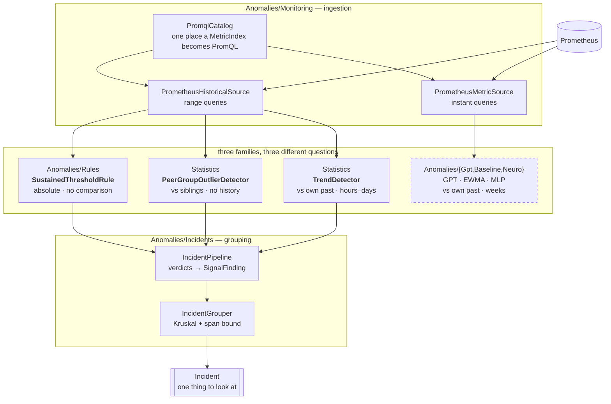

# The detection pipeline, as built

What actually exists in the tree, how a metric becomes an incident, and which numbers behind each decision
were measured rather than assumed.

This is the **implementation map**. The product and market reasoning lives in
[aiops-cluster-anomaly-guard.md](aiops-cluster-anomaly-guard.md); the canary variant in
[aiops-canary-blueprint.md](aiops-canary-blueprint.md). Read this one when the question is "how does it work
and what can I rely on".

---

## One picture



The dashed box is built but **never validated against real data** — see [Where we stand](#where-we-stand).

---

## Why there are three detector families

They are not redundant. Each answers a question the others cannot, and each one is the *only* one that works
in some situation the cluster will actually produce.

| Family | Question | History needed | Fails when |
|---|---|---|---|
| **Rules** (`Anomalies/Rules`) | Is this value simply too high, for long enough? | none | the threshold is not knowable a priori |
| **Peer** (`Statistics`) | Does one member behave unlike its siblings? | none | the group has one member, or no norm |
| **Trend** (`Statistics`) | Is this series drifting in one direction? | hours–days | the fault is a persistent *level*, not a movement |
| **Learned** (`Anomalies/Gpt`, `Baseline`, `Neuro`) | Does this pod behave unlike its own past? | weeks | there are no labels, and no history yet |

The lab made the complementarity concrete rather than theoretical:

- A CPU-throttled replica has a **persistent level** difference, so **trend found nothing — correctly**. Right
  tool, wrong fault.
- `container_cpu_cfs_throttled_periods_total` exists **only on containers carrying a CPU limit**, so the peer
  group had exactly one member. A relative method over a group of one is not a hard case, it is undefined —
  and that one member was the degraded pod. Hence the **Rules** family.
- Latency is per-request and therefore comparable across peers, so **peer comparison** is what named the
  culprit.

---

## Layer 1 — ingestion

`PromqlCatalog` is the single place a `MetricIndex` becomes PromQL. Both sources go through it, and
`IPrometheusQuerySelector` is the contract that lets them share it.

**That consolidation was not tidying.** Both sources carried their own copy of the same twelve query
templates, so a census that found three defects in one found the identical three, untouched, in the other:

1. A hard-coded `dc="west"` matcher. No exporter adds that label, so on a cluster that has never heard of it
   **every query reduced to the empty set** — and Prometheus returns `success` with no series, so the failure
   was completely silent. Now `DataCenterLabel = ""` means single-data-centre: no matcher, one pass instead of
   two.
2. Metric names from a different exporter (`http_server_request_duration_seconds`,
   `process_runtime_dotnet_*`). Names are a property of whoever exports them, not a contract — hence
   `QueryOverrides` with a `%selector%` token, and `PromqlCatalog.OverfitServerQueries()` as the worked example.
3. `sum by (pod)` missing. cAdvisor emits one series per container *plus* a pod-level aggregate;
   `histogram_quantile` needs `sum by (pod, le)` or the result carries no `pod` label and every sample is
   discarded during parsing.

### Missing is NaN, never zero

`LiveMonitoringPipeline.ConvertToSnapshots` fills absent features with `float.NaN`. Zero-filling made "the
query matched nothing" and "the value is zero" the same fact, which is how a misconfigured query becomes a
calm, flat, entirely fictional signal that a detector will happily learn.

Consequences that had to be fixed with it:

- **`EwmaAnomalyDetector`** — a NaN seeded into the mean made every later operation NaN, **permanently**. Now
  each feature is seeded by its first *finite* value, missing features are skipped in scoring, and the score
  divides by the number of features that actually contributed. Dividing by all twelve would make a half-blind
  detector look calmer than a fully-sighted one.
- **`MetricTokenizer`** — `(int)NaN` saturates to 0, so a missing feature landed in the lowest bin *by
  accident*. It still lands there, but by decision: the vocabulary has no "missing" symbol and adding one
  would change `VocabSize` and invalidate every trained checkpoint.

### Coverage is reported, because silence is invisible

Both sources expose `SeriesReturned(metric)` and `IsMapped(metric)`. A count of 0 on a cluster known to be
running pods means the query is wrong, not that the system was quiet — and feature assembly cannot tell those
apart.

Measured on the lab: **12 of 12 features, 45 series**. Before the fixes: zero, silently.

---

## Layer 2 — the detectors

### Rules — `SustainedThresholdRule`

A signal held at or above an absolute threshold for a material share of the window.

**Persistence is what makes it a rule rather than a noise generator.** CPU throttling on the degraded replica
measured median 1.4%, p90 11.8% in the same window — a threshold on one sample would fire constantly.

**The threshold was measured, and the literature figure would have missed the fault.** Common guidance names
25% throttling as the point of concern. On a pod limited to one core while its siblings burst to ~1.8, the
throttled fraction **peaked at 19.8% and never reached 25%**. `ForCpuThrottling` is therefore 5% held across
25% of the window: the loaded window had 33% of samples at or above 5%, a mostly-idle half hour only 13%.
`SustainedThresholdRuleTests.TheLiteratureThreshold_WouldHaveMissedIt` exists to stop anyone "correcting" it
back.

No `Inconclusive` here: that status is for a relative method with contradictory evidence, and an absolute
threshold has no second opinion to contradict.

### Peer — `PeerGroupOutlierDetector`

Leave-one-out over a rank comparison: each member's window against the pooled windows of the others, through
`ITwoSampleComparer` (Mann-Whitney + Cliff's delta), Bonferroni-corrected over two one-sided tests per member.

**Two gates, and the second one is new because the first cannot express size.** Cliff's delta is *scale-free*
— it counts how often one distribution sits above another and says nothing about by how much. Four replicas
at 860, 880, 902 and 875 ms — a **3% spread** — produced deltas of **0.52 and 0.68** against the 0.33 "medium
effect" gate, so the detector called a healthy group split and returned `Inconclusive`. That is why a replica
genuinely 2.75× slower, **with no distribution overlap at all**, produced no finding.

`MinRelativeGap` fixes it, in the shape `TrendDetector` already used: a rank measure for **consistency** and a
second gate for **size**, in the metric's own units. A deviation must clear both.

- The gap is measured against the **median of the other members' medians**, not the pooled samples. A pooled
  baseline mixes distributions, so one deviating member drags the reference everyone else is judged against;
  a median barely moves. That difference is why the gate works at four replicas.
- Defaults come from the tightest pair the suite pins: reject an ordinary **4.7%** spread, catch a real
  **13.3%** regression. 8% sits between them with comparable margin. `Strict` 20%, `FastFeedback` 25%.

**A split group is never tidied into a list.** When **more than a third** of the group sits that far from the
group's *own* median, the verdict is `Inconclusive` reported with the **raw** directions — members pulling
both ways is the evidence for "no norm". Strict inequality, so a single outlier among three peers still counts
as an outlier.

**A group centred on zero yields zero departures.** The unscaled case returns an infinite relative gap, which
is right for "should this finding be blocked" and exactly wrong for "how many members depart". Getting it
backwards made four identically-zero counters — OOM events, the 5xx ratio, GC pause, thread-pool queue — read
as fully split groups. Found by the live lab, not by the 1688-test suite; pinned now by
`AnIdenticallyZeroSignal_IsHealthy_NotInconclusive`.

### Trend — `TrendDetector`

Theil-Sen slope (magnitude) + Mann-Kendall (significance) + Kendall's tau (effect size), with an AR(1)
autocorrelation correction that is **not optional**: consecutive scrapes are nearly identical, and feeding a
correlated series to a test that assumes independence manufactures significance.

The median of all pairwise slopes comes from `MedianSelector` — selection, not sorting. `slopes.Sort()` was
**99% of this detector's runtime** (8.02 ms of 8.10 ms at the 600-sample cap); selection cut a full evaluation
from 8.10 ms to 1.29 ms, **6.3×**, with a canary arm confirming the box had not moved.

---

## Layer 3 — findings

Every detector reduces to one `SignalFinding`: subject, signal name, `SignalClass`, window, severity, reason.
`IncidentPipeline` is the bridge.

**Severity is the effect size, never the p-value.** The detectors answer different questions with different
statistics and their outputs must be ordered against each other. A p-value cannot do that — it shrinks with
sample count, so a trivial difference measured over a long window would outrank a large one measured over a
short one. Effect sizes are bounded and sample-count-independent: Kendall's tau for a trend, Cliff's delta for
a peer comparison, breach fraction for a rule.

**Only decided anomalies become findings.** `WarmingUp`, `InsufficientData` and `Inconclusive` are
deliberately distinct from `Healthy`; collapsing any of them would report "we could not tell" as "something is
wrong".

`SignalCatalog` places a metric name on the cause-to-consequence axis by substring, because Prometheus names
are compound and an exact-name table goes stale the first time an exporter adds a suffix. Order is
load-bearing — `container_cpu_cfs_throttled_periods_total` matches both `cpu` and `throttl`, and
infrastructure is tested first. The default is `Symptom`: an unrecognised metric must not outrank a known
restart.

---

## Layer 4 — grouping

`IncidentGrouper` uses **Kruskal-style agglomeration, not connected components.** Relatedness is not
transitive, so a chain of individually-plausible links walks an incident across the cluster until everything
is one incident called "something is wrong". Strongest links merge first, and any merge that would push the
group past `MaxIncidentSpan` is refused.

Three sources of evidence, **multiplied** rather than added — each is necessary:

| Evidence | Weight |
|---|--:|
| same pod | 1.0 |
| same workload | 0.7 |
| **same node** | 0.6 |
| same namespace | 0.25 |
| strong lagged rank correlation | lifts topology to 0.7 |

Node matters: a failing node degrades workloads that have nothing else to do with each other.

Correlation uses `SpearmanCorrelation` with a lag scan, **Bonferroni-corrected by the number of offsets
evaluated** — 21 offsets on pure noise otherwise fabricates a causal story for any pair of metrics. Ranking is
hoisted out of the scan: re-ranking inside every offset gives each its own rank scale, so the argmax compares
incomparable coefficients, and it cost **1.66 seconds** per 256-finding cycle versus 172 ms.

Findings are ordered cause-first by `SignalClass`. **This is a heuristic about where to look, not causal
inference** — nothing here establishes that the infrastructure event caused the symptom, and a relative method
cannot.

---

## Where we stand

### Working end to end, measured on the lab

Three healthy replicas plus one with a hard `cpu: 1` limit, under even load, 10-minute window:

```
=== 1 incident(s) from 3 finding(s) ===
[1] overfit_chat_response_time_seconds_p50 on overfit-server-degraded-…-m9kxs
    severity 1.00, 1 subject(s), 3 signal(s), span 0:10:00
      - [Symptom] …_p50 @ m9kxs
      - [Symptom] …_p95 @ m9kxs
      - [Symptom] …_p99 @ m9kxs

findings on the degraded replica: 3
findings on healthy replicas:      0   <-- the false-positive budget
```

Before the magnitude gate: **0 incidents, everything `Inconclusive`.** Server-side p95 was 2441 ms against
860–902 ms, with no distribution overlap; the client saw 4874 ms against 408–443 ms.

Reproduce with `Tests/Anomalies/Diagnostics/AnomalyGuardEndToEndDiagnostics.cs` (`[LongFact]`), which needs
the lab from `k8s/`, the fault from `k8s/overfit/fault-cpu-throttle.yaml`, a port-forward to Prometheus **and
traffic** — the fault is invisible on an idle pod.

### Calibrated, with the calibration stated

| Threshold | Value | Measured against |
|---|--:|---|
| `PeerOutlierOptions.MinRelativeGap` (Balanced) | 8% | reject 4.7%, catch 13.3% |
| `SustainedThresholdOptions.ForCpuThrottling` | 5% over 25% of window | loaded 33%, idle 13% |
| split discriminator | > ⅓ of the group | separates all five pinned cases |

**All of it on one fault, on one single-node lab.** Directions and shapes are solid. Exact numbers are not: a
multi-node cluster, a different limit ratio or a CPU-bound workload should be expected to move them, and none
of these should become a product default without that repeat.

### Not usable yet, and why

- **Raw CPU** — healthy replicas measured 1.44 / 1.78 / 1.92 cores under *even* load, a **33% spread**, four
  times the 8% gate. The degraded replica does come out `Low` (0.63 cores — the measured "broken replica looks
  cheaper" mode), but alongside a false `High` on a healthy one, so directions cancel to `Inconclusive`. Raw
  CPU should stay supporting evidence, not a verdict.
- **Memory / GC heap** — `high=2 low=2`. The window contained a pod restart ramp (within-pod spread 99–104%).
  Contaminated data, not a property of the metric.
- **The learned stack** (`Gpt`, `Baseline`, `Neuro`, `Training`) — substantial and complete: a GPT over
  tokenised metric sequences, an offline trainer, EWMA, an evolutionary MLP, per-pod LoRA adaptation. It now
  has a real 12-feature source. **It has never been run against real cluster data, and there are no labels.**
  That is the M0 gate, and it is not a code problem.

### Open

1. **Per-pod coverage in the diagnostic** — it checks "did this metric return *any* series", not "one per
   pod". `CpuThrottleRatio` at 1 of 4 passes, correctly; another metric at 1 of 4 would pass wrongly.
2. **Incident identity across cycles** — `IncidentPipeline` is stateless, so it cannot track an incident over
   time. Deliberately not mixed in: designing a lifecycle for something nobody has watched on real data is
   guessing.
3. **False-positive rate on somebody else's cluster** — zero here, on four pods, on one fault. The blueprint's
   M0 gate turns on this number and one lab does not settle it.
4. **The two stacks still meet only at ingestion.** `AlertEngine` versus the grouper's output, EWMA versus
   `TrendDetector`, `AdaptivePolicy` versus `PeerOutlierOptions` — concepts that overlap and would ship as two
   configurations and two status vocabularies.

---

## Running it

```powershell
k8s\monitoring\install.cmd          # kube-prometheus-stack
k8s\overfit\build.cmd               # overfit:latest (Native-AOT publish; minutes)
k8s\overfit\deploy.cmd              # three replicas + ServiceMonitor
kubectl apply -f k8s\overfit\fault-cpu-throttle.yaml   # the fourth, throttled
k8s\monitoring\forward.cmd          # Prometheus on 9090, Grafana on 3000
```

PromQL for each layer is in [../k8s/QUERIES.md](../k8s/QUERIES.md), grouped by the decision it serves.

Diagnostics, all `[LongFact]` and skipped by default:

| Test | Answers |
|---|---|
| `PrometheusMetricSourceLabDiagnostics` | which of the 12 features resolve, per metric |
| `AnomalyGuardEndToEndDiagnostics` | does the whole guard produce one incident naming the right pod |
| `AnomalyLabLoadGeneratorTests` | drives traffic, with skew control |
