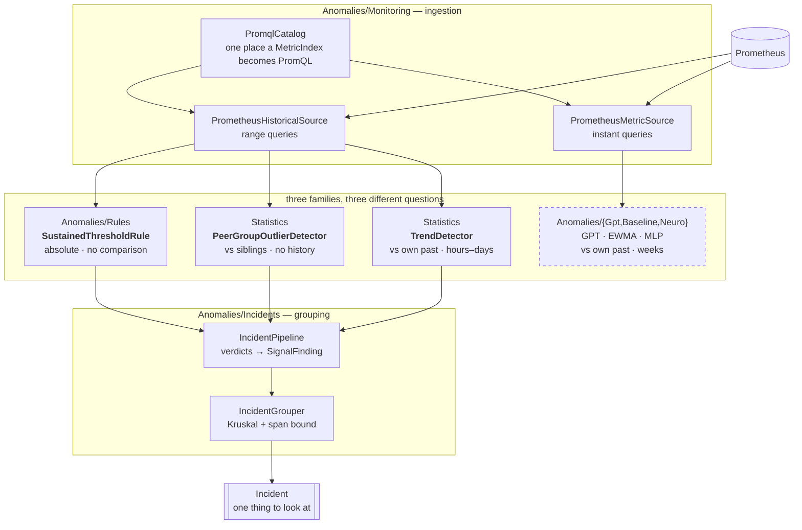

# The detection pipeline, as built

What actually exists in the tree, how a metric becomes an incident, and which numbers behind each decision
were measured rather than assumed.

This is the **implementation map**. The product and market reasoning lives in
[aiops-cluster-anomaly-guard.md](aiops-cluster-anomaly-guard.md); the canary variant in
[aiops-canary-blueprint.md](aiops-canary-blueprint.md). Read this one when the question is "how does it work
and what can I rely on".

---

## One picture



The dashed box is built but **never validated against real data** — see [Where we stand](#where-we-stand).

---

## Why there are three detector families

They are not redundant. Each answers a question the others cannot, and each one is the *only* one that works
in some situation the cluster will actually produce.

| Family | Question | History needed | Fails when |
|---|---|---|---|
| **Rules** (`Anomalies/Rules`) | Is this value simply too high, for long enough? | none | the threshold is not knowable a priori |
| **Peer** (`Statistics`) | Does one member behave unlike its siblings? | none | the group has one member, or no norm |
| **Trend** (`Statistics`) | Is this series drifting in one direction? | hours–days | the fault is a persistent *level*, not a movement |
| **Learned** (`Anomalies/Gpt`, `Baseline`, `Neuro`) | Does this pod behave unlike its own past? | weeks | there are no labels, and no history yet |

The lab made the complementarity concrete rather than theoretical:

- A CPU-throttled replica has a **persistent level** difference, so **trend found nothing — correctly**. Right
  tool, wrong fault.
- `container_cpu_cfs_throttled_periods_total` exists **only on containers carrying a CPU limit**, so the peer
  group had exactly one member. A relative method over a group of one is not a hard case, it is undefined —
  and that one member was the degraded pod. Hence the **Rules** family.
- Latency is per-request and therefore comparable across peers, so **peer comparison** is what named the
  culprit.

---

## The algorithms, named

Every statistic here is **rank-based**, and that is one decision made once rather than a preference repeated.
Monitoring series carry scrape spikes, restarts, saturation and gaps; a single outlier moves a Pearson
coefficient or a least-squares slope arbitrarily far, and moves a rank statistic by one rank position. The cost
is that ranks discard magnitude, which is exactly the defect that made the peer detector unusable until a
separate size gate was added, so the trade-off cuts both ways.

| Where | Algorithm | Computes | Why this one |
|---|---|---|---|
| Peer, significance | **Mann-Whitney U** (Wilcoxon rank-sum) | is one member's distribution shifted against the pooled others | assumes no distribution shape; latency is nothing like normal |
| Peer, effect size | **Cliff's delta** | how often one distribution sits above another, -1..+1 | bounded and sample-count independent, so it is comparable across detectors |
| Peer, family-wise error | **Bonferroni** over 2n tests | corrected alpha | two one-sided tests per member; valid under arbitrary dependence, and leave-one-out tests are dependent by construction |
| Peer, size | **relative median gap** against the median of the other members' medians | how far, in the metric's own units | Cliff's delta is scale-free and cannot express "materially different" |
| Trend, magnitude | **Theil-Sen** slope | median of every pairwise slope | ~29% breakdown point; least-squares has 0% and one scrape artefact steers it |
| Trend, significance | **Mann-Kendall** | concordant minus discordant pairs against time | the same pairwise machinery as Mann-Whitney, distribution-free |
| Trend, effect size | **Kendall's tau** | how monotone the movement is | direct analogue of Cliff's delta, so the two detectors' severities are comparable |
| Trend, dependence | **AR(1) variance inflation** (1+rho)/(1-rho) | discounted significance | consecutive scrapes are nearly identical; uncorrected this manufactures p-values |
| Seasonality | **median across the same phase of previous periods** | expected reading per sample | a mean would carry one bad day forward and suppress detection for a week |
| Rules | **sustained-breach fraction** | share of the window at or above a threshold | no comparison and no history needed; the only method that reaches a metric one pod alone exports |
| Grouping, correlation | **Spearman rho with a lag scan** | do two series move together, and which leads | rank-based; the scan is Bonferroni-corrected because picking the best of 21 offsets is a multiple comparison |
| Grouping, clustering | **Kruskal-style agglomeration** with a span bound | which findings are one event | relatedness is not transitive, so connected components walk an incident across the cluster |
| Learned | **GPT over tokenised snapshots** | mean negative log-probability of the next snapshot | see [Training](#training--the-fourth-family) |
| Learned, baseline | **EWMA** mean/variance per feature | robust z per feature, averaged | the classical comparison the learned path has to beat to justify itself |
| Learned, search | **evolutionary MLP** (`AnomalyMlp`) | a scoring function fitted by population search | no gradient needed, so it can optimise a non-differentiable fitness |
| Peer, sawtooth signals | **sliding minimum over a collection cycle** (`RunningMinimum`) | the floor of the sawtooth, before comparing | replicas do not collect in step, so an instantaneous comparison compares GC phase; a leak moves the floor and the phase does not |
| Internals | **introselect** (`MedianSelector`) | medians without ordering | `slopes.Sort()` was 99% of the trend detector's runtime |
| Internals | **monotonic deque** (`RunningMinimum`) | the sliding minimum in one pass | the obvious nested loop is O(n·k) and the lookback is a whole GC cycle |

Two things deliberately **not** used, recorded because both were considered:

- **No z-scores or sigma multipliers in the statistical layer.** They promise a normal-distribution trade-off
  that latency and resource data do not honour. Every threshold there is a p-value, an effect size, or a
  fraction of the metric's own scale. (The EWMA baseline does use a z, which is part of why it is a baseline.)
- **No exact Mann-Whitney distribution.** The normal approximation with tie and continuity corrections is used
  throughout; at the sample counts the guard works with (>=30 per arm) the difference sits below the thresholds
  being tested.

---

## Layer 1 — ingestion

`PromqlCatalog` is the single place a `MetricIndex` becomes PromQL. Both sources go through it, and
`IPrometheusQuerySelector` is the contract that lets them share it.

**That consolidation was not tidying.** Both sources carried their own copy of the same twelve query
templates, so a census that found three defects in one found the identical three, untouched, in the other:

1. A hard-coded `dc="west"` matcher. No exporter adds that label, so on a cluster that has never heard of it
   **every query reduced to the empty set** — and Prometheus returns `success` with no series, so the failure
   was completely silent. Now `DataCenterLabel = ""` means single-data-centre: no matcher, one pass instead of
   two.
2. Metric names from a different exporter (`http_server_request_duration_seconds`,
   `process_runtime_dotnet_*`). Names are a property of whoever exports them, not a contract — hence
   `QueryOverrides` with a `%selector%` token, and `PromqlCatalog.OverfitServerQueries()` as the worked example.
3. `sum by (pod)` missing. cAdvisor emits one series per container *plus* a pod-level aggregate;
   `histogram_quantile` needs `sum by (pod, le)` or the result carries no `pod` label and every sample is
   discarded during parsing.

### Missing is NaN, never zero

`LiveMonitoringPipeline.ConvertToSnapshots` fills absent features with `float.NaN`. Zero-filling made "the
query matched nothing" and "the value is zero" the same fact, which is how a misconfigured query becomes a
calm, flat, entirely fictional signal that a detector will happily learn.

Consequences that had to be fixed with it:

- **`EwmaAnomalyDetector`** — a NaN seeded into the mean made every later operation NaN, **permanently**. Now
  each feature is seeded by its first *finite* value, missing features are skipped in scoring, and the score
  divides by the number of features that actually contributed. Dividing by all twelve would make a half-blind
  detector look calmer than a fully-sighted one.
- **`MetricTokenizer`** — `(int)NaN` saturates to 0, so a missing feature landed in the lowest bin *by
  accident*. It still lands there, but by decision: the vocabulary has no "missing" symbol and adding one
  would change `VocabSize` and invalidate every trained checkpoint.

### Coverage is reported, because silence is invisible

Both sources expose `SeriesReturned(metric)` and `IsMapped(metric)`. A count of 0 on a cluster known to be
running pods means the query is wrong, not that the system was quiet — and feature assembly cannot tell those
apart.

Measured on the lab: **12 of 12 features, 45 series**. Before the fixes: zero, silently.

---

## Layer 2 — the detectors

### Rules — `SustainedThresholdRule`

A signal held at or above an absolute threshold for a material share of the window.

**Persistence is what makes it a rule rather than a noise generator.** CPU throttling on the degraded replica
measured median 1.4%, p90 11.8% in the same window — a threshold on one sample would fire constantly.

**The threshold was measured, and the literature figure would have missed the fault.** Common guidance names
25% throttling as the point of concern. On a pod limited to one core while its siblings burst to ~1.8, the
throttled fraction **peaked at 19.8% and never reached 25%**. `ForCpuThrottling` is therefore 5% held across
25% of the window: the loaded window had 33% of samples at or above 5%, a mostly-idle half hour only 13%.
`SustainedThresholdRuleTests.TheLiteratureThreshold_WouldHaveMissedIt` exists to stop anyone "correcting" it
back.

No `Inconclusive` here: that status is for a relative method with contradictory evidence, and an absolute
threshold has no second opinion to contradict.

### Peer — `PeerGroupOutlierDetector`

Leave-one-out over a rank comparison: each member's window against the pooled windows of the others, through
`ITwoSampleComparer` (Mann-Whitney + Cliff's delta), Bonferroni-corrected over two one-sided tests per member.

**Two gates, and the second one is new because the first cannot express size.** Cliff's delta is *scale-free*
— it counts how often one distribution sits above another and says nothing about by how much. Four replicas
at 860, 880, 902 and 875 ms — a **3% spread** — produced deltas of **0.52 and 0.68** against the 0.33 "medium
effect" gate, so the detector called a healthy group split and returned `Inconclusive`. That is why a replica
genuinely 2.75× slower, **with no distribution overlap at all**, produced no finding.

`MinRelativeGap` fixes it, in the shape `TrendDetector` already used: a rank measure for **consistency** and a
second gate for **size**, in the metric's own units. A deviation must clear both.

- The gap is measured against the **median of the other members' medians**, not the pooled samples. A pooled
  baseline mixes distributions, so one deviating member drags the reference everyone else is judged against;
  a median barely moves. That difference is why the gate works at four replicas.
- Defaults come from the tightest pair the suite pins: reject an ordinary **4.7%** spread, catch a real
  **13.3%** regression. 8% sits between them with comparable margin. `Strict` 20%, `FastFeedback` 25%.

**A split group is never tidied into a list.** When **more than a third** of the group sits that far from the
group's *own* median, the verdict is `Inconclusive` reported with the **raw** directions — members pulling
both ways is the evidence for "no norm". Strict inequality, so a single outlier among three peers still counts
as an outlier.

**A group centred on zero yields zero departures.** The unscaled case returns an infinite relative gap, which
is right for "should this finding be blocked" and exactly wrong for "how many members depart". Getting it
backwards made four identically-zero counters — OOM events, the 5xx ratio, GC pause, thread-pool queue — read
as fully split groups. Found by the live lab, not by the 1688-test suite; pinned now by
`AnIdenticallyZeroSignal_IsHealthy_NotInconclusive`.

### Trend — `TrendDetector`

Theil-Sen slope (magnitude) + Mann-Kendall (significance) + Kendall's tau (effect size), with an AR(1)
autocorrelation correction that is **not optional**: consecutive scrapes are nearly identical, and feeding a
correlated series to a test that assumes independence manufactures significance.

The median of all pairwise slopes comes from `MedianSelector` — selection, not sorting. `slopes.Sort()` was
**99% of this detector's runtime** (8.02 ms of 8.10 ms at the 600-sample cap); selection cut a full evaluation
from 8.10 ms to 1.29 ms, **6.3×**, with a canary arm confirming the box had not moved.

### Seasonality — what a window cannot contain

A trend detector given twenty minutes of a twenty-four-hour cycle sees a straight line, because that is all the
information there is: the window covers 1.4% of the period. Measured on a healthy synthetic population, the
consequence is not marginal.

| Window | raw trend | with seasonal residual | |
|--:|--:|--:|---|
| 20 min | 239 false incidents/day | **267** | **worse by 12%** |
| 60 min | 93 | 93 | trend findings 2885 -> 1504 |
| 240 min | **2551** | **376** | **6.8x better** |

`SeasonalBaseline` builds an expected reading for each sample from the **median of the same phase across
previous periods**, and `TrendDetector` then tests the **residual** — observed minus expected. That turns "is
this rising?" into "is it rising more than it does every day at this hour?". At a four-hour window
`RequestsPerSecond` leaves the top signals entirely.

**It is worse at twenty minutes, and the reason matters more than the number.** At that window the dominant
false positive is not the daily cycle but the **GC sawtooth**, whose period is *minutes*. Subtracting a
24-hour-phase expectation does not remove a minute-scale sawtooth; it adds variance, because the expectation is
itself an unsynchronised sawtooth from previous days. **The period has to match the signal.** A seasonal
baseline is not a general noise filter, and pointed at the wrong period it makes things worse rather than merely
failing to help.

Decisions inside it, each with its reason:

- **Median across periods, not mean.** One bad day — a deploy, a load test, an incident — would drag a mean and
  then suppress detection for the following week.
- **The scale comes from the original series, not the residual.** A residual is centred on zero, and a relative
  materiality threshold against zero is meaningless.
- **A phase with no usable history is `NaN`, not zero.** Zero would claim "we expected nothing here", which is a
  different and false statement.
- **Fewer than the required periods returns `false` rather than an expectation.** Building one from a single day
  would make the first day of operation the definition of normal.

**Still open:** 376/day at four hours and 267/day at twenty minutes are both far above anything shippable, and
memory and GC heap dominate the remaining **findings** — but see the correction below, because findings
are not incidents. That is the third time in
this subsystem that the dominant lever turned out to be **signal selection rather than algorithm choice**: a
short window on working-set memory is almost always monotonically rising because of the GC sawtooth and the
post-restart ramp, and the live lab reported the same thing independently. The next step there is a decision not
to trend-test memory over windows shorter than several collection cycles, not another estimator.

---

## Cold start — a pod with no history

The layering exists so something useful is available from the first minute, and the answer differs per family.

| Age of the pod | Available | Not available |
|---|---|---|
| **first scrape** | nothing — every detector has a minimum sample count | all |
| **~5-10 min** (>=20-30 samples) | **hard rules**, **peer comparison** | trend, seasonal, learned |
| **hours-days** | + **trend**, raw | seasonal, learned |
| **>=2-3 periods** (2-3 days for a daily cycle) | + **seasonal residual** | learned |
| **weeks** | + the learned stack, once its score can be validated | — |

Concretely:

- **A brand-new deployment is covered on day one**, because the two families that need no history are the two
  answering "is this value simply too high" and "is one replica unlike its siblings". Neither consults the past.
- **A single new pod joining an existing group is covered immediately**, for the same reason: it is compared
  against its siblings, not against itself. That property is why peer comparison was the right thing to build
  first.
- **Below the sample floor the verdict is `WarmingUp`, never `Healthy`**, and `IncidentPipeline` refuses to turn
  it into a finding. Reporting "we could not tell" as "nothing is wrong" is the failure mode that makes a
  monitoring product untrustworthy — the same rule as "missing is NaN, not zero" one layer down.
- **The seasonal path degrades rather than breaking.** `SeasonalBaseline.TryBuild` returns `false` and the caller
  falls back to the raw trend test. That fallback is noisy on a seasonal signal, measurably so per the table
  above, and the cost is stated rather than hidden.
- **A restart resets nothing the relative detectors depend on**, but it contaminates the metrics that ramp:
  working set drops to near zero and climbs back, and any window containing that ramp showed a 99-104%
  within-pod spread on the lab. `EwmaAnomalyDetector.Reset()` exists for the stateful path; the stateless
  detectors simply see a window they should not be trusted on.

**What has no cold-start answer at all:** a metric only one pod in the group exports. CFS throttling is the
worked example — the counters exist only on containers carrying a CPU limit, so the peer group can hold exactly
one member and the relative methods are undefined, on precisely the pod being throttled. That case belongs to
the rules family permanently, not until enough history accumulates.

---

## A new version goes out — the hardest thing that happens to this guard

A rollout is not an edge case, it is the most common event in a cluster's life, and it breaks more assumptions at
once than any fault does. Worth being blunt: **most of what follows is not implemented yet.** The section states
what happens today, what the consequence is, and what would fix it.

### What actually changes

| At a rollout | Consequence for the guard |
|---|---|
| **Every pod is replaced** | no per-pod history, no seasonal expectation, and the ramp-from-zero contamination on every metric that accumulates |
| **Pod names change** (the ReplicaSet hash moves) | every piece of per-pod state — EWMA means, LoRA adapters, trend windows — is orphaned and silently starts over |
| **Old and new coexist for minutes** | the peer group is genuinely bimodal; half the members behave differently *by design* |
| **Counters reset to zero** | `rate()` handles the reset, but raw gauges (working set, heap) restart low and climb |
| **The new version's normal is legitimately different** | a build that is 15% slower is a real change, not necessarily a fault, and "unlike its own past" is now true of every pod |
| **The learned checkpoint describes the old program** | its expectations are systematically wrong until retrained |

### What the guard does today, and it is already pinned by a test

During the mixed phase the peer group has no single norm, and the detector says exactly that:
`PeerGroupOutlierDetectorTests.ASplitGroup_IsInconclusive_NotAListOfOutliers` is literally the rollout case —
four pods on the old version, six on the new — and it asserts `Inconclusive` with "no coherent norm". That is
the **correct** answer and it is **useless for detection**: for the duration of the rollout the peer family goes
quiet rather than wrong.

The trend family is worse off. A window straddling the boundary contains two different programs, so a step
change reads as an enormous, perfectly monotone trend. `SeasonalBaseline` will happily take a median across the
version boundary and hand back an expectation describing software that is no longer running.

`IncidentSubject.Workload` already survives the rename — it is the pod name with the ReplicaSet and pod hashes
stripped — so **grouping** keeps working across a rollout. Nothing else does.

### How to handle it — the shape of the fix

**1. Know that it happened, without a Kubernetes client.** The Pod → ReplicaSet → Deployment chain and the
rollout timestamp are already in Prometheus, which is the claim §11 of the blueprint rests on:

```promql
kube_pod_owner{namespace="overfit", owner_kind="ReplicaSet"}
kube_replicaset_owner{namespace="overfit"}
kube_deployment_created{namespace="overfit"}
sum by (owner_name) (kube_pod_owner{namespace="overfit", owner_kind="ReplicaSet"})   # the old/new split
```

`PromqlCatalog` has **no queries for any of these**, and `IncidentSubject` has **no ReplicaSet field**. That is
the first gap and everything below depends on closing it.

**2. Partition the peer group by ReplicaSet rather than by workload.** Comparing old-against-old and
new-against-new turns one useless `Inconclusive` into two usable groups, and detection keeps running through the
rollout instead of pausing. The old-against-new comparison is a *different question* — is the new version worse
— and the blueprint already names it as the **Compare** mode rather than part of detection.

**3. Treat the version boundary as a hard discontinuity for anything with memory.** A trend window that spans it
must be discarded, not tested; a seasonal expectation must not be built across it. The honest verdict for a pod
younger than the detector's requirement is `WarmingUp` — which the pipeline already refuses to turn into a
finding, so the plumbing is right even though nothing computes the boundary yet.

**4. Reset the stateful path explicitly.** `EwmaAnomalyDetector.Reset()` exists for exactly this and **nothing
calls it**, because nothing detects the rename. Per-pod LoRA adapters in `AdaptiveAnomalyMonitor` have the same
problem: state keyed on a pod name that no longer exists.

**5. Attribute, do not suppress.** An incident whose start coincides with the deployment timestamp moving is
*more* informative, not less — "this began when version N went out" is the attribution a bare recording rule
cannot produce, and it is a large part of what this product is for. Suppressing alerts during a rollout is the
common industry workaround and it hides the one class of fault most worth catching: the one the rollout caused.

### What is safe to rely on during a rollout, today

- **Hard rules.** `SustainedThresholdRule` needs no history and no peers, so throttling, OOM kills and restarts
  keep being caught throughout. On a rollout this is the only family that is fully functional.
- **Grouping and attribution.** Workload identity survives the rename, so findings still collapse into one
  incident per workload.
- **Peer comparison after the rollout completes**, once every member is on the new version — which is the
  cold-start property again: a group of same-version siblings needs no history at all.

### What is not safe, today

- Trend and seasonal verdicts for roughly one detector window either side of the boundary, and for two to three
  seasonal periods afterwards. They will fire, they will be arithmetically correct, and they will be about the
  deploy rather than about a fault.
- Any learned score, until the checkpoint is refitted on the new version.

---

## Training — the fourth family

`Anomalies/{Gpt,Baseline,Neuro,Training}` is a complete learned stack, and it is the part of this subsystem that
answers a question the other three cannot: **does this pod behave unlike its own past**, across all twelve
features at once, including the correlations between them.

### What is trained, on what

| Piece | Trained on | Objective |
|---|---|---|
| `GptAnomalyDetector` + `MetricTokenizer` | sequences of `MetricSnapshot` | next-token prediction over a 768-symbol vocabulary — 12 features x 64 bins |
| `OfflineTrainingJob` | historical CSV or a Prometheus range query | fits the above and writes a checkpoint |
| `AnomalyMlp` + `AnomalyFitness` | the same snapshots | a scoring function fitted by population search rather than gradient |
| `AdaptiveAnomalyMonitor` | one pod's own stream, online | per-pod LoRA adaptation on top of the shared base |
| `EwmaAnomalyDetector` | nothing — it is online and stateful | the classical baseline the learned path must beat |

`MetricTokenizer` quantises each feature into 64 bins with a per-feature range and a log or linear scale, so a
snapshot becomes 12 integers. The anomaly score is the **mean negative log-probability** of the tokens that
actually arrived: ~0 means the model expected this, ~3+ means it did not.

### The key property: training needs no labels, validation does

The GPT objective is **self-supervised** — predict the next snapshot from the previous ones — so training can
start the moment enough history exists. Nothing has to be labelled for the loss to be computable.

**What labels are needed for is knowing whether the score means anything.** A model can reach excellent
perplexity on metric sequences and still score a real fault below a quiet Tuesday, and there is no way to find
that out without incidents whose ground truth is known. That is the whole of the blueprint's M0 gate, and it is
not a code problem.

### When it becomes worth doing

Two preconditions, in order:

1. **A real source of the full feature vector.** Now satisfied: `PrometheusHistoricalSource` returns 12 of 12
   features from the lab. Before that fix every query matched nothing, so any model trained through it would
   have been trained on zeros.
2. **Labelled incidents to validate against.** Not satisfied. The lab can manufacture them — the CPU-throttle
   fault is a known-ground-truth incident — but a handful of injected faults on one single-node cluster is a
   validation set of about one.

### Why the learned path is expected to help where the statistics do not

Worth stating as a prediction, before it is measured, so it can be checked rather than rationalised afterwards:

- **Seasonality comes for free.** A model trained on weeks of history sees the daily cycle as ordinary and
  should not need an explicit residual. The statistical layer needs `SeasonalBaseline` precisely because it has
  no memory.
- **The GC sawtooth becomes normal too.** That is the largest single source of false *findings* (though not,
  measured, of false incidents — see the ablation) and exactly the kind of repeating structure a sequence model
  absorbs. It is otherwise the failure mode behind much of the guard's false
  positives, and it is exactly the kind of repeating structure a sequence model absorbs.
- **Cross-feature correlation is available.** "p95 rose while requests/s did not" is one token pattern to a
  model and requires a hand-written rule in the statistical layer.

### The trap to avoid, already measured once

`MetricSnapshot` carries CPU **and** requests/second as separate features and has no "CPU per request" field.
That is deliberate and it matters: the lab measured that dividing one by the other produces a signal with two
failure modes — a false alarm under uneven load, and an **inverted** reading under CPU throttling, where the
broken replica looks 3x cheaper than its healthy siblings. A model given the two features separately can learn
the affine relationship `cost ~ fixed + marginal x work` that division cannot express. **Feed it the ratio and
it will learn both failure modes faithfully, with confidence and without explanation.**

The corollary applies to everything else here: the measured lesson of this subsystem, three times over, is that
**signal selection beats algorithm choice**. A learned model does not repeal that; it makes it harder to notice,
because a model trained on a bad feature produces a plausible score instead of an obvious error.

---

## Layer 3 — findings

Every detector reduces to one `SignalFinding`: subject, signal name, `SignalClass`, window, severity, reason.
`IncidentPipeline` is the bridge.

**Severity is the effect size, never the p-value.** The detectors answer different questions with different
statistics and their outputs must be ordered against each other. A p-value cannot do that — it shrinks with
sample count, so a trivial difference measured over a long window would outrank a large one measured over a
short one. Effect sizes are bounded and sample-count-independent: Kendall's tau for a trend, Cliff's delta for
a peer comparison, breach fraction for a rule.

**Only decided anomalies become findings.** `WarmingUp`, `InsufficientData` and `Inconclusive` are
deliberately distinct from `Healthy`; collapsing any of them would report "we could not tell" as "something is
wrong".

`SignalCatalog` places a metric name on the cause-to-consequence axis by substring, because Prometheus names
are compound and an exact-name table goes stale the first time an exporter adds a suffix. Order is
load-bearing — `container_cpu_cfs_throttled_periods_total` matches both `cpu` and `throttl`, and
infrastructure is tested first. The default is `Symptom`: an unrecognised metric must not outrank a known
restart.

---

## Layer 4 — grouping

`IncidentGrouper` uses **Kruskal-style agglomeration, not connected components.** Relatedness is not
transitive, so a chain of individually-plausible links walks an incident across the cluster until everything
is one incident called "something is wrong". Strongest links merge first, and any merge that would push the
group past `MaxIncidentSpan` is refused.

Three sources of evidence, **multiplied** rather than added — each is necessary:

| Evidence | Weight |
|---|--:|
| same pod | 1.0 |
| same workload | 0.7 |
| **same node** | 0.6 |
| same namespace | 0.25 |
| strong lagged rank correlation | lifts topology to 0.7 |

Node matters: a failing node degrades workloads that have nothing else to do with each other.

Correlation uses `SpearmanCorrelation` with a lag scan, **Bonferroni-corrected by the number of offsets
evaluated** — 21 offsets on pure noise otherwise fabricates a causal story for any pair of metrics. Ranking is
hoisted out of the scan: re-ranking inside every offset gives each its own rank scale, so the argmax compares
incomparable coefficients, and it cost **1.66 seconds** per 256-finding cycle versus 172 ms.

Findings are ordered cause-first by `SignalClass`. **This is a heuristic about where to look, not causal
inference** — nothing here establishes that the infrastructure event caused the symptom, and a relative method
cannot.

---

## Where we stand

### Working end to end, measured on the lab — repeated on real series

Three healthy replicas plus one with a hard `cpu: 1` limit, even load verified at 25.1 / 26.5 / 24.0 / 24.4%
of 2130 requests, 12-minute window:

```
=== 2 incident(s) from 8 finding(s) ===
[1] container_cpu_usage_seconds_total on …-degraded-…-m9kxs — sits below the other 3 peers by 72%
    severity 1.00, 1 subject(s), 3 signal(s), span 0:12:00
      - [Resource] container_cpu_usage_seconds_total   @ m9kxs
      - [Resource] dotnet_threadpool_queue_length      @ m9kxs
      - [Symptom]  …_response_time_seconds_p50         @ m9kxs

[2] dotnet_gc_pause_seconds_total on …-nf6pc — "fell by a measurable amount (no usable scale: the
    series sits at zero)"
    severity 0.59, 2 subject(s), 4 signal(s), span 0:12:00

findings on the degraded replica: 3
findings on healthy replicas:      5   <-- the false-positive budget
```

**The fault is caught, and the false-positive budget is not zero.** The five on healthy replicas are three
trend findings (`RequestsPerSecond` rising τ=0.53, `GcPauseRatio` falling τ=−0.59, `LatencyP50Ms` falling
τ=−0.49) and two peer findings (`MemoryWorkingSetBytes` low, `RequestsPerSecond` high). All five are the
classes the synthetic measurement already named: a short window on a drifting signal, and load imbalance
that even traffic does not remove.

Two things worth naming from this run:

- **p95 and p99 came out `Inconclusive`** (`high=1 low=1`) although the degraded replica is at 3667 ms
  against 981–1150 ms. This is the small-group masking bound: with four peers, one outlier is a third of
  every other member's leave-one-out baseline, so the others cross in the opposite direction. `p50` decided
  because the gap there is proportionally larger. **A four-pod group is at the edge of what leave-one-out can
  resolve** — the fault was caught through CPU, not through the latency signal that most obviously shows it.
- **A trend fired on a series sitting at zero**, and the reason string said so out loud. `GcPauseRatio` is
  identically zero on the healthy replicas apart from readings around 10⁻⁵, and it produced a severity-0.59
  incident. **Fixed** — see below.

#### The size gate had the zero-scale case backwards

The rule was `material = !scaleIsUsable || fittedChange >= MinRelativeChangeOverWindow * |median|`. When the
median was zero there was nothing to be relative to, so the gate was **skipped** — and a skipped gate counts
as passed. "The size cannot be judged" was being treated as "the size is large". An existing test pinned
that behaviour by name, so it was a decision rather than an oversight; it was simply the wrong one.

Silencing every zero-median series would be wrong in the other direction, and that is the case that matters
most: an error rate leaving zero, a queue starting to build. Its median *is* zero across most of the window
in which catching it is worth anything.

So the scale falls back to **the largest magnitude the window actually reached**. A climb away from zero
stays material because its fitted change is large against its own peak; noise at 10⁻⁵ does not, because its
change is small against its peak too. A window that never leaves zero has no scale under either rule and can
no longer be material — which is the whole point. `TrendOptions.MinAbsoluteChangeOverWindow` adds the
per-metric floor in the signal's own units, exactly as `MinAbsoluteGap` does for the peer path, and the
reason string now names which scale decided the verdict rather than saying "of typical" about a value the
series never held.

Six tests pin both directions. Re-running the guard over the busiest loaded window, `GcPauseRatio` returns
`Healthy` and no longer appears among the trends, and the fault is still caught as the top-severity incident
— now with four signals including p95. **That run used a different window from the one above, so it is
confirmation rather than an A/B**; the attribution is in the unit tests.

#### What the same run exposed next: no common-mode rejection

Over that window, ten of the eleven healthy-replica findings are **the same falling latency trend on all
three healthy pods at once** (p50, p95 and p99, τ between −0.46 and −0.72). The window sits early in the
load run, when the server was still warming — JIT, caches — so latency genuinely fell, on every replica
together.

**A signal moving the same way on every replica is the workload or the environment, not a fault.** The peer
detector rejects this by construction: if everyone moves together nobody is an outlier. The trend detector
has no such protection — it runs per pod in isolation and fires on all of them. The grouper does absorb the
result into one incident with three subjects rather than eleven pages, which is it working as designed, but
the finding count is the honest measure of the noise and it is the largest remaining source.

> **⚠ The earlier run reported "1 incident, 3 findings, 0 on healthy" and was computed on constant series.**
> `PrometheusHistoricalSource
> .FetchAsync` returns one entry per scrape step, but **every entry holds the same series list** — the
> batching was written for an aligner that does not exist in this codebase. `Collect` looped the entries and
> took `Samples[^1]` from each, so every pod's every metric became its final value repeated once per step.
>
> A constant is a well-formed series and nothing downstream rejects it. A trend over a constant is exactly
> zero **by construction**, so the trend family could not have contributed. A peer comparison between four
> constants still produces findings, but its p-value comes from a sample count that does not exist: sixty-one
> copies of one number is **one** observation. The *direction* survives independent checking — a direct
> Prometheus query confirms the throttled replica at p95 2466 ms against 927–959 ms — but the significance,
> the effect sizes and the "0 on healthy" budget do not.
>
> Both callers made the same reading within minutes of each other, which is a statement about the API rather
> than about either caller; `FetchAsync`'s remarks now document the shape, and `Collect` takes `frames[0]`
> once and aligns each series' own timestamps onto the grid.

Reproduce with `Tests/Anomalies/Diagnostics/AnomalyGuardEndToEndDiagnostics.cs` (`[LongFact]`), which needs
the lab from `k8s/`, the fault from `k8s/overfit/fault-cpu-throttle.yaml`, a port-forward to Prometheus **and
traffic** — the fault is invisible on an idle pod.

### The lab fixture — the measurement stops depending on a simulator

`Tests/Anomalies/Diagnostics/LabFixtureRecorderDiagnostics.cs` records a window of the real cluster into
`Tests/test_fixtures/lab/lab-window.csv`: one row per (metric, pod), aligned to a timestamp grid, `nan` where
a scrape returned nothing, and a header naming which pod carries `overfit.dev/fault=cpu-throttle`. Six
numbers copied by hand off a dashboard were enough to find three generator bugs; a recorded window makes that
comparison repeatable and is also **the first labelled data this project has**.

It refuses to write a fixture whose request-rate channel is empty, because the lab's RED signals sit at zero
until something drives the server and a file recorded from an idle cluster looks exactly like data. The first
attempt still produced a contaminated window — a `kubectl port-forward` had died silently, so one replica was
idle rather than healthy — which is why the load run now verifies every endpoint answers before driving
traffic.

Its coverage report is **per pod, per metric**, not "did this metric return any series". That distinction is
the open item this closes: on the first run it correctly showed `CpuThrottleRatio` on 1 of 4 pods, which is
the CFS property rather than a fault — the counters exist only on containers carrying a CPU limit.

**Verified against a direct Prometheus query rather than trusted.** Per pod, fixture versus the same
`histogram_quantile` expression queried independently:

| pod | median, fixture | median, direct | spread, fixture | spread, direct |
|---|--:|--:|--:|--:|
| lm684 | 980.9 | 980.9 | 109.8% | 109.8% |
| nf6pc | 1150.0 | 1150.0 | 89.4% | 89.4% |
| xj98m | 987.5 | 987.5 | 109.4% | 109.4% |
| m9kxs *(fault)* | 3666.7 | 3666.7 | 54.3% | 54.3% |

Exact on both statistics; the small difference in *distinct value count* is `float` versus `double` — the
fixture stores what `RawSample.Value` holds. Given the day's two constant-series mistakes, this check is not
optional: a recording is worth what its comparison against the source says it is worth.

**And it immediately contradicts the generator's calibration.** The synthetic cluster was tuned this morning
to a between-pod spread of 4.7% and a within-pod spread of 52%, taken from six numbers copied off a
dashboard. This window measures **17.1% between healthy pods and 89–110% within them** — roughly 3.6× and 2×
wider. The two measurements were taken at different traffic levels, so this is not yet a refutation, but it
does mean **the generator is currently calibrated against a single unverified operating point**, and the
realism diagnostic should read the fixture rather than carry hard-coded constants.

### Where the false positives actually come from — an ablation, and a correction

The per-signal breakdown attributed most false **findings** to memory and GC heap, and that led to a plan to
fix memory. The ablation refuted it. Removing metrics from the trend family, everything else held identical:

| Trend family | Incidents/day | Findings | trend | peer |
|---|--:|--:|--:|--:|
| all metrics (baseline) | **254** | 1193 | 389 | 804 |
| minus memory + GC heap | 203 (80%) | 825 | 21 | 804 |
| minus memory + GC heap + GC pause | 203 (80%) | 819 | 15 | 804 |
| **removed entirely** | **198 (78%)** | 804 | 0 | 804 |

**Deleting the whole trend family moves the incident count by 22%.** The remaining 198/day are produced
entirely by the peer comparison, whose 804 findings do not move in any arm.

**The mistake was counting findings instead of incidents**, which the grouper merges by design — 1193 findings
become 254 incidents, and removing 368 of them removes 51. An operator sees incidents. Any claim about "the
biggest source of noise" has to be measured at that level or it is measuring the wrong thing.

With the trend family off, the top peer signals are `GcPauseRatio` (218) and `LatencyP50Ms` (133). Both are
small-magnitude, relatively noisy signals — the generator's GC pause is `0.004 × diurnal × (1 ± 0.3)` — and 8%
of 0.004 is 0.0003, a difference nobody would act on. That points at a **third gate**, an absolute floor on
what counts as material, rather than at another statistical method.

### The generator was wrong, and every number above is an upper bound because of it

The false-positive rate is only worth what the generator is worth, and the generator had never been checked
against the lab it was supposedly built from. `SyntheticClusterRealismDiagnostics` compares two spreads,
because they pull the detector in opposite directions: **between pods** drives the relative-gap gate, and
**within a pod** drives Cliff's delta — which measures *overlap*, so unrealistically quiet pods separate
cleanly and manufacture findings.

| | Lab (3 replicas) | Generator, before | Generator, after |
|---|--:|--:|--:|
| between-pod spread | **4.7%** | 8.4% | **5.0%** |
| within-pod spread | **52%** | 8% | **51%** |

Both errors were modelling mistakes rather than parameters needing a nudge:

- **The daily curve was drawn per pod.** Each pod got its own phase, up to a fifth of a day apart. Replicas of
  one Deployment serve the same traffic at the same instant. This was the dominant source of between-pod
  spread.
- **Within-pod scatter was 6.5× too tight** — ±4% against a measured ±26%. This is the damaging one, for the
  overlap reason above.

**What the correction changed, and what it did not.** The latency findings vanished — `LatencyP95Ms` and
`LatencyP99Ms` fell from 132 and 133 to zero in two seeds of three, and 4 each in the third. **They were a
simulation artefact.** The incident rate did not fall (206 / 181 / 157 per day against 195), because the
composition changed underneath it.

### Comparing memory across replicas compares GC phase, not health

After the correction, `MemoryWorkingSetBytes` and `GcGen2HeapBytes` are **95% of all peer findings**, with
median real differences of 130–480 MB. Those differences are genuine: nothing synchronises garbage collection
across replicas, so their phases drift apart and one pod sits near the top of its sawtooth while another sits
near the bottom. **No threshold can filter that, because there is nothing there to filter** — the differences
are real and meaningless at once. This is a structurally invalid comparison, not a mis-set gate.

**A leak moves the floor of the sawtooth; the phase does not.** `RunningMinimum` takes the minimum over at
least one full collection cycle, which is phase-invariant by construction and is also the quantity the
operator actually cares about — memory a collection could not reclaim. The lookback must cover a whole cycle
or the floor lands inside a single tooth and carries the phase straight through, so `TryFloorWindow` refuses a
window it cannot back with that much history rather than quietly returning a biased one. That makes the peer
path read *more* history than it evaluates, which is the honest cost of asking about a cycle rather than an
instant.

#### Measured: the floor is a tie, and the reason is arithmetic

| seed | floor off | floor on |
|---|--:|--:|
| 20260729 | 206 | 211 |
| 424242 | 181 | 172 |
| 77777 | 157 | 156 |

**It changes nothing, and it could not have.** This generator's sawtooth amplitude is 6% of a 1.15 GB
baseline — **69 MB** — while `MinAbsoluteGap` for memory is **100 MB**. The largest possible phase-induced
difference is already below the gate, so the third gate was filtering exactly what the floor was built to
remove. Not a refutation of the mechanism: a real service with a 2 GB heap and 30% teeth would put 600 MB of
pure phase above any sane floor. It is a statement that **this population cannot decide the question**, which
is a different and more useful thing to know than "it did not help".

The primitive is kept on its own merits — it is the correct statistic for a leak, it is tested against the
naive definition, and it costs 115 ns per pod per signal. **No claim is attached to it about false positives.**

### Third generator bug: the post-restart ramp, and a confounded ablation that nearly hid it

The generator reset memory to 30 MB on restart and refilled it at the **allocation** rate, 1.2 MB per sample,
so recovery took **933 samples — 3.9 hours**. At 20 pods and one restart per pod per day that left **3.2 pods
permanently mid-ramp**, each hundreds of megabytes below its siblings and climbing monotonically: a perfect
trend signal and a perfect peer outlier, both entirely manufactured.

**Two different rates were conflated.** A tooth's growth rate is how fast the process allocates. A cold
start's recovery rate is how fast a process reaches its working set — assemblies, JIT'd code and caches
populating as traffic arrives, which takes minutes. The fix models the second as an exponential approach with
a ~90 s time constant from a 35% cold floor, so a restarted pod is within 5% of its siblings after about four
and a half minutes.

Same seeds, same windows, only the memory model changed:

| seed | incidents before | after | trend findings before | after |
|---|--:|--:|--:|--:|
| 20260729 | 206 | **184** | 393 | **25** |
| 424242 | 181 | **162** | 471 | **27** |
| 77777 | 157 | **68** | 484 | **24** |

**The trend family collapses by 94%** — it was almost entirely this one artefact. Incidents move far less
(−11%, −10%, −57%) for the reason the earlier ablation already established: the grouper merges findings, and
an operator sees incidents.

> **A confound worth remembering.** The first restart ablation reported −60%, and it was wrong. Disabling
> restarts short-circuited past the `rng.Next(...)` that picked the restart instant, which shifted the random
> stream for that pod and every pod after it — so the "without restarts" arm was **a different cluster**, not
> the same cluster minus restarts. The tell was an ablated arm coming out *worse* than the arm it was
> supposed to be a subset of. The draw is now made unconditionally and discarded when unused. Re-measured
> honestly, ablating restarts moves incidents by **−3% / −4% / −25%**: restarts were never the dominant
> remaining source, the 3.9-hour *ramp* was.

**Seed variance is now large** — 184 / 162 / 68 across three seeds, a 2.7× span. Any threshold decision taken
against a single seed from here on is measuring the seed.

### Fourth fix: memory was load-normalised, and memory does not scale with load

`MemoryWorkingSetBytes` produced most peer findings (317 / 269 / 35) at a median gap of 10–12%. The mechanism
is nameable: memory sat in the **load-sensitive** set, so it was divided by requests per second before
comparison. A working set is dominated by a *fixed* cost — assemblies, JIT'd code, caches, live set — with
almost no per-request component, while traffic share varies ±9% per pod by construction. **Dividing a fixed
quantity by a varying one manufactures a difference the size of the traffic imbalance**, permanently, on a
perfectly healthy cluster. The median gap was not a symptom; it *was* the traffic spread.

The classification now lives in `PeerSignalCatalog` — one place, per signal, each line a physical claim that
can be argued with — instead of in a private list inside a diagnostic, which is how memory came to be divided
by request rate in the measurement while the product held no opinion at all. `PeerSignalKind`'s own
documentation listed memory beside CPU as a throughput-tracking signal; that has been corrected, since it is
what led here. CPU stays load-sensitive: its per-request component is real and was measured across three
traffic skews.

**This is the degenerate case of the affine fit the codebase already knows it needs.** Cost is
`fixed + marginal × work`; for a signal whose marginal term is ~0 the correct affine treatment is not to
divide at all. `MetricSnapshot` carries CPU and request rate as separate features for exactly this reason.

| seed | before | after |
|---|--:|--:|
| 20260729 | 184 | **40** |
| 424242 | 162 | **46** |
| 77777 | 68 | **49** |

Peer findings fall from 452 / 377 / 81 to 20 / 27 / 36. Memory and gen-2 heap disappear from the breakdown
entirely — they were 95% of peer findings at the start of the day.

### Where the rate stands, and what the remainder actually is

| stage | incidents/day |
|---|--:|
| before the absolute gate | 254 |
| third gate (`MinAbsoluteGap`) | 195 |
| generator made realistic (phase + scatter) | 206 / 181 / 157 |
| post-restart ramp fixed | 184 / 162 / 68 |
| **memory normalisation fixed** | **40 / 46 / 49** |

Seed spread tightened from 2.7× to 1.2×, which is itself evidence the dominant artefacts are gone: what is
left is a property of the population rather than of where a seed happened to put a restart.

The remainder decomposes into two classes, neither mysterious:

- **`ContainerRestarts` peer findings** (~25/day, the bulk of what peer still reports). These are not
  statistically false — the pod did restart and its siblings did not. Whether one planned restart a day
  deserves an incident is a **policy** question, not a detector question, and it should be answered as one.
- **`RequestsPerSecond` and `GcPauseRatio` trend findings** (~25/day). A 20-minute window on the rising or
  falling limb of the daily curve genuinely trends. This is the seasonality case already documented above,
  and the seasonal baseline addresses it **when the period matches the signal** — which for a diurnal curve
  it does.

### Calibrated, with the calibration stated

| Threshold | Value | Measured against |
|---|--:|---|
| `PeerOutlierOptions.MinRelativeGap` (Balanced) | 8% | reject 4.7%, catch 13.3% |
| `SustainedThresholdOptions.ForCpuThrottling` | 5% over 25% of window | loaded 33%, idle 13% |
| split discriminator | > ⅓ of the group | separates all five pinned cases |
| `RunningMinimum` lookback (memory, heap) | ≥ one collection cycle | phase-invariance is exact at a full cycle, absent below it — **but its effect on the rate measured as a tie, see above** |

**All of it on one fault, on one single-node lab.** Directions and shapes are solid. Exact numbers are not: a
multi-node cluster, a different limit ratio or a CPU-bound workload should be expected to move them, and none
of these should become a product default without that repeat.

### Not usable yet, and why

- **Raw CPU** — healthy replicas measured 1.44 / 1.78 / 1.92 cores under *even* load, a **33% spread**, four
  times the 8% gate. The degraded replica does come out `Low` (0.63 cores — the measured "broken replica looks
  cheaper" mode), but alongside a false `High` on a healthy one, so directions cancel to `Inconclusive`. Raw
  CPU should stay supporting evidence, not a verdict.
- **Memory / GC heap** — `high=2 low=2`. The window contained a pod restart ramp (within-pod spread 99–104%).
  Contaminated data, not a property of the metric. The sawtooth floor addresses the *phase* half of this;
  **a restart is a separate mechanism it does not touch**, because a freshly restarted pod's floor genuinely
  is far below its peers' and stays there while the heap refills.
- **The learned stack** (`Gpt`, `Baseline`, `Neuro`, `Training`) — substantial and complete: a GPT over
  tokenised metric sequences, an offline trainer, EWMA, an evolutionary MLP, per-pod LoRA adaptation. It now
  has a real 12-feature source. **It has never been run against real cluster data, and there are no labels.**
  That is the M0 gate, and it is not a code problem.

### Open

1. **Per-pod coverage in the diagnostic** — it checks "did this metric return *any* series", not "one per
   pod". `CpuThrottleRatio` at 1 of 4 passes, correctly; another metric at 1 of 4 would pass wrongly.
2. **Incident identity across cycles** — `IncidentPipeline` is stateless, so it cannot track an incident over
   time. Deliberately not mixed in: designing a lifecycle for something nobody has watched on real data is
   guessing.
3. **False-positive rate on somebody else's cluster** — zero here, on four pods, on one fault. The blueprint's
   M0 gate turns on this number and one lab does not settle it.
4. **The two stacks still meet only at ingestion.** `AlertEngine` versus the grouper's output, EWMA versus
   `TrendDetector`, `AdaptivePolicy` versus `PeerOutlierOptions` — concepts that overlap and would ship as two
   configurations and two status vocabularies.

---

## Running it

```powershell
k8s\monitoring\install.cmd          # kube-prometheus-stack
k8s\overfit\build.cmd               # overfit:latest (Native-AOT publish; minutes)
k8s\overfit\deploy.cmd              # three replicas + ServiceMonitor
kubectl apply -f k8s\overfit\fault-cpu-throttle.yaml   # the fourth, throttled
k8s\monitoring\forward.cmd          # Prometheus on 9090, Grafana on 3000
```

PromQL for each layer is in [../k8s/QUERIES.md](../k8s/QUERIES.md), grouped by the decision it serves.

Diagnostics, all `[LongFact]` and skipped by default:

| Test | Answers |
|---|---|
| `PrometheusMetricSourceLabDiagnostics` | which of the 12 features resolve, per metric |
| `AnomalyGuardEndToEndDiagnostics` | does the whole guard produce one incident naming the right pod |
| `AnomalyLabLoadGeneratorTests` | drives traffic, with skew control |
