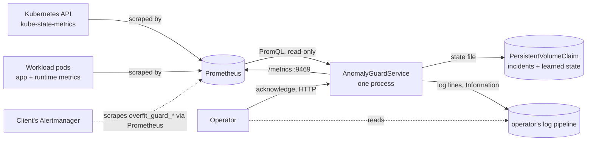
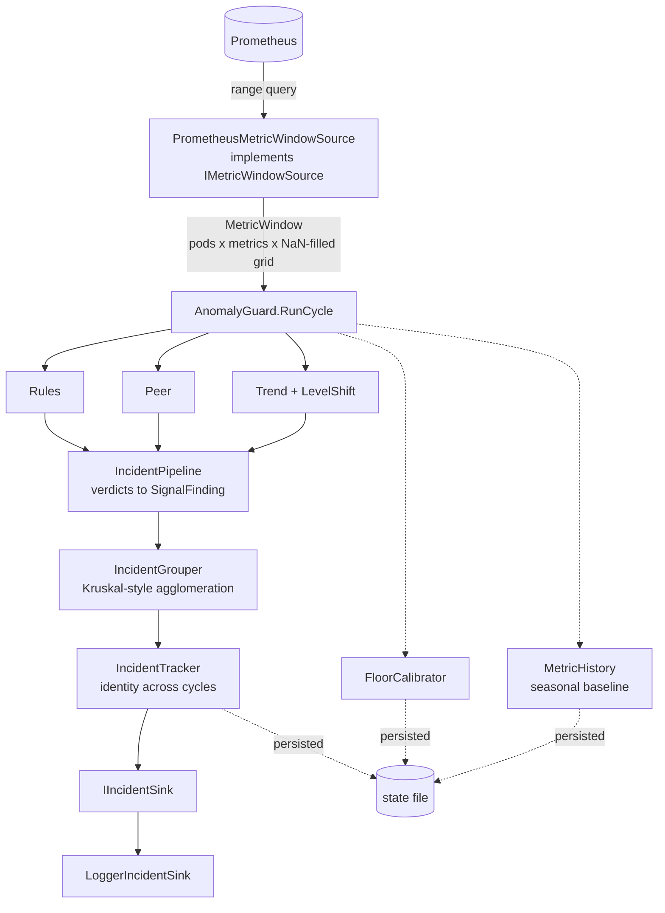

# Anomaly-guard architecture

How the anomaly-detection subsystem is built, for someone who has to change it without breaking it and for
someone deciding whether to run it.

**This is not the implementation map.** `aiops-detection-pipeline.md` (1151 lines) is the closer, denser
account of the algorithms and the measurements behind every threshold — read it when the question is "why
this number." This document answers "what are the pieces, who owns what, where does it break, what happens
when it fails." Where the two disagree, this one has been re-checked against `Sources/Anomalies/**` as of
2026-08-09; see [What contradicts what](#what-contradicts-what) at the end.

Two sibling documents cover ground this one deliberately does not: `aiops-architecture-security.md`
(permissions, data at rest, what leaves the cluster, supply chain — written by `overfit-ciso`) and
`aiops-business-case.md` (should you run this, what it costs — written by `overfit-analyst`). This document
argues neither.

---

## 1. What this is, in one sentence

A process that reads a rolling window of metrics from Prometheus, runs four independent families of
statistical tests over it, groups the results into incidents, tracks those incidents across evaluation
cycles, and reports rows to a sink — with **no write path back into the cluster**. It is read-only against
Prometheus and stateful only in its own files.

## 2. System context

- **Depends on:** Prometheus (query only — `IPrometheusQuerySelector`/`PrometheusHistoricalSource`,
  `Sources/Anomalies/Monitoring/PrometheusHistoricalSource.cs`), optionally kube-state-metrics through
  Prometheus for pod topology, and a writable volume for durable state.
- **Depended on by:** nothing inside the cluster. Its own `/metrics` endpoint is designed to be **scraped by
  the same Prometheus**, deliberately not pushed — `aiops-detection-pipeline.md` §"Layer 5" — which needs
  the guard's own series excluded from its own `podRegex`, or it becomes its own input.
- **Never writes to the Kubernetes API.** No RBAC beyond reading a ConfigMap, no CRDs, no operator pattern —
  recorded as a deliberate decision in `aiops-multi-scope-design.md` ("not chosen: a Kubernetes operator").
  `k8s/lab/anomaly-guard.yaml`'s own header states this as the claim made to clients and notes that
  deploying it this way in the lab is what tests the claim rather than asserting it.

## 3. Assembly and execution-path boundaries

| Assembly | Contains | Depends on | AOT-reachable |
|---|---|---|---|
| `Sources/Main` | nothing of this subsystem | — | yes (smoketest, `Main`-only) |
| `Sources/Anomalies` | all four detector families, grouping, tracking, contracts, config reading, Prometheus clients | `Main` only | not via `Tests/AotSmokeTest` (references `Main` only); **is** published under `PublishAot=true` through `Sources/Cli` in the `aot-guard` CI job, so it is AOT-verified by a different path |
| `Sources/Server.AspNet` | `LoggerIncidentSink`, `AnomalyGuardService` hosting glue, HTTP acknowledgement endpoint | `Server`, `Main`, `Anomalies` | via `Cli` |
| `Sources/Cli` | wires `anomaly-guard` as a CLI verb, the widest-reaching shipped assembly | `Main`, `Mcp`, `Server`, `Server.AspNet`, `Anomalies` | the real AOT proof for this subsystem |

Verified against `.csproj` `ProjectReference`s, not assumed — matches the standing assembly-graph memory.
`Anomalies` is `IsPackable=false`: nothing in it is published NuGet public API, so a change here does not
carry the "cannot be withdrawn" cost that a `Main` public type does.

**Two execution paths exist inside `Anomalies`, and they do not meet at runtime** — this is the single
thing most likely to surprise someone who has only read the algorithm documentation:

1. **The four-family cycle** — `AnomalyGuard.RunCycle` (`Sources/Anomalies/Incidents/AnomalyGuard.cs`),
   driven by `AnomalyGuardService` (`Sources/Anomalies/Hosting/AnomalyGuardService.cs`), on a `Cadence`
   (default 5 min) over a `Window` (default 20 min). This is what `k8s/lab/anomaly-guard.yaml` deploys, and
   everything under "Deployed today" below is about this path.
2. **The learned-only path** — `LiveMonitoringPipeline` (`Sources/Anomalies/Live/LiveMonitoringPipeline.cs`),
   which reads `IRawMetricSource` directly (not `IMetricWindowSource`, not `MetricWindow`), scores each
   snapshot through a GPT checkpoint + per-pod LoRA adaptation (`AdaptiveAnomalyMonitor`), and alerts on the
   raw unbounded surprise score. It never calls `AnomalyGuard.RunCycle` and is not part of the deployed
   manifest.

`aiops-detection-pipeline.md`'s own "Open" list names this: *"the two stacks still meet only at
ingestion."* Anyone extending "the guard" needs to say which of the two they mean — a change to
`MetricIndex` or `AnomalyGuardOptions` touches only #1; a change to `MetricTokenizer` or the checkpoint
format touches only #2.

Neither path is the `InferenceEngine`/`ComputationGraph` hot-path split this repository's other subsystems
use. `RunCycle` is arithmetic over a window already in memory (milliseconds, no I/O); `AnomalyGuard`'s own
doc comment on `_gate` describes it as cheap enough to hold a lock around unconditionally. This is not a
zero-allocation path and carries no such requirement — `AnomalyGuard.cs` allocates a `List<PeerSeries>` and
a `double[]` window copy per metric per cycle, on a five-minute cadence.

## 4. The four detection families — what each answers, what it cannot see

All four run inside `AnomalyGuard.RunCycle` (`Sources/Anomalies/Incidents/AnomalyGuard.cs:479-501`), once
per `MetricIndex` member and once per `CustomMetricBinding`. A fifth mechanism — level-shift — runs only on
the cross-peer common component, not per pod (§4.5).

| Family | Type | Question | History needed | Structurally blind to |
|---|---|---|---|---|
| **Rules** | `SustainedThresholdRule` (`Sources/Anomalies/Rules/SustainedThresholdRule.cs`) | Is this value too high, for long enough? | none | anything the threshold wasn't measured against; has no comparison so cannot say "unlike its peers" |
| **Peer** | `PeerGroupOutlierDetector` (`Sources/Main/Statistics/PeerGroupOutlierDetector.cs`) | Does one member behave unlike its siblings, right now? | none | **everyone moving together** (a rollout, a shared traffic swing) — by construction, if all move the same way nobody is an outlier; also a group of one (only member with a CPU limit) |
| **Trend** | `TrendDetector` (`Sources/Main/Statistics/TrendDetector.cs`) | Is this series drifting in one direction? | hours–days for a raw trend, ≥2 calendar days for the seasonal residual (`AnomalyGuardOptions.MinimumHistoryDays`, default 2) | a **persistent level** difference that never moves (CPU-throttling case: trend correctly finds nothing) |
| **Learned** (not wired into the deployed cycle) | `GptAnomalyDetector` + `EwmaAnomalyDetector` baseline (`Sources/Anomalies/Gpt`, `Baseline`) | Does this pod behave unlike its own past, across all 12 features and their correlations at once? | weeks | has never been validated against labelled real-cluster data — see §8 |

### 4.1 Why rank-based statistics throughout

Every algorithm in the peer, trend and grouping layers is rank-based (Mann-Whitney, Cliff's delta,
Theil-Sen, Mann-Kendall, Kendall's tau, Spearman) rather than mean/variance-based. Monitoring series carry
scrape spikes, restarts and saturation; a rank statistic moves by one position on an outlier where a
Pearson coefficient moves arbitrarily far. The cost is real, not free: ranks discard magnitude, which is why
peer comparison needed a *second*, absolute-magnitude gate (`MinRelativeGap`/`MinAbsoluteGap`) before it was
usable at all — full account in `aiops-detection-pipeline.md` §"Peer — PeerGroupOutlierDetector".

### 4.2 Cliff's delta is why peer comparison needs no training

Cliff's delta measures how often one distribution sits above another; it is scale-free and requires no
calibration period, which is why peer comparison is the one family that works from cycle one on a brand-new
deployment (`aiops-detection-pipeline.md` §"Cold start"). The same scale-freedom is exactly why it cannot
express "materially different" on its own — 860/880/902/875 ms (a 3% spread) produced Cliff's deltas of
0.52 and 0.68, clearing the 0.33 "medium effect" gate and calling a healthy group split. `MinRelativeGap`
(measured floor: reject 4.7%, catch 13.3%) is the second, size-in-the-metric's-own-units gate that fixes it.

### 4.3 Peer comparison is blind to a single OOM kill — measured, and now partly compensated

`OomDetectionTests.PeerComparison_MissesASingleOomKill` (cited in `MetricIndex.ContainerRestarts`'s own doc
comment, `Sources/Anomalies/Contracts/MetricIndex.cs:30-34`) shows why structurally: one OOM event produces
a non-zero rate across roughly 10% of the window, and Cliff's delta over that shape lands under the 0.33
materiality gate every time. This is not a bug to fix in the peer detector — it is what "compare
distributions" means when the event is a spike, not a level. The fix that exists is a second, independent
signal: `ContainerRestarts` (a rules/trend-visible raw series, deliberately never added to the learned
model's fixed feature vector — §6) and `OomEventsRate`, which today's ConfigMap binds via a join against
`kube_pod_container_status_last_terminated_reason{reason="OOMKilled"}` (`k8s/lab/anomaly-guard.yaml:195-199`,
task `AN-D8`). §8 covers the defect history of this specific channel.

### 4.4 Everyone moving together is invisible to peer comparison, and trend fires on all of them

Measured on a real lab run: ten of eleven healthy-replica findings in one window were the same falling
latency trend on all three healthy pods at once, during a warm-up period. Peer comparison correctly says
nothing (nobody is an outlier if everyone moves together); the trend family has no such protection and
fires per pod. This is why the cross-peer common-mode decomposition exists (§4.5) — it turns eleven
per-pod pages into one workload-level finding — but it does not make the underlying movement not-worth-
reporting, and the finding count (not the incident count, which the grouper collapses) is the honest measure
of how much of this remains. `AN-D3` (`docs/TASKS.md`) records the harder open case: a CPU rise on every
replica at once, invisible to all four families, never diagnosed to the end.

### 4.5 Level shift is a fifth mechanism, not folded into trend

`LevelShiftDetector` runs only against the **cross-peer common component** (`CrossPeerBaseline.TryBuild`),
never per pod, because Mann-Kendall's tau (the trend significance test) scores a step at τ≈0.51 regardless
of its size — a 10× step scored a *worse* p-value than a 2.5× one on one measured window shape. Splitting
the window and rank-testing the halves separates a real step cleanly. This exists specifically to answer
"did a rollout just happen" without a Kubernetes client, by treating the deployment-wide series as a single
subject (`AnomalyGuard.RunTrend`, `Sources/Anomalies/Incidents/AnomalyGuard.cs:910-965`).

### 4.6 The learned family: what it would answer, and why it is not the answer today

Self-supervised (predicts the next `MetricSnapshot` from previous ones, so it needs no labels to *train*),
which is why it is the family expected to absorb seasonality and cross-feature correlation "for free." It
needs labelled incidents to know whether its score *means* anything, and — per `docs/TASKS.md`, `AN-F1` —
turning it on in replay made the guard **three times noisier**, not quieter, with the cause not fully
isolated (seasonal history was the whole effect in an isolation test, floor calibration moved nothing). It
is not wired into the deployed cycle (§3) and is not part of what "the guard" means below unless stated.

## 5. The data path, end to end

Seams that exist because something went wrong at them, named because each is a place a future change can
reintroduce the original defect:

- **`IMetricWindowSource` returns `null`, not an empty window, when nothing answered.** A cluster the source
  cannot see is not an empty cluster, and a window of `NaN` reads exactly like one — collapsing the two
  would silently turn "Prometheus is unreachable" into "the cluster is perfectly healthy."
  (`AnomalyGuardService.RunCycleAsync`, `Sources/Anomalies/Hosting/AnomalyGuardService.cs:448-454`, returns
  `GuardCycleOutcome.Blind`.)
- **Missing is `NaN`, never zero**, at ingestion (`LiveMonitoringPipeline.ConvertToSnapshots`,
  `Sources/Anomalies/Live/LiveMonitoringPipeline.cs:276-280`, and the same rule in `MetricWindow`). Zero-fill
  makes "the query matched nothing" indistinguishable from "the value is zero," which is how a broken query
  becomes a calm, entirely fictional signal a detector will happily learn.
- **A sample with no matching grid slot is dropped, never snapped to a neighbour.** A value nudged onto an
  adjacent timestamp is a fabricated observation; the gap it would otherwise leave is something every
  detector already handles honestly.
- **`PrometheusHistoricalSource` used to reuse one `HttpClient` across an owning caller that then disposed
  it** — fixed, named here because the failure mode (a shared client sharing a lifetime it does not own)
  recurs in any code that wraps `HttpClient`.
- **Three counters distinguish three different kinds of silence** (`GuardCycleResult`,
  `Sources/Anomalies/Contracts/GuardCycleResult.cs`): `BlindMetrics` (nobody reported it),
  `PartialMetrics` (some but not all pods did — usually legitimate, e.g. CFS counters exist only on
  containers with a CPU limit), `UnevaluableMetrics` (reported, but too few members cleared the sample
  floor for peer comparison to mean anything — this third one was found only by reading, not by running: on
  one lab cycle it swallowed nine of eleven metrics while `BlindMetrics` read zero).

## 6. Contracts a change must not break

| Contract | What it protects | What breaks it |
|---|---|---|
| `MetricIndex.Count` (13) > `MetricSnapshot.FeatureCount` (12) | The rules/peer/trend families read raw series keyed by the 13-member enum; the learned model takes a fixed 12-feature vector. **This gap is deliberate**, not an oversight — `ContainerRestarts` (member 12) is scraped and reaches rules/peer/trend but never the learned model, because adding it as a 13th feature once moved the token vocabulary 768→832 and broke two committed checkpoints, a `ContextLength` no longer divisible by tokens-per-snapshot, and a 200k-row CSV fixture. | Adding a `MetricIndex` member and also adding it to `MetricSnapshot` without budgeting for a full retrain (`Sources/Anomalies/Contracts/MetricSnapshot.cs:26-36`, `MetricIndex.cs:36-40`) |
| `MetricIndex` values are **appended, never inserted** | Values persist as a `byte` `MetricTypeId` on `RawMetricSeries` and in historical CSV | Inserting a new member in the middle silently reinterprets every stored sample as a different metric |
| `PromqlCatalog.DefaultTemplate`'s `switch` has **no `_ =>` arm** | The one mandatory touch point for a new built-in metric — everything else in the ~15 other call sites falls through a safe default | Forgetting this step throws `ArgumentOutOfRangeException` at runtime, loudly, which is the intended failure mode for "you forgot a step," not a silent one |
| `FloorCalibrator` and `MetricHistory` key persisted state by enum **name**, not ordinal (`Enum.TryParse<MetricIndex>`, `FloorCalibrator.cs:456`, `MetricHistory.cs:354`) | Appending a `MetricIndex` member does not corrupt state written before the member existed | Switching either store to key by ordinal would |
| `CustomMetricBinding` (config-only vehicle) never reaches the learned family, **by construction** | A client-specific metric can be added with no release and no retrain | Nothing breaks this — it is a structural property (the learned model's feature vector is fixed-width and keyed by `MetricIndex`, and a custom binding has no `MetricIndex`), stated here because it is the single most common thing a new-metric request gets wrong (`aiops-adding-a-metric.md` step 0) |
| `IncidentLogRecord` is a separate schema from `Incident` | A dashboard query, log filter or alert rule is written against field *names* — interning them once lets internal contracts evolve without breaking a saved search | Renaming a field on `IncidentLogRecord` directly, instead of updating the flattening step that produces it |

## 7. Calibration — every floor is measured on this population, none from literature

**Statement of the rule, because it governs every threshold anyone will ever touch here:** no floor in this
subsystem was set from a textbook, and where the two disagree the textbook has been checked and found
wrong. Worked example, verified in `Sources/Anomalies/Rules/README.md` and
`SustainedThresholdRuleTests.TheLiteratureThreshold_WouldHaveMissedIt`: the commonly quoted 25%
CPU-throttling threshold **never fires** on the lab's own workload — the measured peak on a pod limited to
one core was 19.8% (median 1.4%, p90 11.8%). The shipped rule (`SustainedThresholdOptions.ForCpuThrottling`)
is 5% held across 25% of the window, derived from what the fault actually produced.

**How a floor is calibrated.** `FloorCalibrator` (`Sources/Anomalies/Monitoring/FloorCalibrator.cs`) watches
a period believed healthy and proposes the smallest gap/trend-change that would not have fired during it.
It requires `Samples >= 30 && Windows >= 24` before proposing at all — not from literature either: the
original gate (`Samples >= 30` alone) was satisfied after three cycles on a twelve-pod population, because
twelve replicas at one instant are twelve views of one moment, not twelve independent looks (`AN-C3`,
`docs/TASKS.md`). Twenty-four windows at the default 5-minute cadence is reasoned as roughly six
independent looks at the maximum, and is stated in the code as *reasoned, not measured* — nothing yet shows
where the true maximum settles.

**What invalidates a floor.** Two documented failure modes, both real:

1. **A window shorter than the workload's period underestimates spread.** A CPU-usage floor calibrated over
   24 windows (2 hours) was 2.6× too low because it never saw the evening traffic ramp where peers diverge
   most; the same lesson as a 240-minute detector window sitting on the daily slope, in the opposite
   direction. Verified by injection, not arithmetic alone — a real fault was reproduced against the raised
   floor and still fired with 7.3× headroom (`k8s/lab/anomaly-guard.yaml` note 4).
2. **A fault inside the observed period raises the bar above itself and blinds the guard to that fault at
   that size, permanently** — because the calibrator does not know which windows were healthy. `FloorProposal`
   documents the hazard; `AnomalyGuard.RunCycleCore` only calls `_calibrator.Observe(window)` when the cycle
   is not inside a declared maintenance window, which is the one input the guard is told is abnormal on
   purpose (`AnomalyGuard.cs:521-524`).

A calibrated floor also **cannot** answer a question the lab has never faced: `CpuThrottleRatio` and the PSI
CPU-pressure channel have never seen a starved pod, so their "healthy" distribution is "nothing happened,"
and a floor fit to it would repeat the same mistake once made on `ContainerRestarts` (a floor of 1.25 fit to
a population that had never restarted for cause). Calibrating a starvation floor needs an induced-contention
experiment, not more healthy traffic (`aiops-adding-a-metric.md` step 6).

## 8. How this system fails — its most distinctive property

A working detector is silent almost all the time. That means **every defect in it presents as silence**,
and silence is indistinguishable from health at every layer above the defect. This is not a hypothetical —
four verified instances, each found and later addressed:

| Defect | What it looked like | Found | Status |
|---|---|---|---|
| `OomEventsRate` bound to `container_oom_events_total`, which this runtime leaves permanently at zero | Reports a number, passes every coverage check, contributes to no finding | Cross-checked against a pod Kubernetes had reported OOMKilled — 43 series cluster-wide over an hour, only distinct value 0.0 (`InertChannel.cs:19-21`) | Rebound to a `kube_pod_container_status_restarts_total` join against the OOMKilled reason (`AN-D8`); fires end to end, verified live 2026-08-09 |
| `CpuThrottleRatio` blind in every cycle | `blind` count included it silently for as long as the lab existed | CFS accounting exists only on a container carrying a CPU quota, and no lab-workload pod set one — `k8s/anomaly-guard/guard.lab-workload.json` left it out with the comment "left out and reported blind" | Structural, not a bug — the channel is genuinely unbindable without a CPU limit on the workload. Fixed *for the throttle-fault test config specifically* by giving that workload a 1-core limit (`AN-E2`), and `blind` reached 0 for that scope for the first time. **Superseded 2026-08-10**: all twelve `lab-workload` replicas now carry `cpu: 1`, verified against the live cluster, so the channel has a full twelve-pod peer group on this lab rather than a group of one. The structural point stands for any cluster whose pods carry no quota; the lab is no longer an example of it |
| Three latency channels returned `25 + q × 25` (37.50 / 48.75 / 49.75) | Reported, coverage-clean, indistinguishable from a genuinely quiet signal | Every request fell in one `histogram_quantile` bucket, so the function was interpolating bucket geometry, not reporting a measurement — "three channels carrying one bit" (`InertChannel.cs:22-24`) | Diagnosed 2026-08-08; the fixture-recording tooling now checks per-channel plausibility (see the fixture-gate row below) |
| The lab-fixture gate validated only the default-named recording, silently, while a second checked-in recording sat unvalidated | A CSV could drift from the population it was recorded on with nobody told | Found while rebuilding the gate for other reasons (`AN-F5`) | Rebuilt: per-channel verdicts, fleet-excursion detection, and it globs every `test_fixtures/lab/*.csv` instead of one filename. Threshold measured (3.38× clean vs 90.85× inside a fleet excursion, gate at 5.0×) |

**What now guards against this class of failure, specifically:**

- **`InertChannel` / `FloorCalibrator.InertChannels()`** (`Sources/Anomalies/Contracts/InertChannel.cs`) —
  a channel that has reported on every cycle for ≥240 observations and **never once changed value**. It
  distinguishes a conclusive defect (constant *non-zero* — no real measurement of load, latency or memory
  is bit-identical for hours) from a genuinely ambiguous one (constant *zero* — could be a dead binding, or
  a correctly bound rare-event channel that simply hasn't fired). It cannot resolve the ambiguous case by
  itself; that needs an operator who knows whether the event occurred.
- **`GuardCycleResult.BlindMetrics` / `PartialMetrics` / `UnevaluableMetrics`** — three separately-counted
  reasons a metric produced nothing, so an operator reading "no incidents" can also read "and the guard
  could see everything," or not (§5).
- **The deployed-config parity gate** (`docs/TASKS.md` `XC-7`) — every `dotnet test` now checks the
  live ConfigMap against the standalone config file it is supposed to mirror. It caught a real, live
  divergence: the ConfigMap (12 metrics, 9 measured thresholds, what actually ran) and
  `guard.lab-workload.json` (11 metrics, one threshold, a round `256MiB` where the cluster measured
  `9.52MB`) had drifted, and a third file holding the real calibrated numbers was referenced by nothing.
  Four mutations, each caught, including a clean `customMetrics` removal reproducing the exact 2026-08-08
  failure verbatim.
- **`overfit_guard_last_cycle_timestamp_seconds`**, scraped by the same Prometheus the guard queries, is
  what makes *"the guard itself has stopped"* alertable — alert on `time() - overfit_guard_last_cycle_
  timestamp_seconds > 900` **and** with `absent()`, because a comparison alone goes `inactive`, not
  `firing`, once the pod and its series both disappear together (`k8s/lab/anomaly-guard.yaml`'s own
  `ServiceMonitor` comment). A guard that has stopped is worse than one that never started, because
  somebody is relying on it.

**What still does not have a guard:** a metric bound to the wrong series *that varies* — everything above
catches a channel that is flat; nothing catches one that moves plausibly but means the wrong thing (the
`AN-D3` case, a movement shared by every replica that all four families still miss). And a calibrated floor
is only as good as the belief that its observation period was healthy — nothing here verifies that belief
independently; it is asserted by whoever configures the maintenance calendar.

## 9. Operational shape

- **One guard process per scope** (namespace + pod regex); today one scope per deployed instance
  (`AN-E1`, multi-scope slices 3–5, is `DEFER`ed — `aiops-multi-scope-design.md` is the design for several
  scopes sharing one process, not yet built).
- **Cadence 5 minutes, window 20 minutes, end-offset 2 minutes** (`AnomalyGuardServiceOptions`, all three
  measured defaults with the sweep behind each documented in the class itself — a 240-minute window
  measured **2583** false incidents/day against 234 at 20 minutes, because a four-hour window sits on the
  slope of the daily traffic curve).
- **Shadow first.** `IncidentLogOptions.Shadow` (everything logged at `Information`, nothing routed to an
  alert channel) is the default sink configuration — deliberate, because the guard still produces tens of
  false incidents a day on a healthy population and Warning-level noise teaches the first operator who sees
  it to filter the channel out, which is not recoverable.
- **One replica, by design, not by omission.** `k8s/lab/anomaly-guard.yaml`: *"Two would keep two
  independent incident trackers and page twice for one problem — naive HA here is worse than none."*
- **Durable state is a `PersistentVolumeClaim`, not an `emptyDir`, and the reason changed over time.** It
  used to hold only open incidents, where the cost of losing it was a bounded, known one: one duplicate
  notification per open incident per restart. It now also holds the seasonal baseline and floor
  calibration, which take **days** to rebuild — losing those does not produce a burst of duplicates, it
  produces a guard that is quietly quieter than it should be for a week, which is the failure mode that
  looks like success. `AnomalyGuard.StateError` and `overfit_guard_state_failures_total` are the operator's
  way to notice a write is failing *before* the next restart makes it visible the expensive way — stores
  swallow their own exceptions on purpose (a monitoring guard that dies because a volume filled up has
  replaced the problem it exists to detect).
- **On restart:** every incident the tracker held open is restored from the state file, aged against
  `MaxRestoredIncidentAge`; without a store, every open incident reopens as new. `AnomalyGuardService`
  logs the restored count once at startup — zero after a restart that *should* have restored something is
  the operator's only signal that persistence is not actually wired.
- **On a failed cycle:** logged and skipped, never fatal (`overfit_guard_cycle_failures_total` increments;
  the loop continues on the next `Cadence` tick). A guard that dies because Prometheus was briefly
  unreachable has replaced the problem it exists to detect with one of its own.
- **Acknowledgement is an HTTP call into the running process, not a file edit.** The guard rewrites its
  learned-state file every cycle from memory, so editing it directly loses the edit within one cadence,
  silently. `AnomalyGuard.Acknowledge` takes the same lock a cycle does.

## 10. Honest status

**Verified end to end on a live cluster**, each independently confirmed against the deployed guard rather
than a fixture, per `docs/TASKS.md`:

- A real OOM kill detected, incident led by `OomEventsRate` (`AN-D8`, 2026-08-09).
- First-chance exceptions detected while every other channel — 5xx count, latency percentiles, peers —
  stayed flat throughout (`RS-5`): `ErrorRate` cannot see this by construction, since it counts 5xx
  *responses* and a caught exception never becomes one.
- In-flight requests (`ActiveRequests`, a custom channel over ASP.NET Core's own
  `http.server.active_requests`) moving two minutes **before** any latency percentile during a stall
  (`RS-3`) — the request only enters the latency histogram when it finishes, so the in-flight count is the
  leading signal and the percentile then saturates at its top bucket edge, carrying no further magnitude.
- CPU throttling detected with `blind` reaching **0** for that scope for the first time in this project
  (`AN-E2`).
- A StatefulSet rollout distinguished from a topology-preserving pod replacement: findings median **14**
  vs **1** for the same pods replaced under unchanged topology (`AN-A5`).

**Not verified, stated plainly:**

- `AN-A1`: a 24-hour run on a frozen configuration measured **10.63 incidents/day against a 1–9/day
  criterion**, and failed it. The honest caveat matters as much as the number: 11 events over 24 hours
  cannot statistically decide a rate band at all — the 95% interval on that count is roughly 5.5–19/day —
  so the *right* correction is a longer run, not a smaller number picked to pass this one.
- The learned-state replay tripled the incident rate (11 → 33 opened, 296 → 517 findings) against the
  identical 298-cycle window with learned state off; isolating the two payload halves pinned the effect
  entirely to seasonal history (floor calibration moved nothing). **The leading explanation was refuted by
  measurement**: the standing theory — that the seasonal correction injects apparent trend — produced zero
  findings across every tested history depth and noise level in a two-armed regression built to test it
  directly. The actual cause is still open (`AN-F1`).
- `AN-D1`: peer comparison reports a fixed pod property as a recurring anomaly — diagnosed 2026-08-06,
  **unfixed**, and independently corroborated 2026-08-08 (272 of 298 cycles carried exactly one finding,
  which is not a noise distribution).

## 11. What contradicts what

- **Incident matching key.** `aiops-detection-pipeline.md` describes matching as "same primary subject,
  plus subject overlap" and states the overlap requirement as load-bearing. The current
  `IncidentTracker.cs` doc comment (`Sources/Anomalies/Incidents/IncidentTracker.cs:24-38`) says this
  changed: the overlap *veto* was removed after it cost a shadow run a real incident at 0.33 overlap
  against a 0.34 bar (same pod, same fault, one hundredth short). Matching today is **by primary subject
  alone**; subject overlap still ranks candidates when more than one qualifies and labels a trace, but does
  not gate a match. The code is authoritative here; the pipeline document has not been updated to match.
- **The false-positive numbers throughout `aiops-detection-pipeline.md`'s "Where the false positives
  actually come from" section are all against a synthetic population, corrected multiple times during the
  same investigation** (the daily-curve-per-pod bug, the 6.5×-too-tight within-pod scatter, the post-restart
  ramp, the memory load-normalisation bug). Every number in that section is explicitly an **upper bound**,
  by the document's own admission, and `AN-A1`'s real-cluster 24-hour run (10.63/day) is the only measured
  figure against a real deployment; it is not directly comparable to the synthetic-population numbers
  because the underlying threshold set differs (see the ConfigMap note history in `k8s/lab/anomaly-guard.yaml`).

## 12. What could not be sourced

- Whether `LiveMonitoringPipeline` (the learned-only path, §4.6) is intended to ever reach production, or
  exists purely as the harness the training/validation work runs against. No roadmap item states an intent
  either way; `AL-8`-adjacent items are silent on it.
- A single authoritative number for "current" incidents/day on the real lab deployment — `AN-A1` gives one
  run's 10.63/day, explicitly too short a sample to trust, and no longer run is recorded in `docs/TASKS.md`
  as of this writing.
- Whether the deployed `guard.lab-workload.json`/ConfigMap divergence that `XC-7` fixed has a real-client
  analogue — `XC-7`'s gate is lab-specific tooling; whether a client's own config drifts from what they
  believe is deployed is unverifiable from this repository.

---

Route any perf claim about this subsystem through `overfit-perf-claim-auditor` before it is repeated —
nothing above should be read as a verified perf number outside the ones explicitly cited with their
provenance. Route a code-vs-comment drift check to `overfit-reviewer`; several long doc
comments cited above (`InertChannel`, `IncidentTracker`, `MetricSnapshot`) are exactly the kind of
prose-carries-a-measurement comment that subsystem exists to keep honest.
