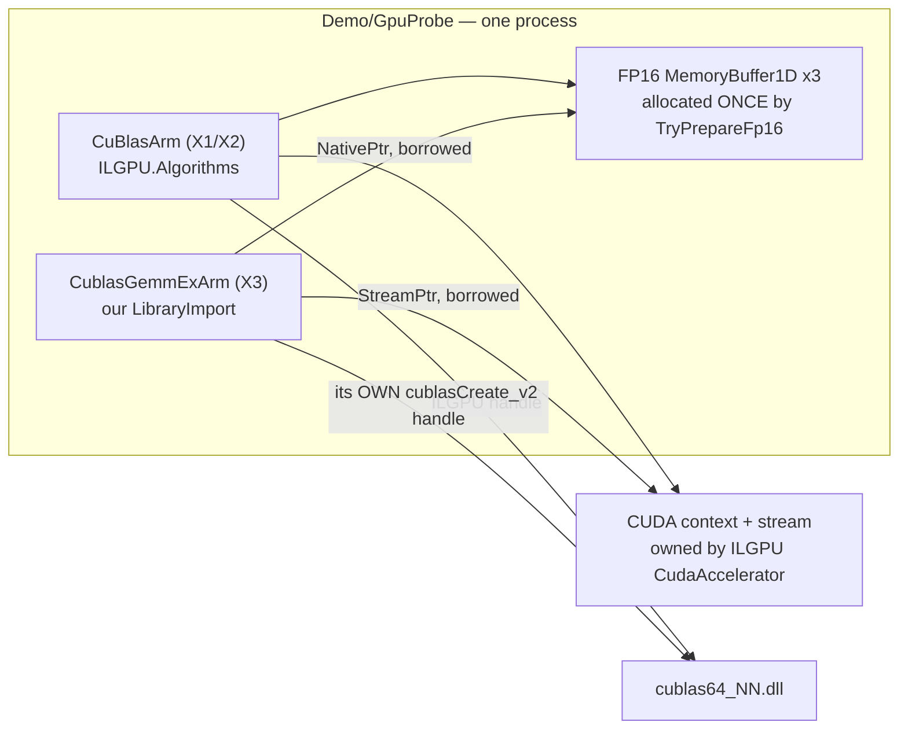

# `XC-107` — brief for `overfit-architect`: the P/Invoke `cublasGemmEx` arm

**Written 2026-08-21, immediately before a console reset, so that the dispatch after the reset costs one
line instead of a re-derivation.** Everything below was verified in-session; the one part that was not
verified says so.

## Dispatch line

> `overfit-architect`: decide whether Overfit should add a P/Invoke arm that reaches `cublasGemmEx` with
> `CUBLAS_COMPUTE_32F`, per `docs/specs/XC-107-pinvoke-gemmex-brief.md`. Do not write source. Append your
> sections to this file.

## The finding that creates the question

`AMENDMENT 1` made an FP16 tensor-core arm the PRIMARY arm of the GPU probe, on the argument that
*"cuBLAS is the same cuBLAS in both routes"*. That argument is true only of the part ILGPU exposes.

Verified against the assembly bytes of `ILGPU.Algorithms 1.5.3`, not against its documentation:

| symbol | occurrences |
|---|---|
| `cublasGemmEx` | **0** |
| `GemmEx` | **0** |
| `cublasHgemm` | 1 |
| `cublasSgemm` | 1 |

A tensor core is reached through `cublasGemmEx` with `CUBLAS_COMPUTE_32F` — FP16 storage, **FP32
accumulate**. ILGPU exports no `GemmEx` and therefore no compute-type parameter. The only FP16 route it
offers is `cublasHgemm`, which accumulates in FP16 and is neither the fastest nor the most accurate FP16
path the card provides.

## What the gap costs, measured

On the host, at the real shapes (`--fp16-bound`, no GPU required):

| accumulate | relative L2 against F32 |
|---|---|
| FP32 (tensor core, `GemmEx` `COMPUTE_32F`) | **2.87e-4 to 2.97e-4**, flat across every k, m, n |
| FP16 (`cublasHgemm`, what arm `X1` does) | **6.5e-3 at k=2048**, **1.58e-2 at k=11008** |

Between 23x and 55x. The k-dependence is a **confirmed mechanism, not a fitted curve**: `hgemm` rounds its
running sum once per multiply-add, so error grows as `sqrt(k)`. Fitting `C*sqrt(k)` to the k=11008 point
alone gives `C=1.51e-4`, which then **predicts** 6.82e-3 at k=2048 against 6.53e-3, 6.58e-3 and 6.91e-3
measured.

## The question for the architect, in one line

Does Overfit add a P/Invoke arm reaching `cublasGemmEx`, and if so does that arm live in the throwaway
probe, or is it the first piece of a GPU route that the product keeps?

Those are different decisions and they must not be answered together by accident. The probe is a
throwaway instrument built to settle a hardware purchase. A P/Invoke CUDA interop layer that the product
keeps is a dependency on a native, vendor-specific, version-skewing library, inside an engine whose whole
public identity is **no native binaries, no Python, no ONNX Runtime**.

## What the architect must weigh, and the traps

1. **The identity conflict is the first question, not the last.** `CLAUDE.md` opens with the
   zero-native-dependency identity, and `Sources/Main` bans `System.Reflection` outright at build time
   through `RS0030`. A CUDA P/Invoke layer cannot live in `Sources/Main` under those rules. Decide the
   assembly boundary before the API.
2. **Native-AOT.** The probe already sets `PublishAot=false` because ILGPU generates IL and PTX at
   runtime. A raw P/Invoke layer does NOT carry that restriction and could be AOT-clean — which is an
   argument in its favour that ILGPU cannot make. Check it rather than assume it.
3. **dotLLM took this route.** They P/Invoke cuBLAS directly. That is convergent evidence and should be
   read as such — but read their tree, do not trust a summary of it. **A quotation attributed to dotLLM
   earlier in this work did not exist in their source**, along with two further claims about them that
   were also wrong. All three were caught by the architect. Verify anything attributed to them.
4. **Nothing can be tested on this machine.** No NVIDIA device exists here. A P/Invoke arm is
   compile-checked only until the friend runs it, exactly like the existing FP16 path. Any plan must say
   how it degrades when `nvcuda.dll` / `cublas64_*.dll` is absent — the established shape is
   `CuBlasArm.TryCreate` returning null and printing the reason, never throwing.
5. **The version skew is the real maintenance cost.** `cublasGemmEx` is stable, but the DLL name carries
   the CUDA major version and the friend's driver decides which is present. Name the discovery strategy.
6. **Do not let the probe's deadline decide the product's architecture.** If the answer is "P/Invoke in
   the probe only, product decision deferred", that is a legitimate and probably good outcome — but it
   must be stated as a decision, with what would reopen it, rather than reached by drift.

## Bounds on all of the above — state these in any plan

- **No line of any FP16 path has ever executed.** Compile-checked only.
- The FP16-accumulate figures are a **host** computation over **4096 sampled output elements per shape**,
  not the full tensor. They are a subsample estimator and the report says so.
- The probe's `--quick` headline is **not reproducible**: 2.20x, 0.86x, 0.16x, 0.20x, 0.26x across five
  runs. Do not build any argument on a headline number from this probe.

---

STATUS: APPROVED

GATES:
  verifier:           NOT_REQUIRED — the artefact stays a throwaway probe outside `Overfit.sln`. No product
                       behaviour and no suite test changes. Arm X3's correctness gate is the probe's own
                       parity oracle, `ParityResult.Fp16Fp32AccumulateCeiling`
  reviewer:           NOT_REQUIRED — no file in `Sources/**` or `Tests/**` is touched. Becomes REQUIRED the
                       moment any part of this arm moves into the solution
  mutation-proof:     NOT_REQUIRED — no suite test is added, so there is no assertion to mutate
  performance:        REQUIRED for the RESULT, NOT_REQUIRED for the code. Every number X3 returns is a
                       performance claim and `overfit-perf-claim-auditor` owns the verdict on it
  security:           NOT_REQUIRED — no parser, endpoint or externally-fed surface. Input stays synthetic
                       and seeded in-process
  leak-scan:          REQUIRED — unchanged from the base plan, and X3 adds one more machine-identifying
                       string: the resolved cuBLAS DLL name and version
  AOT:                NOT_REQUIRED for the probe, which is not in `Overfit.sln`. **Measured anyway** — see
                       finding F2, because the answer is the load-bearing input to Decision D5
  API-compatibility:  NOT_REQUIRED — nothing in `DevOnBike.Overfit`'s public surface changes
  release-readiness:  NOT_REQUIRED — nothing ships

**This file carried no `STATUS:` line before this amendment.** The line above is the file's status and the
gate manifest is seeded here for the same reason.

---

# AMENDMENT 2 — the architecture decision on `XC-107`

**Written by `overfit-architect` on 2026-08-22.** Appended only. Nothing above this line was edited.

## A2.0 The answer, in two separate decisions

The brief asks one question that is really two. They are answered separately and neither answer depends on
the other.

**Decision D4 — the probe gets a P/Invoke `cublasGemmEx` arm, `X3`. Approved.**

**Decision D5 — the product does not take a P/Invoke GPU route. Deferred, with four named triggers in
A2.5.** This is a decision, not a silence. Nothing in D4 advances D5 by one step.

The rest of this amendment is the evidence for both, then the shape of X3, then what I could not check.

---

## A2.1 Review findings on the brief

Nine findings. Each states what makes it true and the tool that established it.

**F1 — Trap 1 is right, and the mechanism is narrower and harder than the brief says.** The blocker in
`Sources/Main` is not the P/Invoke. `BannedSymbols.txt:2` bans the whole `System.Reflection` namespace at
`RS0030`-as-error, and the idiomatic multi-version DLL discovery is
`NativeLibrary.SetDllImportResolver(Assembly, DllImportResolver)` — whose delegate takes a
`System.Reflection.Assembly`. So the **resolver** is what the ban stops, not the `[LibraryImport]`. Second
half of the finding, and it is the identity fact: `Grep` for `DllImport|LibraryImport|NativeLibrary` across
`D:\Overfit\Sources` returns **no matches**. There is no native interop anywhere in the shipped tree today.

**F2 — Trap 2 settles, and it settles in P/Invoke's favour. Measured on this box, not assumed.** I built a
scratch project (`.claude/tmp-arch/aotcheck`, gitignored and disposable) containing a
`[LibraryImport("cublas")] cublasGemmEx` declaration, a `cublasGetVersion_v2`, and a
`NativeLibrary.SetDllImportResolver` resolver over `cublas64_13/12/11.dll`.

| step | command | result |
|---|---|---|
| analysers | `dotnet build -c Release` with `IsAotCompatible`, `EnableTrimAnalyzer`, `EnableAotAnalyzer`, `EnableSingleFileAnalyzer` all `true` | `Build succeeded. 0 Warning(s) 0 Error(s)` |
| real ILC | `dotnet publish -c Release -r win-x64 -p:PublishAot=true -p:TreatWarningsAsErrors=true` | exit 0, native binary **1,063,936 bytes** |
| execution | ran that binary on this machine — **no NVIDIA device, no CUDA installed** | exit 0, printed `aotcheck ok` |

ILCompiler ran to completion and emitted no `IL2xxx`/`IL3xxx` diagnostic with warnings promoted to errors.
**A P/Invoke cuBLAS layer is Native-AOT clean. ILGPU is not and cannot be** (plan, Decision D2 and section
2). This is the fact D5 turns on and it is the one the brief asked me to check rather than assume.

**F3 — the missing-DLL degradation is measured, and it is LAZY, which changes the `TryCreate` shape.** Same
binary, same box, with the call actually attempted:

```
Unhandled exception. System.DllNotFoundException: Unable to load DLL 'cublas' or one of its dependencies: ...
   at Internal.Runtime.CompilerHelpers.InteropHelpers.ResolvePInvokeSlow(...)
   at AotCheck.CublasNative.cublasGemmEx(...)
```

Three consequences the developer needs:

1. The failure lands at the **first call site**, not at type load and not at `SetDllImportResolver`. So
   constructing the arm proves nothing. `TryCreate` must force resolution itself — an explicit
   `NativeLibrary.TryLoad` sweep, or one cheap guarded call — and return null with the reason.
2. The exception type is `System.DllNotFoundException` under **both** AOT and JIT. One catch clause covers
   both hosts.
3. The message is **localised by the operating system**. On this box it reads *"Nie mozna odnalezc
   okreslonego modulu"*. `CuBlasArm.TryCreate` already embeds `ex.Message` verbatim, so a report coming back
   from the friend's machine can carry a reason nobody here can read. X3 must print a stable English prefix
   of its own and treat the OS text as an appendix.

**F4 — the ground on which the plan rejected P/Invoke has already been spent, and this is the strongest
argument for D4.** `gpu-probe-route-and-design-plan.md:82` rejects "CUDA via P/Invoke" because it *"needs
`cublas64_*.dll` from the CUDA toolkit, which is not part of an NVIDIA driver install"*. `AMENDMENT 1` then
made `cublasHgemm` through `ILGPU.Algorithms` the **primary** arm, and that arm loads the same DLL —
`CuBlasArm.cs` states it in its own doc comment (*"cuBLAS lives in `cublas64_*.dll`, which comes with the
CUDA redistributable"*). **Arm X3 adds no native dependency the approved design does not already carry.**
The rejection was sound when written and stopped being sound when Amendment 1 landed; nobody noticed,
because the two statements live 500 lines apart.

**F5 — a second, independent robustness gap, found while checking trap 5.** `ILGPU.Algorithms 1.5.3`
enumerates cuBLAS **v10, v11 and v12 only**: `CuBlasAPIVersion` has exactly three members (reflected from
the assembly), and the assembly string table contains `cublas64_10.dll`, `cublas64_11`, `cublas64_12.dll`,
`libcublas.so.10/11/12` and **nothing for 13**. dotLLM's resolver tries `cublas64_13.dll` first. So on a
machine carrying only a CUDA 13 redistributable, ILGPU's cuBLAS wrapper resolves nothing and **X1 and X2
both skip, taking the primary arm with them.** Our own resolver has no such limit. I did **not** verify that
CUDA 13's Windows DLL is actually named `cublas64_13.dll` — that is dotLLM's assumption and I have no CUDA
installation to check it against.

**F6 — the oracle for X3 already exists and currently judges nothing.** `ParityResult.cs:64` declares
`public const double Fp16Fp32AccumulateCeiling = 1e-3;`. `Grep` across `Demo/GpuProbe` finds it referenced
only by a `<see cref>` in its own file — **zero call sites**. `Program.cs` uses `Fp16Fp16AccumulateCeiling(cell.K)` for arm X1 — at line 287 when I re-checked,
and at line 217 ninety minutes earlier in the same session, because another agent is editing that file
right now. The symbol is the citation; the line is a hint. The gate that would judge an FP32-accumulate arm was
written, and the arm it was written for was never built.

**F7 — dotLLM: everything the brief attributes to them is in their tree, and one open item from `A1.7` now
closes.** Verified by reading `D:\dotLLM`, not a summary of it:

| claim | file | verdict |
|---|---|---|
| they P/Invoke `cublasGemmEx` with `CUBLAS_COMPUTE_32F` | `src/DotLLM.Cuda/CudaGemm.cs:29-40` | confirmed |
| via `[LibraryImport]`, not `[DllImport]` | `src/DotLLM.Cuda/Interop/CublasApi.cs:45` | confirmed |
| multi-version discovery by resolver | `Interop/CudaLibraryResolver.cs`, tries `13`, `12`, `11` | confirmed |
| `A1.7`: *"whether their AOT builds include CUDA"* | `src/DotLLM.Cli/DotLLM.Cli.csproj` carries an **unconditional** `<ProjectReference Include="..\DotLLM.Cuda\DotLLM.Cuda.csproj" />`; `.github/workflows/release.yml:195-199` publishes that CLI with `-p:PublishAot=true` | **resolved: yes.** Their AOT `NoWarn` is `IL2104;IL3053;IL3000;IL3002` and its own comment attributes it to Spectre.Console, not to CUDA |

That closes `A1.7` in the direction opposite to the evidence flagged there. **What I did not check: whether
that CI job currently passes.** I read the workflow file; I have no run logs.

**F8 — one thing dotLLM does that we should NOT copy.** `src/DotLLM.Cuda/CudaCublasHandle.cs:26` calls
`cublasSetMathMode(handle, CUBLAS_TENSOR_OP_MATH)`. That flag has been deprecated since CUDA 11 — cuBLAS
selects tensor cores itself — and `CuBlasArm.cs` already records the decision **not** to set it, on the
ground that setting it would let the report imply the probe switched something on when it had not. Their
setting it is not evidence that it is needed. Keep the existing decision.

**F9 — their error handling is the inverse of this project's and must not come across with the signature.**
`CudaGemm.LinearF16` calls `.ThrowOnCublasError()` on every call. The established shape here is
`TryCreate` returning null and printing the reason, never throwing. Copy their ABI, not their control flow.

---

## A2.2 Decision D4 — arm `X3`, thin, inside the probe

**Approved on F4 and F6: the dependency is already carried, and the oracle is already written.**

### What X3 borrows and what it owns

Every member below was verified by reflecting `ILGPU 1.5.3` / `ILGPU.Algorithms 1.5.3` from the package
cache, not read from documentation.

| thing | route | verified |
|---|---|---|
| device pointers for the FP16 operands | `MemoryBuffer.NativePtr`, public `IntPtr`; `MemoryBuffer1D<T,TStride>` derives from `MemoryBuffer` | base chain reflected |
| the stream | `CudaAccelerator.DefaultStream` → `CudaStream.StreamPtr`, public `IntPtr` | reflected |
| CUDA context binding | `Accelerator.Bind()` / `BindScoped()`, both public | reflected |
| compute capability, for requirement `N1` | `CudaAccelerator.Architecture`, public `CudaArchitecture` | reflected |
| the cuBLAS **handle** | **X3 creates its own** with `cublasCreate_v2` and binds it with `cublasSetStream_v2` | see below |
| ILGPU's own P/Invoke table | **not reachable** — `ILGPU.Runtime.Cuda.API.CuBlasAPI` is `internal` | reflected: `public=False` |

**`CuBlas<T>.Handle` is a public `IntPtr` and X3 must still not use it.** Passing a handle created inside one
loaded copy of cuBLAS to a function resolved in another copy is undefined behaviour, and nothing in the
managed type system stops it. Owning the handle costs three extra declarations (`cublasCreate_v2`,
`cublasDestroy_v2`, `cublasSetStream_v2`) and removes that whole class of defect rather than making it
unlikely. Device pointers are safe to borrow because they are scoped to the **CUDA context**, which is
shared, not to the library module. This is also the shape dotLLM uses, arrived at independently.

A second reason to own it: cuBLAS defaults to `CUBLAS_POINTER_MODE_HOST`, so `alpha`/`beta` are host
pointers. ILGPU's wrapper manipulates pointer mode (`PointerModeScope`, `EnsurePointerMode`); a borrowed
handle would make X3's correctness depend on ILGPU's internal state at the moment of the call.



**No new allocation, no new upload, no new buffer lifetime.** X3 reuses the exact buffers
`CuBlasArm.TryPrepareFp16` already fills. Execution path **training**, allocation policy **neither** — both
unchanged from the base plan, and X3 must hold to the second: `alpha` and `beta` are stack locals and
nothing may allocate inside a timed region.

### Boundary and files

`Demo/GpuProbe/`, unchanged. Nothing enters `Overfit.sln`, nothing is referenced by `Sources/**`, nothing
becomes public API. Two new files following the house one-type-per-file style, plus one constant in
`ArmNames`. `GpuProbe.csproj` does **not** currently set `AllowUnsafeBlocks` — if the developer takes
dotLLM's `nint` + `&alpha` shape it must be added; declaring the parameters as `in float` avoids it. I
compiled the `nint`+`unsafe` form and **not** the `in float` form; the choice is local and the developer's.

### The ABI constants, and why a wrong one is not silent here

Values, taken from `dotLLM/src/DotLLM.Cuda/Interop/CublasApi.cs` and agreeing with my knowledge of
`cublas_api.h`: `CUBLAS_OP_N=0`, `CUBLAS_OP_T=1`, `CUDA_R_16F=2`, `CUDA_R_32F=0`, `CUBLAS_COMPUTE_32F=68`,
`CUBLAS_GEMM_DEFAULT=-1`. **I could not open `cublas_api.h` — there is no CUDA installation on this
machine.** Two sources, neither authoritative. Verify before handover.

**The probe's own oracle is the discriminator, and this is why the arm is safe to add.** The single most
plausible error is `64` (`CUBLAS_COMPUTE_16F`) instead of `68`, which would produce a fast, plausible,
wrong number. It cannot pass: the brief's measured host bound puts FP32-accumulate at 2.87e-4 to 2.97e-4
against a `1e-3` ceiling, and FP16-accumulate at 6.5e-3 at `k=2048` — **6.5x over the ceiling.** A wrong
compute type fails parity, and the probe prints no timing for an arm that fails parity.

### Version discovery (trap 5)

`NativeLibrary.SetDllImportResolver`, trying `cublas64_13.dll`, `cublas64_12.dll`, `cublas64_11.dll` on
Windows and `libcublas.so.13/12/11`, then bare `libcublas.so`, on Linux. **Resolve by bare name, never by a
full path** — a bare name returns the module already loaded in the process when one matches, which is what
keeps X3 and ILGPU on the same library. The report prints the name that resolved.

As a diagnostic, not a safety gate: print our `cublasGetVersion_v2` result beside ILGPU's public
`CuBlas<T>.Version`. They should agree. If they disagree the run is still valid — X3 owns its handle — but
the report must say so, because a disagreement means X1 and X3 measured two different libraries.

### Degradation — X3 never throws out of the arm and never prints a zero for an unread quantity

| condition | X3 |
|---|---|
| accelerator is not CUDA | `TryCreate` returns null, reason names the accelerator type |
| no `cublas64_*.dll` resolves | null after an **explicit** `NativeLibrary.TryLoad` sweep; the reason lists every name tried |
| DLL resolves, `cublasCreate_v2` fails | null; the reason carries the cuBLAS status code, not the word "failed" |
| entry point absent (older cuBLAS) | `EntryPointNotFoundException` at the first call, caught, null, reason names the resolved version |
| `cublasGemmEx` returns non-zero | `NOT MEASURED` plus the status code; **no timing printed**; the run continues |
| parity above the `1e-3` ceiling | no timing printed — existing oracle rule, unchanged |
| compute capability major < 7 | timing printed, headline **refused**, `TENSOR CORES: NOT engaged` — requirement `N1`, unchanged |
| CUDA 13 only, so X1/X2 skipped | X3 may be the only cuBLAS arm that runs. The report must not present X3 against an absent X1 as a comparison |

### The invariant X3 rests on, and what would refute it

**Invariant:** *X3 engaging a tensor core is not established by X3 running.* The refuting observation is
`CudaAccelerator.Architecture` reporting a major version below 7, or any of `m`, `n`, `k` not being a
multiple of 8. Both are checkable at runtime and requirement `N1` already forces them onto the page.

**What exercises it: nothing on this machine.** There is no NVIDIA device here. No test can attempt the
refutation until the probe runs on the friend's box. That is a stated gap, not a covered one.

---

## A2.3 Quality requirements as parameters

| requirement | parameter | how it is measured | against what baseline |
|---|---|---|---|
| X3 is correct | relative L2 against the F32 host reference **≤ 1e-3** per shape | existing `ParityResult.Compare` with `Fp16Fp32AccumulateCeiling` (F6) | the brief's host bound, 2.87e-4 to 2.97e-4, predicts a 3.4x margin |
| X3 is fast | ms per call, best-of-N, ABAB in one process against `C3 cpu f32 forward`, reported per `(n,k,m)` cell | existing `Arm.TimeOnce` and canary machinery; X3 adds no timing code | **none exists.** `Grep` for `GPU\|cuBLAS\|ILGPU` in `docs/measured-baselines.md` returns no matches |
| tensor cores engaged | `Architecture` major ≥ 7 **and** m, n, k all multiples of 8 | printed by requirement `N1`, refused headline otherwise | n/a — a precondition, not a target |
| degrades cleanly | the probe completes and prints a reason for every skipped arm | **runnable here today**, on a box with no CUDA | must be run before handover |

**There is no GPU row anywhere in `docs/measured-baselines.md`.** X3's first number therefore becomes the
baseline. Recommendation, which is not mine to execute: when the probe returns and
`overfit-perf-claim-auditor` has signed the numbers, add a GPU section there carrying card, driver version,
resolved cuBLAS DLL name, compute capability, shape and arm. A number without those is not evidence about
anything.

---

## A2.4 Risks added by this amendment

| # | risk | what retires it | order |
|---|---|---|---|
| **R6** | our resolver binds a different cuBLAS module than ILGPU's, and a shared handle corrupts | X3 owns its handle (A2.2), so nothing but device pointers is shared and the failure becomes impossible rather than unlikely | in the design |
| **R7** | an ABI constant is wrong and X3 reports a fast wrong number | the `1e-3` parity ceiling **is** the discriminator between `COMPUTE_32F` and `COMPUTE_16F`: 2.9e-4 against 6.5e-3 at k=2048 | in the probe |
| **R8** | a CUDA-13-only machine silently loses X1 and X2 (F5) | our resolver tries 13; the report must state which cuBLAS arms ran rather than implying a comparison that did not happen | in the probe |
| **R9** | no line of X3 can be executed here | unchanged and unretired. Compile-checked only, exactly like the existing FP16 path | accepted |

---

## A2.5 Decision D5 — the product does not take this route now

**Decided, not drifted into.** Three reasons, in order of weight:

1. `ROADMAP.md:1168` records GPU/CUDA as a deliberate **SKIP** on the open side, on the "no native binary"
   identity. That is a live recorded decision, not an omission.
2. `Sources/**` contains **zero** `DllImport`, `LibraryImport` or `NativeLibrary` (F1). Adding the first one
   is an identity change, and identity changes are not made as a side effect of building an instrument.
3. The probe exists to price the port. Deciding the port from inside the probe inverts the exercise — the
   plan's own `A1.3` item 3 makes exactly this argument against building dotLLM's route in order to decide
   whether to build it.

**What this review does change, without reopening D5: the technology ranking for a route nobody has
approved.** `A1.3` already concluded ILGPU is *"the right probe technology and probably the wrong product
technology"*, on dotLLM's evaluation. F2 adds a second, independent, locally measured reason:
**P/Invoke is Native-AOT clean and ILGPU cannot be.** If the route is ever taken it is P/Invoke, in its own
assembly, and the AOT question does not need re-litigating. That is a conclusion held in reserve, not a
decision to act.

### What reopens D5 — named triggers

Reopening needs **both** of the first two, or either of the last two alone.

1. The probe returns, `overfit-perf-claim-auditor` signs the numbers, and X3's ratio against `C3` exceeds
   the plan's section 7 upper band at `n=256` with `TENSOR CORES: engaged` printed.
2. Risk `R3` completes and shows `FrozenQuantizedLinear` is a large enough share of the QLoRA step for a
   GEMM ratio to convert into a product claim. Without `R3` no GEMM number means anything end to end.
3. The client places GPU on the commercial side **with a customer asking for it.** GPU is moat; a customer
   request is a business input and it is not mine to supply.
4. The platform removes the native dependency — a managed tensor-core path in .NET. Speculative, and listed
   so that its absence is a recorded state rather than something nobody thought about.

**A good X3 number alone is not a trigger.** That is the whole point of writing them down.

**No ADR is written now, deliberately.** A GPU route would need one — it decides an assembly, an AOT
boundary, a dependency added to a shipped graph, and which side of the open/commercial line a capability
falls on. Writing it today would record the decision this section defers.

---

## A2.6 Operability

Unchanged from the base plan section 8: nothing runs as a service. Two additions.

- X3 must not run while a `Sources/Benchmark` process holds the `Global\` machine mutex — same rule, same
  reason, one more arm competing for the same box.
- The `leak-scan` gate acquires one more field: the resolved cuBLAS DLL name and version identify the
  friend's CUDA installation.

---

## A2.7 What I did NOT check

- **Any line of X3 against real hardware.** There is no NVIDIA device on this machine. Nothing in this
  amendment has executed against cuBLAS, and the P/Invoke evidence in F2 and F3 is about the *loader and
  the compiler*, not about the call.
- **The ABI constants against `cublas_api.h`.** The header is not on this machine.
- **Whether CUDA 13's Windows DLL is named `cublas64_13.dll`** — dotLLM's assumption, unverified here.
- **Whether dotLLM's AOT CI job passes.** I read `release.yml`; I have no run logs.
- **The `in float` marshalling shape for `alpha`/`beta`.** I compiled the `nint` + `unsafe` form only.
- **ILGPU's actual load path for cuBLAS.** I found bare DLL names in the assembly string table and no full
  paths, which is suggestive of a bare-name `LoadLibrary` and is not conclusive.
- **`HEAD`, and the tree moved under me while I wrote this.** Every citation above is against the working
  tree, not against `HEAD`. At the start of this review `Demo/GpuProbe` had four modified and three
  untracked files; ninety minutes later `Arm.cs`, `ArmRunner.cs`, `Canary.cs` and `GpuArms.cs` were also
  modified and `TimedRegion.cs` was new — another agent is working in this directory, most likely on
  `XC-109`. I re-verified the two citations that matter (`ParityResult.Fp16Fp32AccumulateCeiling` still has
  zero call sites; `CuBlasArm` is untouched) and I did **not** re-verify the rest against the newest
  bytes.
- **`XC-109`'s live-view suspension.** X3 inherits whatever that lands on; I did not review it.

---

## BLOCKING QUESTIONS — round 2

**For the client.**

**C6. Does adding a P/Invoke arm change your answer to `C1` — whether this probe lives in the public AGPL
repository?** The arm is one small file and it is the *interesting* file: it publishes the exact shape a
commercial GPU build would take, and GPU is recorded as the moat. Once published under the open licence it
cannot be withdrawn. This is a business decision with a permanent technical consequence and it is not mine.
*If unanswered:* **Assumption** — the arm is written, no agent commits anything, and placement is settled by
the user at commit time, exactly as `C1`'s assumption already says.

**C5 remains open and X3 sharpens it.** With our own resolver, shipping `cublas64_NN.dll` inside the zip
would make the probe self-sufficient on a machine with only a driver. Still a licence question about a
third party's binary being handed to a fourth party. **Restated, not answered.**

**For the analyst.**

**A1. Are section 7's decision bands still the bands?** They were written against a custom FP32 kernel, then
`AMENDMENT 1` re-pointed the headline at FP16 cuBLAS, and `A1.5` item 6 said to read them against the
primary arm. X3 moves the primary arm again — to FP32-accumulate tensor-core cuBLAS, the fastest of the
three. The bands were your judgement and not a measurement, and I will not silently re-scale somebody
else's success metric.
*If unanswered:* **Assumption** — the bands stand as written, and the report prints every arm's ratio so a
reader can apply their own.

**A2. Does X3 replace X1 as PRIMARY, or sit beside it?** My recommendation is beside: X1 is `cublasHgemm`,
which is what a naive port would reach for, and X3 is the tensor-core path — two numbers, and the second is
nearly free now that the buffers are shared. But "primary" decides the headline and the headline is yours.
*If unanswered:* **Assumption** — X3 becomes PRIMARY and X1 stays, relabelled *"FP16 accumulate — the worse
FP16 route, kept as a floor"*.

---

## Sign-off

**Architecture review:** reviewed and signed by `overfit-architect` on 2026-08-22, against the code and the
package bytes rather than against a description of either. **Execution path: training** (unchanged).
**AOT-reachable: no** — the probe is not in `Overfit.sln` and not reachable from `Tests/AotSmokeTest`;
finding F2 is a fact about a possible *product* route and not about this probe. **Allocation policy:
neither** — measurement harness, nothing allocates inside a timed region. **Public API added: none.**
**Assembly: `Demo/GpuProbe`, unchanged.**

**Handoffs.** `overfit-perf-claim-auditor` owns the verdict on every number X3 returns; whoever runs the
probe must not also rule on it. `overfit-reviewer` stays `NOT_REQUIRED` only while the probe stays outside
the solution. If `D5` is ever reversed, an ADR comes before any code.
