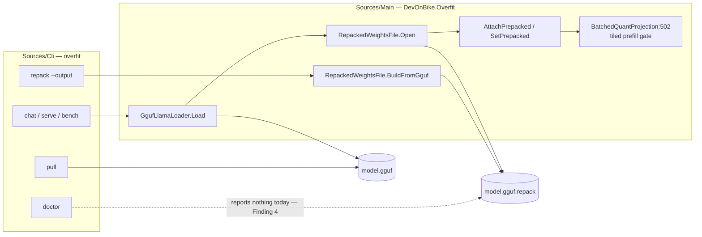

STATUS: APPROVED
Author: overfit-architect — **architecture half only. There is no analyst half; see §0.**
Architecture review: overfit-architect, 2026-08-25 — SIGNED
**Re-signed: 2026-08-25 by overfit-architect, after `XC-119` measured the routes this plan had only
  reasoned about.** The route ranking is refuted in this plan's favour and the value proposition is
  refuted against it. Changes: Findings 11-17 (new); §4 re-priced and its A-sync ruling **corrected**;
  §5 rewritten — the sidecar is a **memory and start-up** feature, not a throughput one; **§9 Q1 replaced
  by Q1a/Q1b after it failed** (§9.1 carries the ruling); Q5 replaced; S1 and S2 retired as measured;
  A1 answered and closed. **Findings 1-10 and §§6-8 are unchanged and nothing earlier was deleted** —
  where a claim was wrong the old text is quoted beside the correction.
Date: 2026-08-25
Slug: auto-repack-sidecar-plan
Task id: **none assigned.** The highest id in `docs/TASKS.md` is `XC-118`. This plan needs a row before
  implementation starts; I did not write one, because `docs/TASKS.md` is outside what I may edit.

GATES:
  verifier:            NOT_REQUIRED at plan time — no source changed yet. Required before `IMPLEMENTED`.
  reviewer:            NOT_REQUIRED at plan time — no source changed yet. Required before `IMPLEMENTED`.
  mutation-proof:      NOT_REQUIRED at plan time. **Required for the identity check** (M4 in §11): a
                        verification that never rejects anything is the exact defect this plan exists to
                        prevent, and only a mutation shows it can go red.
  performance:         NOT_REQUIRED at plan time — this plan states no performance target of its own; it
                        quotes `XC-76`, `XC-105`, `XC-118` and `XC-119`. **Required the moment any new
                        number is produced.** `overfit-perf-claim-auditor` owns that verdict and must not
                        be substituted for. Every figure in §4 and §9 came from that auditor's campaigns
                        and is cited, never restated as new.
  security:            NOT_REQUIRED — no parser change, no endpoint, no gateway, no credential. The format
                        change in ADR 0002 adds fields to a file `RepackedWeightsFile.Open` already
                        validates against its own length. **Re-open this if the sidecar ever moves to a
                        shared or world-writable directory** — that turns a private cache into an untrusted
                        input and is a different question.
  leak-scan:           NOT_REQUIRED at plan time. Required if the load path gains a new `IDisposable`.
  AOT:                 NOT_REQUIRED — nothing here is reachable from `Tests/AotSmokeTest`, which references
                        `Main` only, and no proposed component uses reflection, LINQ or `Activator`.
                        Confirm at implementation; see §3.
  API-compatibility:   NOT_REQUIRED at plan time. **Required before merge** — §5 puts a new parameter on a
                        public load API and ADR 0002 changes a public on-disk format. Run
                        `Scripts/api_compat_check.py`; a `Skipped` result is "not checked", never "no breaks".
  release-readiness:   NOT_REQUIRED — no release is being cut by this plan.

---

## 0. What this file is, and what is missing from it

The team lead asked for a design for making the Q4_K repack automatic. **No `overfit-analyst` round has
been run**, so this file has an architecture half and no business half: there is no recorded problem
statement, no success metric and no acceptance criteria from anybody who owns the product decision.

I have not invented them. The consent question in §7 is a business decision with a permanent technical
consequence, and the questions that belong to the client are in §12.

**What I am signing.** The technical shape below — boundaries, the format decision in
[ADR 0002](../adr/0002-repack-sidecar-model-identity.md), the failure semantics, the risks and their
spikes. **The default answer to "does this happen without asking" is deliberately left at "no" and is
question C1.** A developer may start on §11's M1-M5 today; M6 onwards waits on C1.

**On the re-signing.** The first signature was taken with the repack's cost unmeasured and with the
sidecar's value believed to be prefill throughput. Both are now measured and both moved. Where this plan
was wrong the correction is written beside the original, because deleting the reasoning is how the same
mistake gets made twice.

---

## 1. Review verdict — findings

Findings 1-10 are the original round and are unchanged. Findings 11-17 are the re-signing round. Where a
later finding overturns an earlier one it says so.

### Original round, 2026-08-25 (first signature)

**Finding 1 — the counterfactual the brief calls unmeasured HAS been measured once, at a different prompt
length, and it changes the option set.** `docs/measured-baselines.md` line 566 says
`OVERFIT_TILED_PREFILL=1` against an unrepacked model was never tried, and that is true of the `XC-76`
campaign. It is **not** true of the repository. `XC-105` (`docs/TASKS.md:223`, 2026-08-21, `Scripts/GenHarness`,
HEAD `4155a5a`, 165-token prompt, four interleaved rounds) ran three arms:

| arm | prefill, ms | what it is |
|---|---|---|
| A — no sidecar, weight-stationary | 2336-2596 | today's default |
| B — sidecar present | 1534-1741 | tiled kernel **and** mapped residency |
| C — no sidecar, `OVERFIT_TILED_PREFILL=1` | 1847-1920 | tiled kernel, **runtime heap repack, no file** |

A/B = **1.52×**, A/C = **1.26×**, C/B = **1.20×**, and 1.26 × 1.20 = 1.51, so the decomposition closes.

**So roughly five-sixths of the sidecar's benefit at 165 tokens needs no file at all** — it needs a kernel
default flipped and heap to hold the repacked form. That option has no consent problem, no disk, no cache,
no eviction, no staleness and no cross-process race. It has an entirely different cost, which is Finding 3.

> **SUPERSEDED by Finding 11.** The direction was right and the conclusion drawn from it was wrong. The
> "entirely different cost" turned out to be decisive rather than a footnote, and the arm this finding
> favoured has been measured, built, and reverted.

**Finding 2 — the two recorded measurements of the same lever disagree by about 50%, and neither is wrong
on its face.** `XC-105`'s sweep gives the sidecar **1.96×** at a 572-token prompt (GenHarness, HEAD
`4155a5a`, 2026-08-21). `XC-76` gives **2.91×** at `pp512` (`Scripts/gguf_bench.py`, HEAD `c69bc92`,
2026-08-25). Different instrument, different build four days apart, different thread counts.

> **RESOLVED by `XC-118`, and the cause is neither of the three I named.** The separator is **cold versus
> warm**: `Sources/Benchmark/Helpers/GgufBenchDriver.cs:110` fires an untimed warm-up repetition, so the
> repack is already paid when the clock starts. Same session, same build: 512 warm reads 2.87×, 511 cold
> reads 2.03×. **Prompt length is refuted as the cause** — `XC-105`'s sweep rises monotonically, so at 512
> it would read *below* 1.96× and further from 2.91×, not between them. Spike S2 is retired.

**Finding 3 — the no-file arm costs about 1.27 GiB of managed heap on this model, and that is the reason it
cannot simply become the default.** `BatchedQuantProjection.cs:502` reads
`var tiled = (w.IsPrepacked || UseTiledPrefillQ4K) && ...`, and the tiled path then calls
`w.EnsureRepacked()` (`:558`, `:661`), which allocates a copy of the repacked form per weight when nothing
was pre-attached. The sidecar for `C:\qwen3b\qwen.q4km.gguf` is **1,327,114,624 B for 216 tensors**
against a **2,104,932,768 B** model — **63.1%** — and those same tensors are what the tiled prefill path
repacks. So the choice is not *file or no file*. It is **1.33 GB of the user's disk or ~1.27 GiB of the
user's RAM**, and only whoever knows the machine can pick. A library does not know the machine.

> **CONFIRMED by measurement, and the estimate was good.** `XC-118` measured **+1278 MiB** of peak private
> commit for the flag against the weight-stationary arm (1894 against 616 MiB, `pp512`, HEAD `dc12895`).
> The derived ~1.27 GiB was right. The ruling drawn from it — that the choice belongs to whoever knows the
> machine — is what `XC-119` then settled, in this plan's favour: see Finding 11.

**Finding 4 — nothing tells a user the sidecar exists at the moment it would matter.** `overfit doctor`
prints a `recommended flags` block and names `OVERFIT_REPACK_GEMV` for a Q4_K model
(`Sources/Cli/Commands.cs:529`); it **never mentions the sidecar**. Grepping `.repack` across `Sources/Cli`
and `Sources/Server` returns three hits, all inside the `repack` command itself. This is the cheapest part
of the goal and it needs no design at all. **Stands, unfixed.**

**Finding 5 — `overfit repack --output <elsewhere>` writes a file nothing will ever load.**
`TryOpenSidecar` (`GgufLlamaLoader.cs:78-84`) builds exactly one candidate path, `modelPath + ".repack"`,
and returns null if it is absent. There is no search path and no override. So the `--output` option, which
the brief requires be kept, silently produces an unusable artefact for any value other than the default.
**Stands, unfixed, and it is the sharpest of the six for an automatic route.**

**Finding 6 — `TryOpenSidecar` does not catch `UnauthorizedAccessException`.** It catches
`OverfitFormatException` and `IOException` (`:90-97`). `UnauthorizedAccessException` derives from
`SystemException`, not from `IOException`, so a `.repack` file that exists and cannot be opened — wrong
ACL, a container mount, a file another process has locked exclusively — **throws out of `Load`** rather
than degrading to slow. The comment two lines above says *"a corrupt/incompatible sidecar must never block
loading"*. That is the intent and it is not what the code does. **Stands, unfixed.**

**Finding 7 — `BuildFromGguf` holds every repacked blob in memory before it writes any of them.**
`RepackedWeightsFile.cs:59-85` accumulates a `List<Entry>`, and each `Entry` holds the output of
`Q4KRepack.RepackMatrix` (`Q4KRepack.cs:61`), which returns a fresh `byte[]` of the full repacked size.
Peak managed heap during a build is therefore **the whole sidecar** — ~1.27 GiB here — plus the largest raw
tensor, nearly all of it on the large-object heap. **As written, this cannot be called anywhere a user is
waiting**, and it is a load-path component, where the discipline is peak RAM rather than steady state.
**Stands, unfixed, and Finding 12 raises its priority.**

**Finding 8 — `RepackedWeightsFile.Write` creates the destination file directly.** `:110` is
`new FileStream(path, FileMode.Create, FileAccess.Write, FileShare.None)`. There is no temp-and-rename, so
an interrupted build leaves a truncated file at the name the loader discovers. The repository already has
the right pattern in `Main`: `QLoRAFineTuner.SaveCheckpoint` (`QLoRAFineTuner.cs:201-217`) writes to
`path + ".tmp"` and then `File.Move(tmp, path, overwrite: true)`. **Stands, unfixed.**

**Finding 9 — the brief's disk-space framing is about the wrong drive on this box.** `D:` has **2.47 GB**
free, and that is where the repository lives. The model fixtures are on **`C:`, which has 160.11 GB free**,
and `~/.overfit/models` is on `C:` too. Measured 2026-08-25. It does not change the consent ruling; it
changes "no space" from likely to occasional.

**Finding 10 — `XC-117` is already in the sidecar's own path, not merely near it.**
`RepackedWeightsFile.Open:204` ends with `new MemoryMappedModelFile(path)`, the same type whose `:39`
takes `Length` from `FileInfo` while the map uses `capacity: 0`. So a sidecar reached through a Windows
symbolic link fails the same way the model does, with a message naming "mapped length 0" and never the
cause. `XC-117` records that a **hard** link does not show the disagreement and that a **junction** was
never checked. **Stands, unfixed, and Finding 15 makes it a prerequisite rather than a caveat.**

### Re-signing round, 2026-08-25, after `XC-119`

All figures below are cited from `docs/measured-baselines.md` and `docs/TASKS.md:213`. I measured none of
them and I did not re-take any reference.

**Finding 11 — route R is a measured negative on three of four axes, and it is out.** Three arms, same
tiled kernel, prefill then decode in one process, capability proved by peak commit in every arm.
Short CLI invocation — 31-token prompt, 128 generated tokens, whole process, 3 interleaved rounds:

| arm | in-engine total | vs A | peak private commit |
|---|---|---|---|
| A — no repack | **5991.3 ± 17.1 ms** | — | 849-870 MiB |
| B — heap repack (**route R**) | **6558.2 ± 14.7 ms** | **+567.0 ms, 9.5% slower** | 2045-2058 MiB |
| C — mmap'd `.repack` sidecar | 6099.9 ± 75.1 ms | **+108.6 ms** | **793-794 MiB** |

Long-prompt campaign — 505-token prompt then decode, `decode_ms = fixed + n × per_token`:

| arm | decode `fixed` | `per_token` | peak private commit | cold prefill |
|---|---|---|---|---|
| A — no repack | **103.8 ± 6.1 ms** | 39.41 ± 0.05 ms | 1015 MiB | 5566 ms |
| B — heap repack | **290.1 ± 21.7 ms** | 39.62 ± 0.83 ms | 2209 MiB | 3026 ms |
| C — sidecar | **141.5 ± 14.2 ms** | 40.04 ± 1.05 ms | **930 MiB** | 2780 ms |

**Every `per_token` pairing overlaps inside one standard deviation; every `fixed` pairing is five to nine
apart.** So there is no decode rate loss anywhere and the whole difference is a one-off. **About 80% of
route R's +186.3 ms one-off is the ~1.2 GiB of long-lived LOH arrays, not the tiled path** — arm C runs the
same kernel and pays +37.7 ms.

**Arm C uses less memory than not repacking at all** — 793-794 against 849-870 MiB short, 930 against 1015
MiB long — because a mapped view is not private commit. `A1` is answered: **route R is out**, recorded as a
measured negative rather than an open scope question, and `tiled-default-dev` is reverting the flag default.

**Finding 12 — the sidecar's value is NOT throughput, and §5's original framing sold the wrong thing.**
`XC-118` established that the tiled **kernel**, not the file, carries the warm prefill gain: `pp512`
no-sidecar-with-flag **319.06 ± 1.90** against sidecar **322.74 ± 3.37** t/s, i.e. 98.2% of it, inside the
box's ±2% floor; and at `pp1024` the kernel alone (**346.06 ± 3.06**) **beats** the sidecar (**338.90 ±
3.67**). That part of `XC-118` was correct and survives its own correction.

**So the sidecar buys the same speed at a third of the memory and half of route R's decode start-up cost.**
Any text in this plan or in the product that sells it as a prefill-throughput feature is selling something
the measurements do not support. §5 and Q5 are rewritten accordingly.

**Finding 13 — creating a sidecar CHANGES THE TOKENS THE MODEL EMITS, and that is measured.**
`IsPrepacked` alone selects the tiled kernel (`BatchedQuantProjection.cs:502`), and the repacked kernels are
held to coherence rather than byte-parity. Measured: same model, same 31-token prompt, 48 greedy tokens —
**the two arms produced different text**, both coherent, the tiled arm dropping one clause.
`BatchedQuantProjection`'s own doc records "24 of 24 identical greedy tokens" from a 301-token prompt on
2026-08-21; **that does not generalise** — at 48 tokens from a short prompt the argmax flips.

**This is the strongest argument in this plan for §7's opt-in ruling and it is independent of disk.** With
the flag default reverted, writing a sidecar is not a cache-population step: it silently switches the user's
model onto a different kernel with different output. **A side effect that changes what a model says is not
something to do without being asked**, whatever it costs in bytes.

**Finding 14 — a sidecar on a machine without AVX2 is pure cost.** Two independent gates
(`Q4KGemvKernel.ResolveFlag` and `BatchedQuantProjection.DispatchQ4K`) both require AVX2, so a non-AVX2
machine silently keeps the weight-stationary kernel and never repacks. Measured under `DOTNET_EnableAVX2=0`:
**9.539 t/s flag-unset against 9.535 flag-on**, 292 against 294 MiB, exit 0 in every arm, no warning.
**So any automatic generation must be gated on the same predicate the kernels use**, or it writes 1.33 GB
that can never be read. This also means `overfit doctor`'s sidecar line (Finding 4) must not recommend one
on a machine that cannot use it.

**Finding 15 — `XC-117` is now a prerequisite, not a caveat.** With the flag default reverted, the sidecar
is the *only* route to the tiled kernel, so anything that makes sidecars common makes
`MemoryMappedModelFile`'s two-sources-of-truth defect common with them. A user who symlinks a model to save
disk — exactly the user most likely to care about a 1.33 GB sidecar — gets an unhandled
`ArgumentOutOfRangeException` naming "mapped length 0". It must be fixed before, not alongside.

**Finding 16 — the repack costs 1.01-1.11 s, and that materially weakens one of my own rulings.** §4
originally stated: *"there is no value of S1 that rescues A-sync"*. **That was too strong.** 1.01-1.11 s
against a 5.56-6.13 s fixed process cost is +18%, which is a trade a reasonable person could take, not a
non-starter. The ruling's conclusion survives on other grounds — see §4's corrected entry — but the
argument I gave for it does not, and the difference matters because "no number can rescue this" is the kind
of claim that stops people measuring.

**Finding 17 — Q1 as written fails, and the reason is scoping rather than strictness.** Q1 said *"first
load must not get slower, 0 ms added, at the default settings, on a model with no sidecar"*. Arm C adds
**+108.6 ms** on a short invocation. Note that Q1's own words — *"on a model with no sidecar"* — mean it
does not strictly bind arm C at all, **and that is the defect**: the parameter protects the path the design
moves users *off* and says nothing about the path it moves them *to*. Ruled in §9.1.

---

## 2. System context

**What depends on the pieces this plan touches.** `RepackedWeightsFile.BuildFromGguf` has
**three** callers, established with `find_references`: `Sources/Cli/Commands.cs:451` and two tests
(`RepackedSidecarEngineE2ETests.cs:46`, `RepackedWeightsFileTests.cs:86`). So the build side has exactly
one production caller today and the format is not yet load-bearing anywhere else — which is the cheapest
moment there will ever be to change it (ADR 0002).

**What this does not touch.** The decode *rate*. It is unchanged in all three arms — `per_token` 39.41 /
39.62 / 40.04 ms, every pairing overlapping inside one standard deviation (Finding 11). Decode's *fixed*
cost is a different quantity and this plan does move it.

---

## 3. Boundaries and responsibilities

| question | ruling |
|---|---|
| **Execution path** | **Inference, load path.** Not the hot path and not training. No component here may be reachable per token or per row. |
| **Allocation policy** | **Load path — minimise PEAK, not steady state.** Finding 11 is the vindication of that rule: the three arms are indistinguishable on steady-state rate and 2.6× apart on peak commit. |
| **Ownership / disposal** | The sidecar's mapping is owned by `RepackedWeightsFile`, handed to the engine through `CompositeDisposable.Of(mmap, repacked)` (`GgufLlamaLoader.cs:634`) and disposed last. **Unchanged.** No new `IDisposable` is introduced by the design below; if one appears, the leak-scan gate turns on. |
| **AOT reachability** | **Not reachable.** `Tests/AotSmokeTest` references `Main` only and does not load a GGUF. Nothing proposed needs reflection, LINQ, `Activator`, `Expression`, `Array.Copy` or raw `ArrayPool<T>.Shared`. Confirm at implementation rather than assume. |
| **Assembly** | The *mechanism* (build, format, identity, atomic write) stays in `Sources/Main`. The **policy** — whether, when and where a file gets created — belongs to `Sources/Cli` and to a host. See D2. |
| **Public API surface** | `RepackedWeightsFile` is already `public`. The identity record is internal to the format. The one new public thing is the opt-in in §5. |
| **Moat side** | **Open.** Offline preparation and load-time work on the AGPL surface; `overfit repack` is already public. Nothing here is real-time, GPU or the gateway. |
| **Source of truth for state** | The **model file**. The sidecar is a **derived cache and must be reconstructible from the model alone** — that is what makes it safe to delete, and why ADR 0002 binds it to the model's identity. |
| **Hardware predicate** | **New, from Finding 14.** Generation must be gated on the same AVX2 predicate the kernels use. A sidecar that cannot be read is not a cache, it is 1.33 GB of litter. |

**D1 — `Sources/Main` does not write a file as a side effect of reading one.** `GgufLlamaLoader.Load`
stays a read. I inspected the ~20 write sites in `Main` that `File.Create` / `FileMode.Create` /
`File.WriteAll*` reach: every one is behind an explicit `Save`/`Write`/`Export`-shaped API. **No path in
`Main` writes a file as a side effect of loading one, and this plan does not make it the first.** I did not
audit every one of those call sites for a hidden second caller; I read the declarations.

**D2 — policy lives above the library.** A library embedded in someone's ASP.NET service does not know
whether the model directory is a read-only mount, whether the disk is a 32 GB VM image, or whether the
operator wants 1.33 GB spent — **and, since Finding 13, does not know whether the caller can tolerate the
model's output changing.** The CLI and the host know. So `Main` gains the *ability* to prepare a sidecar on
request and never the *decision* to do so.

---

## 4. The trade, re-priced against `XC-119`

**AMENDED.** The original table priced the repack as unknown and ranked route R as the cheapest way to the
gain. Both are now measured. The original is preserved in Findings 1 and 16.

| route | disk | peak commit | short invocation | decode `fixed` | consent |
|---|---|---|---|---|---|
| **today** — user runs `overfit repack` | 1.33 GB | **793-794 MiB** | +108.6 ms | +37.7 ms | given, by typing the word |
| **R** — flip the kernel default, no file | 0 | **2045-2058 MiB** | **+567.0 ms, 9.5% slower** | +186.3 ms | **OUT — measured negative, reverted** |
| **P** — build at `overfit pull` | 1.33 GB | as "today" | as "today" | as "today" | given by typing `pull` |
| **A-sync** — build during `Load` | 1.33 GB | **+~1.27 GiB transiently** (Finding 7) | **+1.01-1.11 s on the first load only** | as "today" | uninvited |
| **A-bg** — build in the background while serving | 1.33 GB | as A-sync | competes with the tokens it is serving | as "today" | uninvited |
| **W** — explicit prepare call by the host | 1.33 GB | as A-sync, when the host chooses | host chooses when | as "today" | given by the host, in code |

**What the sidecar actually costs and buys, against not repacking at all.** Cost: **1.33 GB of disk**,
**+108.6 ms** on a short invocation and **+37.7 ms** of decode start-up. Buys: **56-88 MiB LESS peak private
commit**, and the tiled kernel's cold prefill at 505 tokens — **2780 against 5566 ms, 2.0×**.

**Where the sidecar does NOT pay.** `XC-118` puts the cold prefill break-even for the tiled kernel near a
**90-token prompt**, and is explicit that this is *an extrapolation from two lengths, not a measurement, and
the crossover was not searched for*. At 31 tokens the tiled kernel is **1.35× slower cold**. So a process
that loads a model, prefills a short prompt, emits a few tokens and exits is worse off — and `Sources/Cli`
is exactly that case. **The sidecar's own crossover was not measured separately from the kernel's and I do
not have a number for it.** Do not derive one by dividing across the two campaigns; they used different
prompts and different instruments.

**A-sync's ruling, CORRECTED.** The original text said: *"there is no value of S1 that rescues A-sync. This
is a ruling, not a measurement waiting to happen."* **That argument is withdrawn** — 1.01-1.11 s is small
(Finding 16). A-sync is now excluded on two different grounds, both of which stand:

1. **Consent** (§7), which is the client's decision, not mine — and Finding 13 raises its cost, because the
   side effect changes the model's output.
2. **Peak RAM during the build.** Building costs ~1.27 GiB transiently (Finding 7), which is *the exact
   resource the sidecar exists to save*. Building it inside a serving process spends, once, more than the
   route the measurements just rejected spends permanently. **A-sync must not be implemented before M2.**

**A-bg stays rejected on mechanism**, and Finding 11 strengthens rather than weakens the argument: the
repack is a bandwidth-bound sweep, decode's per-token rate is bandwidth-bound, and the two campaigns above
resolve differences of tens of milliseconds — a background sweep would move exactly that quantity, on a box
whose measurements are the product's evidence base. If anyone wants it, it needs an A/B with a canary
first (S3, outside the order of work).

---

## 5. What is recommended — AMENDED, and the value proposition is different

**The sidecar is a MEMORY and START-UP feature. It is not a throughput feature.** The original §5 ranked it
on prefill speed; Finding 12 refutes that framing. The one-sentence case, and it is the thing that was
invisible before `XC-119`:

> **The sidecar is what makes the tiled kernel affordable.** The kernel is worth 2.84×-3.08× on warm
> prefill and 2.0× cold at 505 tokens. Reaching it through the managed heap costs **+1.2 GiB**; reaching it
> through a mapped file costs **less peak commit than not using the kernel at all**.

**Recommendation, in priority order. I have a preference and this is it, stated once.**

1. **Finding 15 — fix `XC-117` first.** The sidecar is now the only route to the tiled kernel, so this
   plan makes a known unhandled-exception path common. It is a one-line class of fix: take the length from
   the view's own capacity or from `FileStream.Length`, removing the second source of truth.
2. **Finding 4's fix.** `overfit doctor` reports whether a usable sidecar is present, and `chat` / `serve`
   / `bench` print **one line** when they load a Q4_K model without one — **gated on the AVX2 predicate
   (Finding 14) and naming the memory and start-up benefit, not a throughput number.** Costs nothing, risks
   nothing, needs no consent, and removes most of "learning the word".
3. **Route P — `overfit pull` builds the sidecar by default**, with `--no-repack` to decline, printing the
   size before it writes and the elapsed time after. The one moment when the user has already asked for a
   multi-gigabyte write into a directory the CLI owns, is already waiting on I/O, and cannot be surprised.
   At 1.01-1.11 s it is invisible against a download.
4. **Route W — a host-callable prepare API**, so `overfit serve` and an embedded host can do the work at
   startup. This is the ASP.NET answer to "a library cannot prompt anybody": it does not prompt, it is
   called. **A server is where the sidecar pays best** — it stays warm, it prefills long prompts, and it
   is the deployment most likely to care about 1.2 GiB of commit.
5. **Route A-sync-opt-in** — a load-time parameter, **off by default**, blocked behind M2.

**What this does not achieve, said plainly.** A user who points the engine at their own GGUF, with the
default settings, still gets the weight-stationary kernel on every load. **The goal as stated — no command,
no word, no second file, no cost — cannot be met.** Every route spends the user's disk or the user's RAM,
and since Finding 13, every route also changes the tokens the model emits. What the recommendation buys is
that the choice is one line, visible at the right moment, and free for anyone who used `pull`.

**Public API.** Three constraints; the shape depends on C1.

- **per call, not process-global** — an env var cannot express "yes for this model, no for that one";
- it must **name the directory it will write to**, so a caller can refuse;
- **`GgufLlamaLoader.Load(path, quantize, mmap)` keeps working unchanged**, and adding a parameter with a
  default breaks binary compatibility even where it keeps source compatibility. Run
  `Scripts/api_compat_check.py`; per `CLAUDE.md` a public-API break here bumps **MINOR**, not MAJOR.

An ADR for that shape is **deliberately not written yet** — it depends on C1, and an ADR for a decision the
client has not made is how a technical assumption becomes a business rule.

---

## 6. Location — beside the model, not a cache directory

**Unchanged from the first signature. Ruling: beside the model**, `<model>.repack`, where discovery already
looks.

| for | against |
|---|---|
| Discovery exists and is unconditional (`TryOpenSidecar:78`) — zero new code | needs a writable model directory, which a read-only mount or a container image does not have |
| The model's own directory permissions are the correct signal | |
| Deleting the model orphans one obvious neighbouring file | |
| No key derivation, no eviction policy, no size budget, no two-process store protocol | |
| No links involved, so `XC-117` (Findings 10, 15) is not *additionally* invited into the path | |

**A cache directory is rejected, and the assembly boundary is the decisive reason.** `ModelCache` is
`internal static` in `Sources/Cli/ModelCache.cs` and resolves `~/.overfit/models`. **`Main` has no notion
of a user profile directory and must not gain one by depending on `Cli`** — dependencies point one way. An
engine-owned cache means new configuration inside the library, plus eviction, plus a path→key mapping, plus
a race protocol, plus a story for a stale entry whose model is gone. That is a subsystem, built to avoid
asking a question the filesystem already answers.

**And the read-only case is not a problem to route around.** If the model directory is read-only, the
answer is *no sidecar*, and that is correct. Such a deployment can still have one, built at image-build
time with `overfit repack` — which is why Finding 5 matters and `--output` needs a discovery override or a
warning.

---

## 7. Consent

**Ruling unchanged: off by default, opt-in, for every route except `pull`, which is opt-out.** Finding 13
strengthens it with evidence the first signature did not have.

Two reasons now, and the second is the stronger:

1. **1.33 GB is 63.1% of the model's own size**, and a library that writes that much beside a user's file
   because it was asked to read it has done something the user did not ask for. The repository already
   holds this line: `overfit voice enroll` requires an explicit `--consent` flag
   (`Sources/Cli/Program.cs:209`) for a far smaller side effect.
2. **Creating the sidecar changes the tokens the model emits** (Finding 13, measured: 48 greedy tokens from
   a 31-token prompt, argmax flips). An uninvited side effect that alters a model's output is a different
   category of act from populating a cache, and no amount of free disk makes it a smaller one.

`pull` is the exception because the consent is unambiguous: the user typed a command whose purpose is to
write gigabytes into a directory Overfit owns. It must still print what it is about to do, offer
`--no-repack`, and — because of reason 2 — say that generation switches the model onto the tiled kernel.

**A prompt is not an option.** A library embedded in a service has nobody to ask, and a CLI that prompts
breaks every script. The decision has to be expressible in configuration, which is why §5 requires a
per-call parameter.

**This remains the ruling I am least entitled to make alone.** It is question **C1** in §12.

---

## 8. Failure semantics

Unchanged from the first signature.

**"Presence is not use", and today that is load-bearing in the wrong direction.** `AttachPrepacked`
(`GgufLlamaLoader.cs:1068-1079`) silently skips a tensor whose dimensions disagree, and `TryOpenSidecar`
swallows a corrupt file. **That is the right property for CONSUMING a sidecar and the wrong one for
PRODUCING one.** Consumption must never fail a load over an optimisation. Production is different: if the
engine creates the file, a silently-rejected file means it rebuilds on every load, spending 1.01-1.11 s and
1.33 GB of writes each time, and nothing anywhere says so. **Silence turns a one-off cost into an invisible
loop.**

| failure | behaviour required |
|---|---|
| **truncated file** | Cannot reach the discovered name: write to `<model>.repack.<pid>.tmp`, `File.Move(..., overwrite: true)` on success, delete the temp on any failure. Precedent: `QLoRAFineTuner.SaveCheckpoint` (`QLoRAFineTuner.cs:201-217`). |
| **corrupt / wrong model** | Rejected by `Open` (bad magic, failed identity — ADR 0002), treated as absent, load continues on the weight-stationary kernel. **Observable** — §10. |
| **no space** | `Write` throws mid-write; delete the temp, never fail the load, report once. Finding 9: 160.11 GB free on the model store here, so occasional rather than likely. |
| **read-only directory** | `File.Create` throws `UnauthorizedAccessException`; skip, report once, never fail the load. **Finding 6: the read side does not catch this today and will throw out of `Load`.** Fix both sides. |
| **no AVX2** | **New, Finding 14.** Do not generate. Two gates make the file unreadable on that machine, so it is pure cost. |
| **a link in the path** | **New, Finding 15.** Blocked on `XC-117`; today it is an unhandled `ArgumentOutOfRangeException` naming "mapped length 0". |
| **two processes building at once** | Harmless in content — `RepackMatrix` is deterministic; `XC-105`'s auditor compared 48 `block_q4_Kx8` blocks across four tensors with 0 mismatches, and `XC-118` confirms `overfit repack` emits a file byte-identical to the live sidecar (sha256 `32276fcd...`). Unique temp names make the race a wasted rebuild, not a corrupt file. |
| **a process has the sidecar mapped while another replaces it** | `RepackedWeightsFile.Open` holds a `MemoryMappedFile` for the engine's lifetime. On Windows, replacing a mapped file fails. `File.Move` must be expected to throw; keep the existing file and continue — do not retry. |
| **automatic rebuild loop** | **Never rebuild more than once per process for the same model path, and never rebuild after a failure without the caller asking again.** |

---

## 9. Quality requirements, as parameters

**AMENDED.** Q1 failed and is replaced by Q1a/Q1b (ruling in §9.1). Q2 and Q5 are retired as measured or
refuted. Every baseline column below names a campaign; none is a number I took.

| parameter | value | how it is measured | against which baseline |
|---|---|---|---|
| **Q1a. The no-sidecar default path adds nothing** | **0 ms, 0 B** | fixed-cost intercept, no-sidecar arm | met today. Binding on every design: a user who never opts in must never pay |
| **Q1b. The sidecar path's added fixed cost fits a budget** | **≤ 150 ms** whole-process, **≤ 50 ms** decode `fixed` | `Scripts/GenHarness`, 31-token prompt / 128 tokens, 3 interleaved rounds | measured **+108.6 ms** and **+37.7 ms** (`XC-119`). See §9.1 |
| **Q2. Build time** | **MEASURED: 1.01-1.11 s** | `overfit repack`'s own elapsed print (`Commands.cs:466`) | retired as a risk; now an input to §4 |
| **Q3. Peak managed heap during a build** | must not exceed **the largest single repacked tensor plus a bounded buffer** | forced-collection checkpoints, the shape `XC-105` used for its 448.1 → 367.2 MiB pair | today's builder holds the whole sidecar, ~1.27 GiB (Finding 7). **Not met** |
| **Q4. Identity check cost** | **≤ 1 MB read**, ≥ 8 distinct tensors sampled | count the bytes read | the load budget in Q1b |
| **Q5. The sidecar's benefit is retained** — **REWRITTEN, it is memory and start-up, not t/s** | peak private commit **≤ the no-repack arm**; decode `fixed` **≤ 150 ms** | `Scripts/GenHarness`, both campaigns in `XC-119` | measured 793-794 vs 849-870 MiB short, 930 vs 1015 long; `fixed` 141.5 ± 14.2 vs 103.8 ± 6.1 |
| **Q6. Decode rate unaffected** | within the ±2% floor | same instrument | measured: `per_token` 39.41 / 39.62 / 40.04 ms, every pairing overlapping inside one σ |
| **Q7. Generation is gated on AVX2** | **new, Finding 14** | assert no file is produced under `DOTNET_EnableAVX2=0` | 9.539 vs 9.535 t/s — the kernel is unreachable there |

**One of these is known to be missed**: Q3, by the current builder (Finding 7). Q1a is met today.

### 9.1 Ruling on Q1 — replaced, and why it is not a relaxation

Q1 said *"first load must not get slower — 0 ms added, at the default settings, on a model with no
sidecar"*. Arm C adds +108.6 ms. I am replacing it rather than relaxing it, on three grounds.

**1. It was scoped to the wrong arm, and that is the actual defect.** Q1's own words say *"on a model with
no sidecar"*, so it never bound arm C in the first place. It protects the path the design moves users
**off** and is silent about the path it moves them **to**. A parameter that cannot fail on the change it
governs is not a guard. **Q1a keeps the original requirement exactly, at zero, for the arm it was really
about** — a user who never opts in must never pay, and that is met.

**2. Zero is unachievable for any route, so as a budget it is a veto in disguise.** Mapping a 1.33 GB file
costs page-table work that is not zero. Holding Q1 at zero for the sidecar arm would reject the only route
`XC-119` found to be better than both alternatives on memory, on the strength of a number no design can
reach. That is not strictness, it is a category error.

**3. The budget is set to catch a regression, not to bless the measurement.** 150 ms is ~1.4× the measured
+108.6 ms, and arm C's own band is ±75.1 ms — a budget at the measured value would fail on noise. 50 ms for
decode `fixed` is ~1.3× the measured +37.7 ms and comfortably excludes route R's +186.3 ms, which is the
regression the budget exists to catch.

**What the budget buys, stated so it can be argued with**: 56-88 MiB less peak private commit than not
repacking at all, and 2.0× cold prefill at 505 tokens. **What it costs**: 1.33 GB of disk, and — below
roughly a 90-token prompt, where `XC-118`'s extrapolated crossover sits — a slower process overall. **The
sidecar's own crossover has not been measured** and Q1b does not pretend to cover it; that is S4.

---

## 10. Operability

**How does an operator notice before a user does?** Today they cannot: a rejected sidecar is
indistinguishable from an absent one, and both from a slow machine.

- **A load emits, at information level, which prefill path it took** — `sidecar attached, N of M tensors`,
  `no sidecar`, or `sidecar rejected: <reason>`. The count matters because `AttachPrepacked` skips per
  tensor, so a partially-matching sidecar is a real state that reads as success today.
- **The rejection reason is reachable from the library, not only from the CLI.** A host that cannot print
  our console output can currently learn nothing.
- `overfit doctor` reports presence, size, whether it verifies, and — Finding 14 — whether this machine can
  use it at all.
- **Because of Finding 13, the log line is also the record of why generated text changed.** An operator who
  sees output move after an upgrade needs to be able to find "the tiled kernel is now active" in one place.

**How do they fix it without hand-editing state?** Delete `<model>.repack` and re-run `overfit repack`.
That is already true, and it is why the sidecar must stay a derived cache, reconstructible from the model
alone (§3). Nothing in this plan may make it authoritative for anything.

**On restart**: no durable state beyond the file; a restart re-discovers and re-verifies it.
**When the model is gone**: the sidecar is orphaned beside nothing and is harmless.

---

## 11. Risks, spikes, and the order of work

**S1 (repack duration) and S2 (the 2.91×/1.96× disagreement) are RETIRED — both measured.** 1.01-1.11 s;
cold-versus-warm from `GgufBenchDriver.cs:110`'s untimed warm-up repetition.

**S3 — is a background build survivable?** Rejected in §4 on mechanism, not measured. Reopening it needs a
canary timed in every sample, rejecting any sample where the canary moved. **Outside the recommended order
of work**, recorded so the idea is not re-proposed without its experiment.

**S4 — where is the SIDECAR's cold crossover?** `XC-118` puts the *kernel's* near 90 prompt tokens and says
plainly that this is an extrapolation from two lengths. The sidecar's differs — it pays +108.6 ms of load
instead of +567 ms of heap — and nobody has measured it. It decides whether route P is a win or a loss for
short-prompt CLI use, which is `Sources/Cli`'s whole workload. **Cheap: `Scripts/GenHarness`, arms A and C,
a handful of prompt lengths under 200 tokens, interleaved.**

**R5 — ADR 0002 invalidates every existing `.repack` file.** Anyone who adopted the feature loses the tiled
kernel silently at the next load. The population is probably tiny — `XC-105` found the feature unused — but
I cannot size it. Finding 4's one-line hint is what makes the loss visible.

| # | work | gate |
|---|---|---|
| **M0** | **Fix `XC-117`** (Findings 10, 15). Take the length from the view's capacity or `FileStream.Length`. **Prerequisite** — this plan makes a known unhandled path common. | a test loading a model and a sidecar through a link |
| **M1** | **S4 — measure the sidecar's cold crossover.** Decides whether P is a win for short-prompt CLI use. | result to `docs/measured-baselines.md`, not to this file |
| **M2** | Stream `BuildFromGguf` so peak heap is one tensor, not the whole sidecar (Finding 7, Q3). **Correctness pass only; no kernel change.** **Blocks A-sync and W.** | byte-identical output to today's builder on the real model |
| **M3** | Atomic write: unique temp + `File.Move(overwrite: true)`, temp deleted on failure (Finding 8). | a test that kills the write and shows no file at the discovered name |
| **M4** | ADR 0002: identity record, magic `{2,0}`, verified in `Open`. | **mutation: hand `Open` a sidecar built from a different model with matching shapes and prove it is rejected.** A green mutation here is a finding |
| **M5** | Finding 6's `UnauthorizedAccessException`; Finding 4's `doctor` line and load-time hint, **AVX2-gated and framed as memory + start-up, never as throughput**; Finding 14's generation gate. | a test that an unreadable sidecar does not fail a load |
| **M6** | Route P — `overfit pull --no-repack`, default on. **Says that generation switches the kernel and may change generated text** (Finding 13). | size printed before the write; 1.01-1.11 s printed after |
| **M7** | Route W — host-callable prepare, wired into `overfit serve` startup. | Q1a unchanged for a host that does not call it |
| **M8** | Route A-sync-opt-in — the per-call parameter, off by default. | `Scripts/api_compat_check.py`; a `Skipped` is not a pass |

**Verification oracle, named because no design is approved without one.** M2's oracle is **byte identity
against the current builder's output** on `C:\qwen3b\qwen.q4km.gguf` — the file exists at 1,327,114,624 B,
`XC-118` records its sha256 as `32276fcd...`, and that is the reference. M4's oracle is the mutation. The
end-to-end oracle is `RepackedSidecarEngineE2ETests.Sidecar_ConsumedByLoader_BitExactToRuntimeRepack`,
which needs `OVERFIT_RUN_LONG=1` and the 2 GB fixture — **and note `XC-105`'s ordering trap: that test
deletes the sidecar mid-body for its no-sidecar arm, so run it before building the copy you mean to keep.**

**Say "byte-identical repacked BYTES", never "byte-identical output".** Finding 13 is now the measured
proof: 48 greedy tokens from a 31-token prompt, and the text differs.

---

## BLOCKING QUESTIONS

**I will not treat a resumption, a notification or silence as an answer to any of these.** If this plan is
picked up again with none of them answered, they get repeated, not assumed.

### For the client

**C1. Does an automatic repack ever happen without being asked?** §7 rules **off by default, opt-in,
except `pull` which is opt-out**. **The cost of "on by default" is now two things, not one**: 1.33 GB
written uninvited beside a user's model, **and** the model's generated text changing (Finding 13, measured).
**If unanswered I proceed on the §7 ruling.**

**C2. Is the first-run bar the right bar?** **AMENDED — the technical objection I raised in the first
signature is largely withdrawn.** I argued no repack duration could rescue a synchronous build; it is
1.01-1.11 s, which is +18% on our fixed process cost and a trade a reasonable person could take
(Finding 16). What remains is consent and the build's transient 1.27 GiB (Finding 7, fixed by M2). **So
this is a cleaner business question than it was**: slower once, faster and lighter afterwards, or never
changed unless asked. **If unanswered I proceed on §4's corrected ruling** — not before M2, and not without
C1.

**C3. Who is the user this is for?** Route P fully solves it for anyone who gets their model through
Overfit and does nothing for anyone who brings their own. **And S4 may show P is a loss for the
short-prompt CLI user specifically**, since the tiled kernel is 1.35× slower cold at 31 tokens. **If
unanswered I assume both groups matter, and P ships after M1 so that it can be scoped to the cases where it
wins.**

**C4. Is invalidating every existing `.repack` file acceptable?** ADR 0002 requires it. **If unanswered I
proceed**, because the hazard it closes is silently-wrong numerics.

**C5 — NEW.** `XC-118` closes with *"User decision: may `OVERFIT_TILED_PREFILL` default to on?"* and the
answer taken today was **no**, by revert. **That answer is what makes this plan the only route to the tiled
kernel**, and therefore what makes M0 a prerequisite and Finding 13 a consent argument. **If the flag
default is ever reconsidered, this plan changes shape and must be re-read**, not merely re-run.

### For whoever owns the requirement

**A1. Is route R in scope?** **ANSWERED AND CLOSED — no.** Built, measured, reverted; 9.5% slower on a
short invocation for 2.4× the memory (Finding 11). Recorded here as a measured negative so it is not
re-proposed.

**A2. Should `overfit repack --output <elsewhere>` gain a discovery override, or a warning?** Finding 5: it
currently produces a file nothing loads. **If unanswered I assume a warning**, because a search path is new
configuration surface and a warning is not.

**A3. Should `overfit serve` prepare at startup by default?** Route W makes it possible; §7 leaves it off.
**`XC-119` strengthens the case for yes**: a server stays warm, prefills long prompts, and is the
deployment most likely to care about 1.2 GiB of commit. **If unanswered I assume off, with a flag.**

---

## Outcome

Not yet measurable — nothing has been implemented. The success metric is missing because there was no
analyst round (§0); the nearest measurable proxies are Q1a, Q1b and Q5 in §9.
