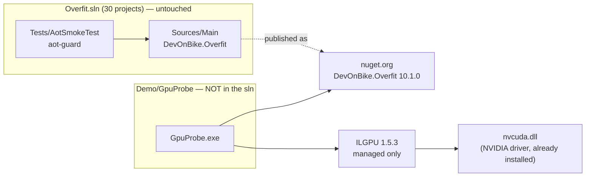

STATUS: APPROVED

GATES:
  verifier:           NOT_REQUIRED — the artefact is a throwaway measurement probe outside `Overfit.sln`;
                       it changes no product behaviour and no test in the suite. Its own correctness gate
                       is the CPU/GPU parity oracle in section 3.6, which is part of the probe, not a
                       suite test
  reviewer:           NOT_REQUIRED — no source file in `Sources/**` or `Tests/**` is touched. If the
                       probe is later moved into the solution, this line stops being true and the gate
                       becomes REQUIRED
  mutation-proof:     NOT_REQUIRED — no test is added to the suite, so there is no assertion to mutate.
                       The probe's parity oracle is exercised by construction on `CPUAccelerator`
  performance:        NOT_REQUIRED for the CODE. **REQUIRED for the RESULT** — every number the probe
                       produces is a performance claim and the verdict on it belongs to
                       `overfit-perf-claim-auditor`, not to whoever runs the probe. Dispatch the auditor
                       on the returned numbers before any purchase or port decision cites them
  security:           NOT_REQUIRED — no parser, endpoint, gateway or externally-fed surface. Input is
                       synthetic and generated in-process from a fixed seed
  leak-scan:          REQUIRED — the probe prints machine identity (GPU name, driver, CPU model) and is
                       intended to run on a THIRD PARTY's machine and come back. Check the returned
                       artefact for a host name, user name or path before it lands in the repository
  AOT:                NOT_REQUIRED — the probe is not in `Overfit.sln`, is not referenced by
                       `Sources/Main` and is not reachable from `Tests/AotSmokeTest`. See Decision D2 for
                       why ILGPU's AOT-hostility therefore costs nothing at this stage
  API-compatibility:  NOT_REQUIRED — nothing in `DevOnBike.Overfit`'s public surface changes. The probe
                       CONSUMES the published package (see Decision D3)
  release-readiness:  NOT_REQUIRED — nothing ships

# GPU probe: route and design

**Author:** `overfit-architect`, 2026-08-21. **Scope:** choose the technology, design one probe, name what
its result licenses. **Not in scope:** the GPU backend, a kernel library, an abstraction layer.

**There is no analyst section in this file.** I was dispatched directly, so I wrote the whole document. The
business questions I could not answer are in `BLOCKING QUESTIONS` at the end rather than filled in with
technical assumptions.

---

## 1. What the operation actually is — verified against the code

The op a GPU would replace in QLoRA is `ComputationGraph.FrozenQuantizedLinear`
(`Sources/Main/Autograd/ComputationGraph.FrozenQuantizedLinear.cs`). Two directions, both in that file:

- **forward** — `out[b,o] = sum_i dequant(W)[o,i] * in[b,i]`. Each weight row is decoded to F32 **once** and
  reused across the batch (`ForwardChunk`), then `TensorPrimitives.Dot` per (row, batch element).
- **backward, dInput only** — `dx[b] += sum_o dy[b,o] * dequant(W)[o]`. No weight gradient exists; that
  absence is the QLoRA memory win. Parallelised over `P = OverfitParallel.WorkerCount` private partial-`dx`
  buffers of `n*k` floats each, reduced afterwards (`BackwardParallel`).

It is the shared kernel of **both** QLoRA families, not only the Llama one. Call sites established by `grep`
over `Sources/`, `Tests/` and `Demo/` — adequate here because it is a concrete, non-virtual method on a
`sealed partial class` with a unique name, so there is no interface or base-class dispatch for a text search
to miss:

| call site | what it is |
|---|---|
| `TrainableLlamaBlock.cs:198` (`Proj`) | all 7 projections of every Llama/Qwen block |
| `TrainableLlamaModel.cs:193` | the LM head |
| `Gpt1LoRAFineTuner.cs:555` | the GPT-1 QLoRA path |

**Two structural facts a GPU port inherits, and both change the kernel:**

1. **The dequant is inside the op.** Decoding a Q4_K row is bit unpacking, not arithmetic, and its cost is
   `k*m` regardless of `n` while the GEMM's cost is `n*k*m`. Its share of the op therefore **falls as the
   batch grows** — see section 3.3 on why the probe must sweep `n`.
2. **The backward reads the weight in the transposed direction.** On the CPU both directions walk the same
   output-major rows. On a GPU the backward is `dx = dy * W` against a row-major `W`, which is a different
   access pattern and can be several times slower than the forward at the same FLOP count. The probe
   measures both directions; a probe that measured only the forward would report the easy half.

---

## 2. Route decision

### Decision D1 — the route is **ILGPU** (1.5.3)

| route | verified facts | verdict |
|---|---|---|
| **ILGPU 1.5.3** | Package inspected on nuget.org 2026-08-21: **5 managed DLLs, `runtimes/` folder empty — zero native assets**, and no transitive package dependencies on the `net7.0` asset that `net10.0` resolves. Ships a `CPUAccelerator`, so kernels execute with no GPU present. | **CHOSEN** |
| ComputeSharp 3.2.0 | net8.0, depends on `ComputeSharp.Core`, carries a **43.7 MB** source generator (the shader toolchain). DirectX 12 only, therefore Windows only. Would run on this box's iGPU. | rejected — see below |
| CUDA via P/Invoke | needs `cublas64_*.dll` from the CUDA **toolkit**, which is not part of an NVIDIA driver install | rejected — breaks probe constraint 1 |
| TorchSharp 0.107.0 | bundles libtorch | rejected — see below |

**Why ILGPU.** It is the only candidate that satisfies the development constraint and the
stranger's-machine constraint at once. `CPUAccelerator` makes the kernel developable and its correctness
provable on this box with no GPU at all — the same kernel source, executed by a CPU emulator, checked
against the CPU reference. And because it emits PTX and loads it through the CUDA **driver** API, an NVIDIA
driver is the only thing the friend needs to install; the driver contains the PTX JIT.

**That last claim is the one thing I could not verify from this repository, and it is load-bearing.** I
verified the package has no native payload. I did **not** verify on hardware that ILGPU runs without a CUDA
toolkit, because this box has no NVIDIA card. It is Risk R1 below and it is the first task.

**Why not ComputeSharp**, despite it being the only route that runs on the GPU *in this box*: it is
Windows-and-DX12 only, and its DX12 compute path has no route to tensor cores or to a vendor BLAS, so a
disappointing number would be a fact about DirectX rather than about the hardware. The local-iGPU advantage
is smaller than it looks — ILGPU's `CPUAccelerator` already gives local correctness, which is what this box
is actually needed for.

**Why not TorchSharp**, stated as a reason rather than a reflex: it would give the **best** hardware number,
fastest, because it is cuBLAS and cuDNN behind a C# surface. It is rejected because a number from libtorch
tells us what NVIDIA's kernels do, not what our port would do, and the gap between those two is exactly the
unknown this probe exists to price. It also drags a multi-gigabyte native runtime into a repository whose
opening identity clause is *"no native binaries, no Python runtime, no ONNX Runtime dependency"*.

### Which identity clause each route breaks — plainly

`CLAUDE.md` opens with *"zero-allocation, Native-AOT-compatible CPU inference identity. No native binaries,
no Python runtime, no ONNX Runtime dependency."* Every GPU route breaks something. Precisely:

- **ILGPU breaks "Native-AOT-compatible".** It generates IL and PTX at runtime and uses `System.Reflection`
  throughout — three of the six symbols banned in `Sources/Main` (`System.Reflection`, `Activator`,
  `Expression`) are its normal working set. It does **not** break "no native binaries": the package ships
  none, and `nvcuda.dll` is part of the driver the user already installed, not something we build or ship.
- ComputeSharp breaks "Native-AOT-compatible" more mildly (source-generated shaders) and adds a native
  shader compiler to the build.
- CUDA P/Invoke and TorchSharp break "no native binaries" outright.
- All four break "CPU inference", which is the point of the exercise and is already a recorded decision.

### Decision D2 — the AOT objection to ILGPU costs nothing *at this stage*, and why

GPU is already recorded as sitting on the **private/commercial** side of the moat (`ROADMAP.md:1168-1169`:
*"SKIP: GPU/CUDA backend — CUDA is a native dependency that breaks our 'no native binary' identity.
Deliberate non-goal (perf/GPU stays the private moat)"*). The AOT and banned-symbol rules bind
`Sources/Main` and anything reachable from `Tests/AotSmokeTest` — not a separate commercial assembly, and
certainly not a probe outside the solution. So *"ILGPU is AOT-hostile"* is a true statement about a
constraint this work does not stand under. It becomes live only if a GPU path is ever proposed for `Main`,
and that proposal should be refused on the recorded moat decision before AOT is even reached.

### Decision D3 — the probe is a standalone project, outside `Overfit.sln`, consuming the published package

`Demo/GpuProbe/`, containing:

- its own `Directory.Build.props` sentinel (`<Project></Project>`) so the root props do **not** apply, plus
  `<ManagePackageVersionsCentrally>false</ManagePackageVersionsCentrally>`;
- `<PackageReference Include="DevOnBike.Overfit" Version="10.1.0" />` — **verified present on nuget.org
  2026-08-21**, and equal to `<LastPublishedVersion>` in `Directory.Build.props`;
- `<PackageReference Include="ILGPU" Version="1.5.3" />`;
- **no** entry in `Overfit.sln` and **no** `ProjectReference` to `Sources/Main`.

**What this buys, each item a real hazard in this tree.** `Directory.Packages.props` never learns about
ILGPU, so `NuGetAudit` with `NuGetAuditMode=all` and `NU1901-1904` promoted to errors in
`Directory.Build.props` cannot ever fail the **whole solution** because of an advisory against a GPU
package. The root `Directory.Build.props` wires `Sources/Analyzers` into every project not on its exclusion
list, so without the sentinel the probe would drag a Roslyn analyzer build onto the friend's machine. And
excluding it from the sln means `dotnet build -c Release` at the root does not build it, so nobody on Linux
CI needs a GPU package to restore.

**The cost, stated:** the probe's CPU arm runs the `FrozenQuantizedLinear` of package **10.1.0**, not of
`HEAD`. If that method has moved since the package was cut, the CPU arm measures the previous library — the
exact shape of the stale-harness incident recorded in the GELU row of `docs/measured-baselines.md`. So the
probe must **print the resolved `DevOnBike.Overfit` assembly version at startup**, and the developer must
confirm `ComputationGraph.FrozenQuantizedLinear.cs` is unchanged since that package was published, before
handing the probe over. If it has changed, switch to a `ProjectReference` and hand over a `dotnet publish`
output instead.

**Delivery to the friend.** Preferred: `dotnet publish -c Release -r win-x64 --self-contained` on this box
and hand over a zip, so the friend needs no SDK, no restore and no network. Fallback for a friend who has
the SDK: the folder plus one `dotnet run -c Release`. Self-contained publish is compatible with ILGPU
because ILGPU JITs at runtime; Native-AOT publish is **not**, and must not be attempted.

---

## 3. The probe

### 3.1 Execution path, allocation policy, ownership

- **Execution path: TRAINING.** The op under measurement is a `ComputationGraph` tape op. Nothing here goes
  near `InferenceEngine`. Do not import a decode kernel into this probe to make it faster.
- **Allocation policy: neither hot nor load path.** It is a measurement harness. Allocate freely *outside*
  the timed region; allocate nothing inside it. The `PooledBuffer<T>` and zero-allocation disciplines bind
  `Sources/Main`, not this project. The probe does not take `Sources/Benchmark`'s machine mutex, so it is
  the operator's job not to run it while a benchmark is running.
- **Ownership:** the CPU arm's `AutogradNode`s are `GraphTemporary`, disposed by `graph.Reset()` — the
  existing `Tests/LanguageModels/Diagnostics/QloraForwardKernelBenchTests.cs` already does this correctly
  and is the right thing to copy. GPU buffers are owned by the probe and disposed in a `using`.
- **AOT-reachable: no.** **Public API added: none.** **Moat side: see BLOCKING QUESTION C1.**

### 3.2 Shapes, with provenance

Model: **Qwen2.5-3B-Instruct Q4_K_M** — `L=36, D=2048, H=16, KV=2, headDim=128, dFF=11008, vocab=151936`
(`ROADMAP.md:1516`; `docs/specs/xc-58-shared-stack-session-contract-plan.md:180`; the FFN pair is already
hard-coded as the real shapes in `Sources/Benchmark/Q4KPrefillProjectionBenchmark.cs:82-83`).

Per training step the model issues **36 * 7 + 1 = 253** `FrozenQuantizedLinear` forward calls
(`TrainableLlamaBlock.Forward` makes seven `Proj` calls — Q, K, V, O, gate, up, down — plus
`TrainableLlamaModel.cs:193` for the head). Their shapes and weight:

| probe cell | k -> m | calls/step | share of forward MACs |
|---|---|---:|---:|
| `ffn_gate` / `ffn_up` | 2048 -> 11008 | 72 | 52.6% |
| `ffn_down` | 11008 -> 2048 | 36 | 26.3% |
| `attn_qo` | 2048 -> 2048 | 72 | 9.8% |
| `lm_head` | 2048 -> 151936 | 1 | 10.1% |
| `attn_kv` | 2048 -> 256 | 72 | 1.2% |

**The share column is arithmetic I derived from those shapes, not a measurement** — `sum(n*k*m)` per call
divided by the total. It is exact given the shapes, and it says only where the *FLOPs* are, not where the
*time* is. Finding F1 below is about that difference.

Include all five. `attn_kv` is 1.2% of the FLOPs and cannot decide the answer, but it is the shape where
this repository has already measured dispatch overhead swamping the work (0.37 TFLOP/s at 2048 -> 128,
`ROADMAP-COMPLETED.md`), and on a GPU it is the shape where kernel-launch latency would show. One extra row.

`lm_head` in F32 is 2048 * 151936 * 4 B = **1.24 GB** of weight. It fits on an 8 GB card but is a large
upload; report the upload time separately (section 3.5, rule 7). Note for any later port: the Qwen LM head
is stored **Q6_K**, not Q4_K (`Sources/Main/LanguageModels/Loading/GgufLlamaLoader.cs:647`), so a real
device-side dequant needs two block formats, not one.

### 3.3 Batch sizes — sweep `n`, do not pick one

`n` is the token count `T` of the training chunk. Three values, each with its provenance:

- **`n = 16`** — the sequence length the only real end-to-end QLoRA fine-tune on Qwen-3B actually ran at
  (`Tests/LanguageModels/Loading/QwenGgufQLoraFineTuneE2ETests.cs:41`, a 17-token sequence -> 16 inputs).
- **`n = 128`** and **`n = 256`** — the two `T` values in `QwenGgufTrainStepTimeTests.cs:36`. 256 is also
  `QLoRAOptions.ChunkLength`'s default, i.e. what a user of `QLoRAFineTuner` gets.

**This sweep is not padding, it is the measurement.** The dequant cost is `O(k*m)` and the GEMM is
`O(n*k*m)`, so at `n = 16` the dequant is a large fraction of the op and at `n = 256` it is a small one — and
on a GPU, `n` is also what decides whether the kernel is bandwidth-bound or compute-bound. A probe run at one
`n` would produce a speedup that does not generalise to the other, and nothing in the repository currently
records which `n` the product should be optimised for.

### 3.4 Arms

Every arm runs **on the same machine in the same sitting**, in one process.

| arm | what it does | why |
|---|---|---|
| **C1 CPU real** | `graph.FrozenQuantizedLinear(input, q4kWeight)` — dequant + F32 dot, forward | this is the code a port replaces |
| **C2 CPU real, backward** | `graph.BackwardFromGrad` over the same node | the transposed direction |
| **C3 CPU F32-only** | the same GEMM with the weight already dequantised to F32 | isolates the dequant's CPU cost; **this is the arm the GPU headline compares against**, because the GPU arm does no dequant |
| **G1 GPU naive** | ILGPU kernel, one thread per output element, F32 | a floor: what a first port gets |
| **G2 GPU tiled** | ILGPU kernel with shared-memory tiling, F32 | so a poor result is a fact about the hardware, not about our first kernel |
| **G3 GPU backward** | `dx = dy * W` in the transposed direction, F32 | section 1, fact 2 |
| **X1 (optional, off by default)** | cuBLAS through `ILGPU.Algorithms`, if the CUDA toolkit happens to be present | an upper bound; prints `NOT MEASURED` and the reason when absent |

**C1 against G1/G2 is not a fair comparison and must never be the headline** — C1 includes a dequant the GPU
arm does not perform. The headline ratio is **C3 against G2**. C1 minus C3 is reported as the dequant's cost,
which is what a future device-side dequant kernel would have to beat.

### 3.5 Method

1. Fixed seed (`new Random(42)`), synthetic weights, synthetic activations. No model files, no fixtures.
2. **At least 2 untimed warm-ups per cell.** The first ILGPU launch includes PTX generation; timing it
   measures a compiler.
3. **At least 5 timed repetitions per cell. Report min, median and max — never a mean alone.** One reading
   is not a fact, and a smooth curve built from single readings is more dangerous than a noisy one.
4. **`accelerator.Synchronize()` before stopping any GPU timer.** A GPU launch is asynchronous; without the
   sync the probe times the enqueue and reports a spectacular, meaningless speedup. This is the single most
   likely defect in the whole probe.
5. **Interleave the arms ABAB within a cell** rather than running all of A then all of B, so drift over time
   cannot wear the costume of the variable.
6. **Canary.** A fixed, untouched CPU workload (a 512-cubed F32 GEMM) timed at the start and at the end of
   the whole run. If it moves by more than 5%, the report prints `CANARY MOVED — sitting suspect` at the
   top. A stranger's machine has a browser open on it.
7. Host-to-device weight upload is **excluded from the timed region and reported separately**, because a
   real fine-tune uploads the frozen base once for the whole run.

### 3.6 The verification oracle — no oracle, no probe

Two levels, both runnable on `CPUAccelerator` on **this** box:

- **Shape oracle.** A deliberately non-square small case (`n=3, k=5, m=7`) against a hand-written triple
  loop, exact to 1e-6. Non-square on purpose: a transposed `m`/`n` index is invisible on a square shape and
  survives a cosine check on random data.
- **Parity oracle.** At each production shape, GPU output against the CPU F32 reference: **cosine at least
  0.9999 and max relative error below 1e-3** on elements whose reference magnitude exceeds 1. Not
  bit-parity — FP32 accumulation order differs between a serial dot product and a parallel tree reduction,
  so demanding bit-parity would fail a correct kernel.
- **The probe refuses to print a timing for any cell whose parity check failed.** A fast wrong kernel is the
  failure mode this design is most exposed to, and a number printed next to a failed check will be quoted
  without the check.

### 3.7 The machine echo

Printed at the top of the report and written to a `.json` beside it:

- **Automatic:** GPU name, VRAM bytes, ILGPU `AcceleratorType` and the backend actually selected, CUDA
  compute capability and driver version (`CudaDevice`), `Environment.ProcessorCount`, OS version and
  architecture, .NET version, resolved `DevOnBike.Overfit` and `ILGPU` assembly versions, UTC timestamp, and
  the CPU model string — on Windows from
  `HKLM\HARDWARE\DESCRIPTION\System\CentralProcessor\0\ProcessorNameString`, on Linux from
  `/proc/cpuinfo`.
- **NOT automatic, and the probe must say so rather than omit it:** **RAM type and speed cannot be read
  without WMI or a native call**, neither of which this probe should carry. It prints
  `RAM: not readable — please fill in manually` and leaves an empty field in the JSON, together with
  `Other load on the machine during the run:`. An empty field a human is asked to fill is honest; a missing
  field reads as "not relevant".

### 3.8 What the probe does NOT measure — printed by the probe itself, at the end of its own report

1. **It is not a fine-tune.** It measures one op family in isolation.
2. **The fraction of a real QLoRA step that is `FrozenQuantizedLinear` has never been measured in this
   repository.** `QwenGgufTrainStepTimeTests` times the whole step and nothing decomposes it. Without that
   number, a 10x on this op cannot be converted into any end-to-end claim. See Risk R3.
3. **No dequant runs on the GPU.** A real port must either dequant Q4_K/Q6_K on the device or upload F32 —
   and the F32 Qwen-3B base is about 11.5 GB (`ROADMAP.md`, against 1.96 GB at 4-bit), which does not fit
   most consumer cards. The probe says nothing about how fast a device-side Q4_K dequant would be.
4. **[SUPERSEDED BY AMENDMENT 1 — true of the custom-kernel arms only, NOT of the probe. `ILGPU.Algorithms`
   reaches cuBLAS FP16 GEMM with tensor cores, and that is now the primary arm.]**
   **FP32 CUDA cores only.** ILGPU has no tensor-core path. On a modern NVIDIA card the BF16/TF32 tensor
   rate is roughly an order of magnitude above the FP32 rate, so this probe measures the **floor** of what
   the hardware can do, not its ceiling. Any decision that reads the result as "the GPU is worth X" must
   carry this sentence with it.
5. No optimizer, no LoRA adapter ops, no tape overhead, no host-device traffic inside a step, no multi-GPU.
6. **It measures OUR kernel, not the card.** G1 and G2 are two of our kernels; arm X1 exists precisely so
   that, when the toolkit is present, the gap between our kernel and cuBLAS is a measured number instead of
   an assumption.

---

## 4. Quality requirements, against measured baselines

| parameter | how measured | current measured baseline |
|---|---|---|
| CPU throughput at `ffn_gate_up`, TFLOP/s | `2*n*k*m / seconds`, arm C3 | **about 1.96 TFLOP/s** — 30.29 GFLOP in **15.44 ms**, `GemmTiled`, 672 rows, 2048 -> 11008, Ryzen 9 9950X3D, 2026-07-22 (`ROADMAP-COMPLETED.md`). **That is the INFERENCE prefill kernel, not this one.** The closest analogue in shape to `FrozenQuantizedLinear` (decode each row once, reuse across the batch) is the `WeightStationary` column of the same table: **53.62 ms, about 0.57 TFLOP/s**. It is not the same code, which is why arm C3 measures the real one |
| whole QLoRA step, s | not measured by this probe | **about 1.27 s/step** at `T=16`, 36 layers, gradient checkpointing on, Qwen2.5-3B Q4_K_M (`ROADMAP.md`; `T` from `QwenGgufQLoraFineTuneE2ETests.cs:41`). The step-time sweep at `T` in {128, 256} exists as `[LongFact]` and per its own comment has **never been run** |
| GPU speedup, C3 -> G2 | ratio of medians, same sitting | none exists |
| parity | cosine + max relative error against C3 | none exists |

**A number this repository has already priced, and the probe must not repeat the mistake it caused:** on
2026-08-21 a kernel microbenchmark here **under-reported a real end-to-end effect by 4.3x**
(`docs/measured-baselines.md`, the `XC-103` row). The transferable rule recorded there is that
extrapolating between a kernel benchmark and a system is not conservative in either direction. This probe is
a kernel benchmark. That is finding F1.

---

## 5. Findings

**F1 — The probe answers "how much faster is the GPU at this op", and the decision needs "how much faster is
a QLoRA step". Those are different questions and this repository has measured the gap between them at 4.3x
once already.** The missing link is the fraction of a step that is `FrozenQuantizedLinear`, which nobody has
measured. It is cheap to get (Risk R3) and without it the probe's result cannot be converted into a
fine-tune speedup in either direction.

**F2 — FP32 is the floor, not the ceiling.** ILGPU gives no access to tensor cores. A result of, say, 8x
would be consistent with a real ceiling anywhere from 8x to 80x, and the probe cannot narrow that. This
argues for arm X1 (cuBLAS reference) whenever the friend's machine happens to have the toolkit — it converts
the single largest unknown into a measured ratio at the cost of about thirty lines.

> **F2 IS WRONG AS WRITTEN AND IS SUPERSEDED BY AMENDMENT 1 (2026-08-21).** *"ILGPU gives no access to
> tensor cores"* is false: `ILGPU.Algorithms` ships a cuBLAS wrapper with FP16 GEMM and automatic
> tensor-core usage. What is true is the narrower claim — no tensor-core access **from a custom ILGPU
> kernel** (no `wmma`/`mma.sync`). The consequence is the opposite of what F2 concluded: arm X1 is not an
> optional extra, it is the **primary** GPU arm. Left in place rather than deleted, because the design
> below was built on the wrong version and a reader needs to see which claim moved.

**F3 — The CPU arm must be the training kernel, and it is slower than the number people will reach for.**
The 1.96 TFLOP/s figure in `ROADMAP-COMPLETED.md` is the tiled **inference prefill** kernel. QLoRA training
does not use it; it uses the weight-stationary F32-dequant path, whose closest measured analogue in that
same table is about **3.5x slower**. Comparing a GPU number against the 1.96 figure would understate the GPU
by about that factor. This is why arm C3 is measured rather than cited.

**F4 — The batch size is a product decision nobody has made.** `QLoRAOptions.ChunkLength` defaults to 256,
but the only real end-to-end proof ran at `T = 16`, and the `T` in {128, 256} timing test has never been
executed (its own comment says so). The GPU's advantage is strongly `n`-dependent. Hence the sweep.

**F5 — Adding any GPU package to `Directory.Packages.props` would put a solution-wide build failure one
security advisory away.** `NuGetAudit` is on with `NuGetAuditMode=all` and `NU1901-1904` are errors in
`Directory.Build.props`, which every project inherits. Decision D3 avoids this entirely; it is recorded here
so that a later "just add it to the solution" is a decision rather than a slip.

**F6 — `CLAUDE.md`'s "Solution layout" section says the solution contains five projects. It contains 30.**
Not this task's business to fix, and I am read-only on that file — reported as a finding. Anyone sizing a
change from that section will size it wrong.

---

## 6. Risks and the spike that retires each

| # | risk | spike | order |
|---|---|---|---|
| **R1** | ILGPU may need the CUDA toolkit, not only the driver — if so the "one `dotnet run`" constraint fails and the route changes | Restore ILGPU 1.5.3 on this box, run the kernel on `CPUAccelerator`, and confirm `Context.Create(b => b.Cuda())` fails *cleanly* with no NVIDIA card present. Then confirm the toolkit question against ILGPU's own documentation before the probe is handed over | **1st, about 1 h** |
| **R2** | A naive ILGPU kernel could reach a small fraction of the card and produce a falsely negative verdict about the hardware | Arms G1 **and** G2 are both in the probe by design; arm X1 bounds it when the toolkit is present | in the probe |
| **R3** | The result cannot be converted to an end-to-end claim (F1) | Flip `QwenGgufTrainStepTimeTests.TrainingStepTime_VsSequenceLength` to `[Fact]` locally **and** add a `ValueStopwatch` tally around `FrozenQuantizedLinear` to get its share of the step. It needs the Qwen-3B fixture and is a `Tests/` and `Sources/` edit, so it is **a separate task with its own review**, not part of the probe | 2nd; does not block the probe |
| **R4** | The friend's machine is loaded or thermally throttled and nobody can tell from the number | Canary, best-of-N and the machine echo, section 3.5 | in the probe |
| **R5** | The published `DevOnBike.Overfit` 10.1.0 no longer matches `HEAD` for this method, so the CPU arm measures the previous library | `git log` on `ComputationGraph.FrozenQuantizedLinear.cs` against the 10.1.0 publish date; print the resolved assembly version at runtime | before handover |

---

## 7. What the result will and will not license

**Will license:**

- A statement of the form *"on `<named card>`, an ILGPU FP32 tiled kernel at the QLoRA FFN shapes runs
  `<ratio, as a range>` against this CPU's dequant-free F32 arm, measured in one sitting with a flat
  canary."* That is a real, attributable, reproducible number and it is what a purchase conversation needs.
- A go/no-go on **writing a spike** of a GPU `FrozenQuantizedLinear`. A ratio below roughly 3x would make
  the port hard to justify against the complexity; a ratio above roughly 10x would make it hard to ignore.
  Those two thresholds are my judgement and not a measurement — they are offered as a decision aid, not a
  rule.

**Will NOT license:**

- Any claim about how much faster a **QLoRA fine-tune** becomes. That needs R3 (F1).
- Any claim about what the **hardware** can do. FP32, no tensor cores, our kernel (F2).
- Any claim about whether a **Q4_K device-side dequant** is viable, or whether the base fits in VRAM.
- Any architecture for a GPU backend. Deliberately out of scope, and it should stay out until R3 is done.

---

## 8. Operability

Not applicable — nothing runs as a service. Two operational rules do apply: the probe must be run when no
`Sources/Benchmark` process holds the `Global\` machine mutex, and its output artefact must pass the
`leak-scan` gate above before it is committed, because it will carry a stranger's machine identity.

---

## BLOCKING QUESTIONS

**For the client** — I will not answer these with a technical assumption.

**C1. Does the probe live in this public AGPL repository, or somewhere private?** It contains no GPU
capability, only a GEMM benchmark, so the technical risk is low. But GPU is recorded as the commercial side
of the moat, and publishing signals the direction and the exact shapes. *Once published under the open
licence it cannot be withdrawn.* This is a business decision with a permanent consequence and it is not
mine.
*If unanswered:* **Assumption** — the developer creates `Demo/GpuProbe/` and leaves the placement for the
user to settle at commit time. No agent commits anything regardless.

**C2. Is the friend's card NVIDIA, and on Windows or Linux?** It does not change the route — ILGPU covers
both, and OpenCL covers AMD — but it changes what the result means. An AMD result through ILGPU's weaker
OpenCL backend is a much looser bound than an NVIDIA/PTX one.
*If unanswered:* **Assumption** — NVIDIA on Windows, and the probe prints which backend it actually used so
the reader can tell.

**C3. Is arm X1 (the cuBLAS upper-bound reference) wanted?** It costs about thirty lines and retires the
largest single unknown in the result (F2). It requires the CUDA toolkit to be already installed on the
friend's machine and is skipped with a stated reason otherwise.
*If unanswered:* **Assumption** — build it, default it off, and report `NOT MEASURED` plus the reason when
the toolkit is absent.

**For whoever owns the QLoRA product decision**

**C4. Which `n` matters — 16 or 256?** `QLoRAOptions.ChunkLength` says 256; the only real end-to-end proof
ran at 16. The GPU verdict may differ between them.
*If unanswered:* the probe sweeps all three and reports each separately, which is the design above. No
assumption needed.

---

## Sign-off

**Architecture review:** designed and signed by `overfit-architect` on 2026-08-21, verified against the code
rather than against a description of it — every shape, call site, package fact and baseline in this document
was resolved from the file or the package named beside it. **Execution path: training.** **AOT-reachable:
no.** **Allocation policy: neither** (measurement harness; nothing allocates inside a timed region).
**Public API added: none.**

**Handoffs:** `overfit-perf-claim-auditor` owns the verdict on every number the probe returns — whoever runs
it must not also rule on it. `overfit-reviewer` becomes required if the probe is ever moved into
`Overfit.sln`. Risk R3 is a `Tests/` and `Sources/` change and needs its own task.

---

# AMENDMENT 1 — the dotLLM precedent, 2026-08-21

Written after `D:\dotLLM` was raised as a comparable project that had already made this decision. **I read
its tree rather than its summary.** The route does not change. The probe's design changes materially, and
one of my own findings above was wrong.

## A1.1 What I verified in `D:\dotLLM`

| claim | verdict |
|---|---|
| GPU isolated in its own assembly, 22 C# files, 4,270 lines | **confirmed exactly** (`src/DotLLM.Cuda`) |
| 24 `.cu` files, 2,053 lines of CUDA C, 24 committed `.ptx` | **confirmed exactly** (`native/kernels`, `native/ptx`) |
| Driver API P/Invoke, plus cuBLAS P/Invoke | **confirmed** (`docs/CUDA.md:45`, `src/DotLLM.Cuda/Interop/CublasApi.cs`) |
| `--gpu-layers N` hybrid offload | **confirmed** (`docs/GPU.md:295`) — but documented as a **VRAM** feature (*"When a model doesn't fully fit in VRAM"*, matching llama.cpp's `-ngl`), **not** as an admission that the GPU is slower |
| Native AOT does not cover the CUDA backend | **not confirmed as stated.** `docs/AOT.md:76` says the opposite about performance — *"GPU inference is dominated by CUDA kernel execution and cuBLAS GEMM... JIT vs AOT makes no measurable difference here"* — and `docs/AOT.md:113` reports AOT builds **running with GPU layers**. I did not find a statement that AOT ships without CUDA |

**They evaluated ILGPU 1.5.3 — the same version — and wrote down why they rejected it** (`docs/CUDA.md:9`,
and the capability table at `:39`). Their reasons, quoted rather than paraphrased: *"no Tensor Core access
from custom kernels (no `wmma`/`mma.sync` API), no bfloat16 support, no published LLM workload benchmarks"*,
and `Perf vs native CUDA: ~60-80% estimated` against `~98-100%` for their chosen route. **Their table also
records ILGPU's key strength, which is the part that changes my design:** *"built-in cuBLAS wrapper in
`ILGPU.Algorithms` providing FP16 GEMM with automatic Tensor Core usage."*

Note the word **estimated** in that 60-80% cell. It is their judgement, not a measurement, and the one
third-party datapoint they cite (~3.7x slower than native) is a physics workload, not a GEMM.

## A1.2 The claimed negative result — I could not find it, and something stronger is there instead

**The statement *"the CUDA backend currently underperforms CPU on small models due to launch overhead, and
the kernel tuning work is ongoing"* is not in the tree.** I searched every `.md` and `.cs` under `D:\dotLLM`
for `underperform`, `launch overhead`, `slower than CPU`, `small model`, `worse than cpu` and
`cpu outperform`. What those searches return instead:

- `docs/GPU.md:289-291` and `docs/ROADMAP.md:79` — *"Prefill: 10-50x over CPU... Decode: 3-10x over CPU...
  **Target**: >50 tok/s decode"*. These are **targets**, and Phase 4 steps 31/32/33 are marked complete.
- `docs/BENCHMARKS.md:84` — *"The remaining gap on small models is per-token overhead... that gets amortized
  on larger models."* This is **dotLLM CPU against llama.cpp CPU**. It is the most likely source of the
  misreading: a small-model overhead sentence that has nothing to do with the GPU.
- `src/DotLLM.Cuda/CudaKernels.cs:16` — a comment about *capping grid size* to amortise block launch
  overhead. A kernel implementation note, not a status.

**But the substance of the concern is supported by data nobody cited, in a document nobody would look in.**
`docs/AOT.md:113-119` carries the only measured GPU throughput in the tree, incidental to a JIT-versus-AOT
startup comparison:

| model | quant | GPU layers | JIT tok/s | AOT tok/s |
|---|---|---:|---:|---:|
| SmolLM-135M | Q8_0 | 30 | 43.6 | 43.8 |
| SmolLM2-135M | Q8_0 | 30 | 43.6 | 43.8 |
| **Llama-3.2-1B** | **Q4_K_M** | 16 | **1.6** | **1.6** |
| Llama-3.2-1B | Q8_0 | 16 | 4.3 | 4.3 |
| Bielik-1.5B | Q8_0 | 28 | 3.7 | 3.9 |

**So the team lead's conclusion is better supported than the quotation they gave for it.** 1.6 tok/s on a 1B
Q4_K_M model on a GPU is very slow. **Four things must be said about that table before anyone uses it:**

1. **The card is not named anywhere I read.** By this repository's own standing rule an uncited number is no
   number, and this one is uncited.
2. **There is no CPU arm in the table for the same model.** It cannot establish "GPU loses to CPU". It
   establishes only that these GPU numbers are low.
3. **It is decode — GEMV, batch 1 — the single worst case for a GPU.** See A1.3.
4. **The 135M model gets 43.6 and the 1B-Q4 gets 1.6, a 27x spread against a 7.4x parameter ratio.** Whatever
   is wrong there is not model size. Both 1B rows run `--gpu-layers 16` on a 16-layer model, i.e. partial
   offload, so tensors cross the host boundary at the split every token. The cause is not established and I
   am not going to guess it.

**And the comparison people will reach for next is invalid, so I am blocking it here:** our own
`docs/measured-baselines.md` records Qwen-3B at 24.4 tok/s and Bielik at 17 tok/s on CPU. Different models,
different quantisations, different box, unknown card, different engine. Putting 1.6 next to 24.4 proves
nothing. What is fair to say is narrower and still useful: **nobody has run a GPU arm and a CPU arm of
anything side by side in one sitting, which is exactly what this probe is for.**

## A1.3 Why the precedent does not move the route

**The precedent is real and it does not apply, for four reasons, in order of weight.**

**1. Their negative evidence is about a different operation than ours.** Every one of the 24 kernels is
inference. The quantised matmul kernel is `native/kernels/quantized_gemv.cu` — **GEMV**, matrix times
*vector*, `n = 1`: memory-bound, launch-overhead-dominated, the regime where a GPU wins least. QLoRA training
is a **GEMM at `n = 16..256`**. That is their **prefill** class, which they route through `cublasHgemm`
(`docs/GPU.md:115, 155, 208`) and for which their own expectation is 10-50x, not 3-10x. **There is no
backward pass, no autograd and no optimizer anywhere in dotLLM** — verified by search; `LoraAdapter.cs` is a
serving-side adapter record, not a trainer. So their engine has never executed the operation this probe
measures.

**2. Their requirement was 98-100% of native for a shipping engine. Mine is one number to decide whether to
start.** For that purpose a route their own table prices at ~60-80% of native is not a weakness, it is a
**bounded, documented haircut** — a conservative floor with a known multiplier to the ceiling. A shipping
engine cannot spend 20-40%; a go/no-go probe can, and should say so out loud.

**3. Their route costs 6,323 lines, nvcc, a PTX build step and committed PTX artefacts.** That is the
*outcome* the probe exists to justify. Building it in order to decide whether to build it is the error the
probe is meant to prevent.

**4. Only ILGPU can be exercised on this box at all.** `CPUAccelerator` runs the kernel and proves it
correct here, today, with no GPU. The CUDA C route cannot even be compiled here without nvcc, let alone run.
The development constraint was explicit and it is decisive between two options that are otherwise close.

**Where the precedent DOES bind, and I will not soften it: ILGPU is the right probe technology and probably
the wrong product technology.** If the probe returns a go, the port should follow dotLLM's shape — own
P/Invoke, `.cu` compiled to PTX, cuBLAS, an isolated assembly, AOT dropped for that assembly — not ILGPU.
Their evaluation is better evidence for that than anything I would produce.

**That collides with the stated principle that a probe in a technology we will not use measures the wrong
thing, so here is the resolution rather than a dodge.** The principle is right, and the fix is to make the
probe measure the part that transfers. **cuBLAS is the same cuBLAS in both routes.** If the primary GPU arm
is `cublasHgemm` reached through `ILGPU.Algorithms`, the number produced is a number about **cuBLAS** — the
identical library the production route would call for this shape — and ILGPU is demoted from *the thing
being measured* to *the harness that reaches it*. The objection dissolves. It only dissolves because of
their document, so the precedent improved this design rather than overturning it.

## A1.4 What changes in the probe

**Arms are re-ranked. The primary GPU arm is now FP16 cuBLAS, not a hand-written FP32 kernel.**

| arm | status | change |
|---|---|---|
| **X1 cuBLAS HGEMM via `ILGPU.Algorithms`** | **PRIMARY** | was "optional, off by default". This is the arm the headline ratio comes from |
| G2 tiled FP32 custom ILGPU kernel | secondary — the *"what if we write our own"* floor | carries ILGPU's documented ~60-80%-of-native estimate; report it as a floor, never as the answer |
| G1 naive FP32 | unchanged — a floor below the floor | |
| G3 backward | unchanged, but must be run in **both** FP32 and FP16 | |
| **G4 decode-shaped GEMV, `n = 1`** | **NEW** | the shape dotLLM measured at 1.6-4.3 tok/s. Cheap, and it is the best available check that our harness measures reality: if we reproduce their bad result at `n=1` and a good one at `n=256`, both numbers gain credibility |
| C1/C2/C3 CPU arms | unchanged | |

**Why FP32-only would have produced a wrong verdict.** dotLLM's own table (`docs/GPU.md:283`) puts tensor
cores at *"~100+ TFLOPS FP16 vs ~1 TFLOPS AVX2"*. A probe restricted to FP32 CUDA cores measures a small
fraction of that and could return a falsely negative go/no-go. Section 3.8 item 4 said this was an
unavoidable limitation. **It is not unavoidable — it was a consequence of my wrong F2.**

**Three new hard requirements:**

**N1 — the probe must report whether tensor cores were actually engaged, not assume it.** Two conditions,
both checkable at runtime: compute capability (`docs/GPU.md:144` — *"On pre-Volta GPUs (Pascal): cuBLAS FP16
GEMM falls back to CUDA cores at ~FP32 speed"*), and matrix dimensions being multiples of 8
(`docs/GPU.md:155`). Our shapes 2048, 11008, 256, 151936 are all multiples of 8; `n = 16, 128, 256` are too.
**But the card generation is the friend's, not ours**, and a Pascal card silently turns the headline arm into
an FP32 arm — an ~8x error in the verdict with nothing on screen to show it. The probe prints
`TENSOR CORES: engaged | NOT engaged (compute capability X.Y < 7.0)` next to every FP16 number, and refuses
to print a headline ratio without that line.

**N2 — FP16 numerics are measured, not assumed.** dotLLM records (`docs/ROADMAP.md:180`) that FP16
everywhere causes cumulative truncation in the residual stream, **measured on Qwen2.5-0.5B as diverging at
layer 1 with maxDiff 4.7 against 0.3 for Llama, growing to 14.9 by layer 24 — enough to flip the argmax
token**, and that llama.cpp uses FP32 residuals as standard practice. That is an *inference* finding;
training accumulates error across a backward pass as well, so it is if anything worse for us. Therefore: the
probe reports FP16-against-FP32 divergence **as a separate measured number per shape**, and the plan states
plainly that **this probe does NOT establish that FP16 is numerically usable for QLoRA.** Speed and
numerical viability are two questions and only the first is being answered.

**N3 — cuBLAS is not in the driver, and that is a constraint-1 problem.** `nvcuda.dll` ships with every
NVIDIA driver; `cublas64_*.dll` comes with the CUDA Toolkit or a standalone redistributable
(`docs/CUDA.md:74, 683`). So the primary arm needs something the friend may not have. The probe must
**degrade gracefully and loudly**: if cuBLAS cannot be loaded it prints
`CUBLAS NOT AVAILABLE — headline arm NOT MEASURED; the FP32 custom-kernel arms below are a FLOOR, not the
answer` and still produces the FP32 arms. Shipping the redistributable DLLs inside the zip would remove the
problem and is a **licensing question I am not deciding** — see BLOCKING QUESTION C5.

## A1.5 Corrections to my own sections above

1. **Finding F2 is wrong** and is marked as superseded in place. `ILGPU.Algorithms` has a cuBLAS FP16 GEMM
   wrapper with automatic tensor cores; what ILGPU lacks is tensor-core access **from custom kernels**.
2. **Section 3.4's arm table is superseded by A1.4's.** X1 is primary, G4 is new.
3. **Section 3.8 item 4** ("FP32 CUDA cores only... measures the floor") is superseded: it is true only of
   the custom-kernel arms, not of the probe as a whole.
4. **Section 2's rejection of ComputeSharp is confirmed and strengthened** by an independent evaluation with
   facts I did not have: no FP16, no tensor cores, and cross-platform support explicitly rejected upstream
   (`docs/CUDA.md:13`).
5. **Risk R1 is partly retired.** `docs/CUDA.md:682` states *"CUDA Runtime: not required — the Driver API
   (`libcuda.so`) is sufficient and ships with the driver."* That is a second project's verified experience
   of the driver-API route, which ILGPU also uses. It does **not** retire the cuBLAS half — see N3. R1
   narrows from *"does the route need a toolkit"* to *"the custom-kernel arms do not; the cuBLAS arm does."*
6. **Section 7's decision thresholds should be read against the primary arm**, and the note about being my
   judgement rather than a measurement stands.

## A1.6 New blocking question

**C5 (client). May the CUDA redistributable DLLs (`cublas64_*.dll`, `cublasLt64_*.dll`) be shipped inside
the probe zip?** NVIDIA publishes them as redistributable under its EULA, but that is a licence question
about a third party's binary being handed to a fourth party, and it interacts with this repository's own
"no native binaries" identity in a way I should not settle alone. It matters because it is the difference
between "the friend runs one exe" and "the friend installs the CUDA Toolkit first".
*If unanswered:* **Assumption** — do not ship them. The probe detects cuBLAS, degrades loudly per N3, and
the friend is asked once whether they already have the toolkit.

## A1.7 What I did not check

- **dotLLM's GitHub issues, PRs, and anything not in the working tree at `D:\dotLLM`.** The claimed
  "underperforms CPU on small models" wording may exist there. My statement is only that it is not in the
  tree on this machine.
- **The `benchmarks/results` directory contents.** I listed it and saw `DotLLM.Benchmarks` and `results`; I
  did not read the result files, so there may be GPU-versus-CPU data there I have not seen.
- **dotLLM's licence against ours.** It is GPLv3 per their own `docs/CUDA.md:11`. I read no code of theirs
  into this design — only their published evaluation and their measured numbers, both from documentation.
  The team lead stated licence and moat are separate questions not being asked of me, and I have not
  answered them.
- **Whether their AOT builds include CUDA.** I found evidence pointing the other way and flagged it in A1.1
  rather than resolving it.

**STATUS after Amendment 1: APPROVED.** The route is unchanged. The probe's primary arm, one new arm, three
new requirements and one new blocking question are added; one of my own findings is retracted.

