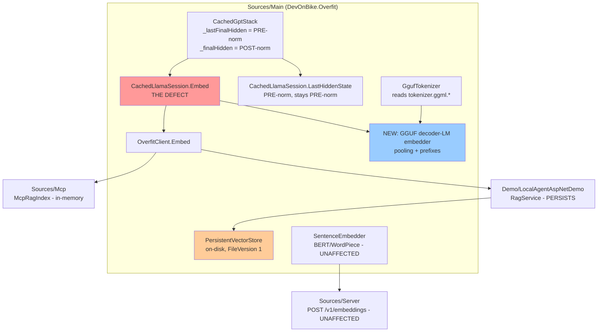

STATUS: SIGNED

GATES:
  verifier:            NOT_REQUIRED at plan time — no source changed yet. Required before `IMPLEMENTED`.
  reviewer:            NOT_REQUIRED at plan time — no source changed yet. Required before `IMPLEMENTED`.
  mutation-proof:      NOT_REQUIRED at plan time. **Required, and it is the gate this plan turns on.** The
                        existing `EmbeddingsTests` was green for the entire life of the defect (Finding 2).
                        A parity test that cannot go red is the exact failure being repaired, so M1-M4 in
                        §9 must each be run and each must go red.
  performance:         NOT_REQUIRED at plan time — this plan states no performance target and makes no
                        comparison. The post-norm fix costs **zero** additional arithmetic (§3, Finding 1).
                        **Required the moment any throughput or RAM number is produced**, including the
                        `quantize:false` peak-RAM figure in Risk R3. `overfit-perf-claim-auditor` owns that
                        verdict and must not be substituted for.
  security:            NOT_REQUIRED — no endpoint, no gateway, no credential. `GgufTokenizer.FromGguf`
                        reads one more metadata key from a file it already parses; no new parse surface and
                        no new file is opened. **Re-open if the new embedder is ever wired to
                        `POST /v1/embeddings`** — that is externally fed and is scoped OUT here (§7).
  leak-scan:           NOT_REQUIRED — no config, log, host name, token or credential touched. The one new
                        fixture path is an existing convention (`C:\qwen3-embed`, env-overridable).
  AOT:                 NOT_REQUIRED — nothing new becomes reachable from `Tests/AotSmokeTest/Program.cs`,
                        which is 47 lines and touches only `typeof(OverfitClient)`, `SamplingOptions.Greedy`
                        and `GenerationOptions`. All new code lands in `Sources/Main`, where `RS0030` is
                        `error` at every build, so the six banned APIs are unavailable regardless.
  API-compatibility:   NOT_REQUIRED at plan time. **Required before merge, and it will report a false
                        clean.** `Scripts/api_compat_check.py` diffs the public *surface*; this change is a
                        public *behaviour* break with an unchanged signature (Finding 5). The comparator
                        cannot see it. The CHANGELOG is the only record.
  release-readiness:   NOT_REQUIRED at plan time. Required before merge — the version bump is a client
                        decision (§8, Q-C1) and `<Version>` is `10.1.0` in `Directory.Build.props:3`.

# `XC-131` + `XC-123` — post-norm embeddings, and Qwen3-Embedding on top of them

**One plan for two rows because they share one fix.** `XC-131` is a shipped defect in
`CachedLlamaSession.Embed`. `XC-123` is a new model family that cannot reach parity until that defect is
repaired. Planning them apart would produce a Qwen3-Embedding feature built on a broken primitive, and a
defect fix with no oracle strong enough to prove it.

**Sources for this document.** The task rows `docs/TASKS.md:162` (`XC-131`) and `:165` (`XC-123`); the
measurement brief from the team lead relaying `xc123-builder`; and my own reading of the source, cited by
symbol and quoted below. **Every number attributed to `xc123-builder` is reported, not reproduced by me** —
see §10 for the full list of what I did not check.

---

## 1. Review verdict on the brief

I agree the defect is real, I verified it in source, and I found four things the brief does not say. Numbered
findings; the disagreements are 3, 5 and 7.

**Finding 1 — the defect is confirmed, and the fix is free.** `CachedLlamaSession.cs:1041-1042` reads
`_stack.LastFinalHidden`, declared `internal` at `CachedGptStack.cs:804` as *"Hidden state AFTER all
transformer layers, BEFORE final RMSNorm — **pre**-norm"*. The post-norm state is `_finalHidden`, and
`DecodeWithoutLogits` writes **both** on every token, three lines apart:

```
CachedGptStack.cs:334        new ReadOnlySpan<float>(current, 0, DModel).CopyTo(_lastFinalHidden);
CachedGptStack.cs:336        ApplyFinalNorm(current, weights, _finalHidden);
```

So the correct vector is already computed, per token, on the path `Embed` already walks. **The fix adds no
arithmetic and no allocation.** That removes performance from the discussion entirely and is why the
performance gate is `NOT_REQUIRED`.

**Finding 2 — the existing test was green through the whole defect, and would stay green after the fix.**
`Tests/LanguageModels/Runtime/EmbeddingsTests.cs` asserts exactly three things: unit norm, determinism
(`cos(cat, catAgain) > 0.9999`), and `related > unrelated`. All three hold for the pre-norm vector. **The
oracle was relative and the defect is absolute direction.** This is the single most important fact in the
plan: it explains why the defect survived, and it is why §9 requires an *external* reference and a
*negative* assertion rather than another relative one.

**Finding 3 — the blast radius is 6 sites, not 7, and I disagree with one inference in the brief.**
`find_references` on `OverfitClient.Embed` returns the 6 the brief lists. I also checked the OpenAI-compatible
endpoint, which the brief does not mention: `Sources/Server/OpenAi/EmbeddingsExchange.cs:20` is typed
`SentenceEmbedder embedder` — the BERT/WordPiece path. **`POST /v1/embeddings` does not touch the defect and
is not affected.** Verified by reading the signature, not inferred from the reference list.

**Finding 4 — the two consumers need different answers, because only one persists.**

| consumer | persists? | what happens after the fix |
|---|---|---|
| `Sources/Mcp/McpRagIndex.cs:75`, `:100` | **no** — `HybridRetriever` is built in `Build()` at process start | self-heals on restart, nothing to decide |
| `Demo/LocalAgentAspNetDemo/Rag/RagService.cs:61`, `:65` | **yes** — `PersistentVectorStore.Save` | **silently wrong until told otherwise** — see Finding 5 |

**Finding 5 — the stale cache is silent by construction, and this is the decision the brief was right to
escalate.** `RagService.TryReloadFromCache` (`:206-254`) validates four things: the file magic/version, the
`Dimension`, the `SourceCount`, and each file's SHA-256 content hash. **None of them moves when the embedding
semantics change.** Document content is unchanged, dimension is unchanged, count is unchanged. So the cache
reloads pre-norm document vectors and `EmbedQuery` produces post-norm query vectors, and every cosine is
computed across two different spaces. Nothing throws, nothing logs, retrieval just gets worse. That is the
worst outcome available and §5/D6 removes it.

**Finding 6 — the comment at `CachedGptStack.cs:797` is not the only defence available, and a rename is
free for half the trap.** `LastFinalHidden` is `internal` (`:804`), so renaming it is not an API break. The
comment says the names *"are wrong and are staying wrong"* — but that sentence is about
`GetLastFinalHidden`, which is `public` at `:811`. **The internal half can be renamed today at zero cost.**
The brief asks how the next reader is stopped by something that fails; the answer is in §5/D7 and it is a
test, not a rename — but the rename removes the ambiguity that produced the mistake and costs nothing.

**Finding 7 — I disagree with the brief's naming of the prefix idiom, and the correction changes the
design.** There is no `SentenceEmbedder.FromBge` or `FromE5`. The members are
`SentenceEmbedder.ForBgeEnV15(string modelDir)` at `Embeddings/SentenceEmbedder.cs:93` and `ForE5` at `:104`.
More consequentially, `SentenceEmbedder` is constructed from a `WordPieceTokenizer` and a `BertEncoder`
(`:29-30`) — **it is a BERT-only type and cannot host a GGUF decoder-LM.** So the existing idiom is the
*shape* (`EmbedQuery` / `EmbedPassage`, `QueryPrefix` / `PassagePrefix`), not the type. §5/D3 follows from
this.

**Finding 8 — the EOS can be appended with no interface change, which makes the risky half of Decision 2
avoidable.** `ITokenizer` already exposes `int EndOfTextTokenId` (`Contracts/ITokenizer.cs:15`), and
`GgufEmbeddedTokenizer.cs:33` maps it straight to `_inner.EosId`, which `GgufTokenizer.FromGguf:179` reads
from `tokenizer.ggml.eos_token_id`. **The id is already reachable through the public interface.** Only the
*flag* is missing.

**Finding 9 — not in scope, recorded because it is a hazard someone will hit.** The final-norm arithmetic is
written out **three times** in `CachedGptStack.cs`: `ApplyFinalNorm` (`:345`), inline in `PrefillBatched`
(`:449-478`), and `FinalNorm` (`:618`). All three are currently equivalent. A future change to one of them
would move embeddings and logits apart depending on which prefill path ran. **Do not refactor this as part of
this task** — a change that moves behaviour and structure at once cannot be A/B-isolated. Raise it as its own
row.

---

## 2. System context



**What depends on the pre-norm vector and must not move.** `find_references` on
`CachedLlamaSession.LastHiddenState` returns 4 sites: the class doc at `:41` and three tests —
`MergeDivergenceTests.cs:50`, `QwenLayer0CompareTests.cs:119` and `:221`. All three are logit-lens or
PyTorch-parity checks, for which pre-norm is **correct**. `find_references` on
`CachedGptStack.LastFinalHidden` returns 8, of which 6 are inside `CachedGptStack` itself and one is
`LastHiddenState`. **The eighth is the defect.** The fix therefore touches exactly one call site and takes
nothing away: the pre-norm vector stays publicly reachable through `LastHiddenState`.

---

## 3. Boundaries and responsibilities

| question | answer |
|---|---|
| **Execution path** | **Inference.** `CachedLlamaSession`, `InferenceEngine`-family, KV cache. No `ComputationGraph`, no `AutogradNode`, no tape. |
| **Allocation policy** | **Hot path for `Embed(tokens, destination, ...)`**, which is the caller-owned-buffer overload and must stay allocation-free per call. `Embed(tokens, pooling, normalize)` at `:1096` allocates one `float[DModel]` by public contract and already carries `#pragma warning disable OVERFIT001` for it. **Load path** for the new embedder's construction, where the discipline is peak RAM (Risk R3). |
| **AOT reach** | **No.** Nothing new is added to `Tests/AotSmokeTest/Program.cs`. `Sources/Main`'s `RS0030` ban applies to all new code regardless of reachability. |
| **Ownership / disposal** | No `AutogradNode` is created, so no ownership tag applies. The new embedder **owns** its `CachedLlamaInferenceEngine` and its session and disposes both — mirroring `SentenceEmbedder : IDisposable` and `OverfitClient.Dispose` (`OverfitClient.cs:347-357`, which already disposes `_embedSession`). |
| **Assembly** | `Sources/Main`. It is the only assembly `Mcp`, `Server`, `Cli` and `Demo/*` all consume, and `SentenceEmbedder` sets the precedent in the same folder. Dependency direction unchanged. |
| **Public surface** | See §5/D5. New: one type, one property, one optional parameter. |
| **Moat side** | **Open.** Embeddings and RAG are offline batch work plus correctness, which is the open surface. No real-time claim appears in this plan or in any documentation it changes. |
| **Source of truth for state** | The only durable state is the demo's `PersistentVectorStore` file. On restart it is reloaded; on a space mismatch it must be **rebuilt, loudly** (D6). `McpRagIndex` holds no durable state and rebuilds every start. |

**The allocation constraint decides the shape of the fix.** `_finalHidden` is reachable only through
`public void GetLastFinalHidden(Span<float> destination)` (`:811`), which **copies**. Calling it once per
token inside the mean-pooling loop would put a `DModel`-element copy on a per-token path to obtain a value the
caller only reads. `CachedLlamaSession` is in the same assembly, so an `internal` span accessor is available
with neither copy nor allocation. That is the required form; see D7.

---

## 4. Quality requirements, as parameters

Each is a number, a measurement method, and a comparison. The reference throughout is `llama-embedding` from
llama.cpp on the identical token stream.

| parameter | target | how measured | baseline it is compared against |
|---|---|---|---|
| **Per-vector parity, last-token pooling** | cosine ≥ **0.999** | committed reference JSON vs `Embed(..., LastToken)`, 4 texts incl. Polish with `ż` | `xc123-builder` reports **0.999417 / 0.999460 / 0.999434 / 0.999672** post-fix; **0.891189 / 0.844347 / 0.854580 / 0.827365** for mean pooling pre-fix |
| **Token-count agreement** | **exact** | sum of per-text counts vs llama.cpp's reported `n_tokens` | reported 56 = 56 |
| **Pairwise similarity parity** | \|Δcos\| ≤ **1e-3** | `cos(text0, text2)` computed on our vectors vs on llama.cpp's | reported: **0.724227** (F32) vs llama.cpp **0.723768** → Δ 4.6e-4; **0.715279** at `quantize:true` → Δ 8.5e-3 |
| **EOS handling** | post-norm cosine must not fall below the 0.999 target | run the parity test with EOS suppressed | reported **0.796002** without the appended EOS |
| **Peak RAM, load path, `quantize:false`** | **unset — must be measured before the default is signed** | see Risk R3 | not measured. Arithmetic only: a 639,150,592 B Q8_0 file is ≈ 2.4 GB of F32 weights. **Arithmetic is not a measurement.** |

**Why the pairwise row exists and must not be dropped.** Per-vector parity moved by 1.4e-4 under
re-quantisation while the pairwise similarity moved by 8.5e-3 — **60 times more.** A predicate over *vectors*
is not a predicate over *similarities*, and similarity is the quantity every consumer of this API actually
uses. A test suite that checks only per-vector parity would sign off on a configuration that is 18x worse at
the job.

**None of these numbers is in `docs/measured-baselines.md` yet.** They were produced by `xc123-builder` on
this dev box and are cited here as reported. Whoever runs the parity campaign must add the surviving rows
there with their provenance — model, quantisation, build, box — or the next reader has no evidence, only this
document's word for it.

---

## 5. Decisions

### D1 — `Embed` moves to the post-norm state for **all** poolings. No opt-in. *(Brief question 1.)*

**Mine, not the client's.** It is a defect, not a preference: HuggingFace's `last_hidden_state` and
llama.cpp's `llama-embedding` both use the post-norm state, and `output_norm.weight` spans -0.1196 to
15.3125, so the two are different directions rather than a rounding difference.

**The decisive argument is that no capability is lost.** The pre-norm vector remains publicly reachable,
unchanged, through `CachedLlamaSession.LastHiddenState` (`:1001`), whose three existing consumers are all
logit-lens or PyTorch-parity checks for which pre-norm is correct. Anyone who wants the old vector still has
it, under a name that says what it is. An opt-in flag would instead preserve a wrong answer as a supported
configuration, double the test matrix permanently, and make every future reader ask which one is right.

**Consequence, stated plainly: every vector any caller has ever stored is invalidated.** That is a public
behaviour change. D6 handles the one consumer that persists; Q-C1 puts the release consequence to the client.

### D2 — `GgufTokenizer` **reads** `add_eos_token`; the **embedder** applies it. *(Brief question 2.)*

**Split the read from the apply, because only the apply carries risk.**

- `GgufTokenizer.FromGguf` gains `var addEos = reader.GetMeta("tokenizer.ggml.add_eos_token", false);`
  beside the existing `add_bos_token` read at `:182`, exposed as a `public bool AddEosByDefault` property
  mirroring `AddBosByDefault` at `:78`. **This is additive and changes no behaviour anywhere.**
- `Encode`'s default is **not** changed. The new embedder appends `ITokenizer.EndOfTextTokenId` when the flag
  is set (Finding 8: the id is already reachable, no interface widening).

**Why not honour it inside `Encode`.** `Encode` is the chat path's tokenizer too. I did **not** check whether
any GGUF currently on this box sets `add_eos_token=True`; if one does, defaulting it on would append an EOS
to every chat prompt on top of the `ChatTemplate`'s own `<|im_end|>` markers. Rejecting the risky option
removes the need for that check. If a later task wants `Encode` to honour it, that task owns the enumeration
and the measurement.

**Known limitation, stated rather than hidden.** `OverfitClient.Embed` holds an `ITokenizer`
(`OverfitClient.cs:37`) which may be a sibling-file HuggingFace BPE tokenizer with no such flag
(`:117-119`). **`OverfitClient.Embed` will therefore not append EOS.** That is acceptable — it is the
embed-with-your-chat-model path, and its models do not set the flag — but it means the two embedding paths
differ, and that difference must be in the XML doc on both.

### D3 — the instruction prefix lives on a **new embedder type**, not on `OverfitClient` and not on `SentenceEmbedder`. *(Brief question 3.)*

`SentenceEmbedder` cannot host it (Finding 7: BERT-only by construction). `OverfitClient` is the *chat*
facade, and a Qwen3-Embedding-specific instruction convention does not belong on a generic chat client.

**One new `sealed class`, one file, in `Sources/Main/LanguageModels/Embeddings/`,** mirroring
`SentenceEmbedder`'s public shape exactly: `Embed` / `EmbedQuery` / `EmbedPassage`, `QueryPrefix` /
`PassagePrefix` / `Pooling` / `Dimension`, plus a `ForQwen3Embedding(path)` factory in the style of
`ForBgeEnV15` / `ForE5`. Matching an existing public idiom is worth more here than a better name.

**The literal prefix template is a spike, not a decision (S2).** Qwen3-Embedding's convention is
`Instruct: {task}\nQuery: {query}` on the query side with the passage side bare, *as I understand it* — **I
did not verify this against the model card or the file's own metadata, and I will not put an unverified
string into a public default.** The implementer reads it from the model's own artefacts and fills it in. The
API shape above does not depend on the answer, so implementation is not blocked.

**Name is the developer's.** `GgufSentenceEmbedder`, `DecoderSentenceEmbedder`, `CausalSentenceEmbedder` —
all fine. It is a local, reversible choice and does not need me.

### D4 — the new embedder defaults `quantize: false`; `OverfitClient.Embed` is **not** changed. *(Brief question 4.)*

**Two paths, two defaults, and that is the point of having two.**

- **New embedder: `quantize: false` by default, flag exposed.** Its entire product is the vector.
  Re-quantising an already-Q8_0 file costs 8.5e-3 on the pairwise similarity — 18x the F32 deviation — and
  `GgufLlamaLoader` genuinely does dequantize-then-re-quantize-to-Q8 on that path (see the comments at
  `GgufLlamaLoader.cs:470`, `:790`, `:946`). That is a **correctness** cost on the quantity users consume,
  not a performance preference.
- **`OverfitClient.Embed`: unchanged.** It embeds with the model *already loaded for chat*
  (`OverfitClient.cs:343`, `_engine.CreateSession(EmbedContextLength)` reuses the engine). Changing its
  quantisation would mean loading the model a second time in F32 — doubling peak RAM for a path whose whole
  premise is that no second model is needed.

**Conditional on S3.** `quantize:false` dequantizes to F32, and peak RAM is the load path's discipline. I
have **not** measured it. If S3 shows the F32 peak is unaffordable on the target machine, the default flips
to `true` and the 8.5e-3 pairwise deviation is documented on the type. **State the number either way** — a
default chosen without it is a guess.

### D5 — public surface. *(Brief question 5.)*

| item | assembly | visibility | why |
|---|---|---|---|
| post-norm fix in `Embed` | `Main` | **no surface change** | behaviour only; signature untouched |
| internal span accessor for `_finalHidden` | `Main` | **`internal`** | `CachedLlamaSession` is in the same assembly; `internal` + the existing `InternalsVisibleTo` covers every test that needs it |
| rename of `LastFinalHidden` (D7) | `Main` | **`internal`** | already internal at `:804`; free |
| `GgufTokenizer.AddEosByDefault` | `Main` | **`public`** | the type and `AddBosByDefault` are already public; hiding one of a pair is worse than exposing both |
| the new embedder type + `ForQwen3Embedding` | `Main`, `LanguageModels/Embeddings/` | **`public`** | it is the feature; `SentenceEmbedder` is the precedent, same folder — **ADR 0004** |
| `PersistentVectorStore` space id | `Main` | **`public`** (one optional ctor parameter) | on-disk format — **ADR 0003** |
| `TestFixture.Qwen3EmbeddingGguf`, `TestModelPaths.Qwen3Embedding` | `Tests` | **`internal`** | matches every existing entry |

**Nothing becomes public that a test could reach through `InternalsVisibleTo` instead.**

### D6 — the persisted store carries the identity of the space its vectors live in; a mismatch is **loud**.

`PersistentVectorStore.FileVersion` goes 1 → 2, and the header gains an `EmbeddingSpaceId` string. On load,
a version mismatch already throws `OverfitFormatException` (`:193`) and `RagService.TryReloadFromCache`
already catches, logs *"Ignoring unreadable RAG index cache … rebuilding"* and rebuilds (`:218-222`). **So
the version bump alone converts a silent wrong answer into an automatic, logged rebuild.**

The space id is added in the same edit because the version must move anyway and the field costs one string
and one comparison. Without it, the *next* embedding change — a different model, a different pooling, the
instruction prefix arriving — repeats this whole incident and needs another version bump. `PersistentVectorStore`
cannot compute the id itself; **the caller supplies it** (model file identity + pooling + prefix + quantise
flag), and an empty id means "unknown", which must **not** silently match a non-empty one.

**Recorded as ADR 0003** — on-disk format, hard to reverse.

**`McpRagIndex` needs no change.** It builds in memory at start (`:52-88`) and persists nothing.

### D7 — the next reader is stopped by a test that fails, not by a comment.

The brief is right that `CachedGptStack.cs:797` predicted this exact mistake and did not prevent it. Three
things, in decreasing order of what they buy:

1. **A negative assertion that goes red the moment `Embed` points back at the pre-norm state.** Embed a
   short token sequence with `LastToken` pooling and `normalize: false`, and assert
   `cos(result, session.LastHiddenState) < 0.99`. Because `output_norm.weight` spans -0.1196 to 15.3125 the
   two directions are far apart, so the margin is large and the assertion is stable. **This is the guard.**
   It needs no external reference and it runs on the *existing* `Qwen3BQ4KmGguf` fixture, so it guards every
   box that runs `EmbeddingsTests` today — not only boxes with the new 639 MB file.
2. **Rename the internal member.** `CachedGptStack.LastFinalHidden` → a name that cannot be misread, e.g.
   `HiddenBeforeFinalNorm`. It is `internal` (`:804`), so this is free. The comment's *"the names are wrong
   and are staying wrong"* is a statement about the **public** `GetLastFinalHidden` (`:811`) and remains
   true of it.
3. **Accepted debt, with its trigger.** `GetLastFinalHidden` keeps its misleading public name. **Cost to
   carry:** one member whose name contradicts its behaviour, mitigated by the doc comment at `:806-810`.
   **Trigger to pay it back:** the next release that already breaks the public surface — rename it then, in
   the same CHANGELOG entry, at no extra cost to consumers.

**Rejected: a Roslyn analyzer banning the member outside its blessed callers.** Two call sites do not justify
an `OVERFIT0xx`, its `AnalyzerReleases.Unshipped.md` entry, its `.editorconfig` severity decision and its
test. Disproportionate.

---

## 6. Risks, and the spike that retires each

Ordered. **S1 comes first because it is the walking skeleton** — the thinnest end-to-end path that really
works — and everything else is widening.

| # | risk | spike | order |
|---|---|---|---|
| **S1** | The parity numbers are unreproducible: they exist in a report, not in a committed artefact, and will decay. | Produce and commit the reference JSON — llama.cpp `llama-embedding` vectors for the 4 texts, both poolings, plus its `n_tokens`. Model it on `Tests/test_fixtures/gpt2_reference_small.json` and the `MiniLmReferenceEmbeddings` fixture convention. **Then** wire one test that reads it. | **first** |
| **R2 / S2** | The instruction prefix template is unverified (D3). A wrong default string is a public contract that is wrong. | Read the template from the model's own artefacts (`tokenizer_config.json` / chat template metadata / the model card). Quote the source in the XML doc. | before the type ships |
| **R3 / S3** | `quantize:false` peak RAM is unmeasured (D4). 2.4 GB is arithmetic, not a measurement, and peak is what decides whether the model fits at all. | Load the fixture both ways and record **peak** working set, not steady state. Hand any number produced to `overfit-perf-claim-auditor`. | before D4's default is final |
| **R4** | Gemma-2. `ApplyFinalNorm` (`:345`) has **no** soft-cap branch — the soft-cap is `_finalLogitSoftcap`, applied after the LM head at `:777-781` — so post-norm hidden should be soft-cap-free, and the loader bakes Gemma's `(1+w)` into the stored weights (`GgufLlamaLoader.cs:143`). **I read this; I did not check it against an external reference.** | If a Gemma-2 embedding claim is ever made, run the same parity against llama.cpp on a Gemma-2 file. Until then, claim nothing about Gemma-2 embeddings. | not blocking |
| **R5** | External NuGet consumers of `OverfitClient.Embed` cannot be enumerated — `find_references` sees this solution only. | None available. Handled by the CHANGELOG (Q-C1), which is the only channel that reaches them. | n/a |

**On S1: it is a walking skeleton, not a throwaway spike.** Its output — the committed reference JSON — is
kept. What is deliberately stubbed at that stage: no instruction prefix, no new embedder type, one pooling,
one text. Do not mistake that for a partial implementation of `XC-123`.

---

## 7. Scoped OUT, with reasons

- **Wiring the new embedder to `POST /v1/embeddings`.** `EmbeddingsExchange.Handle` takes a concrete
  `SentenceEmbedder` (`:20`). Serving a GGUF decoder-LM there needs either a new interface or an overload on
  a **public** type in `Sources/Server`, which is its own API decision and its own security gate (the
  endpoint is externally fed). **Not needed for either row.** If it is wanted, it is a new task with a new
  ADR.
- **The triple final-norm implementation** (Finding 9). Structure and behaviour must not move together.
- **`Encode` honouring `add_eos_token` by default** (D2). Deliberately rejected here; a later task may own it
  with the enumeration it requires.
- **Whether the instruction prefix improves *retrieval*.** `docs/TASKS.md:162` already flags this: it needs a
  labelled set, and this plan establishes only that the prefixed text *embeds at parity*. **Do not let a
  parity result be reported as a retrieval result.**
- **A `--embed-model` CLI path for the new type.** `Sources/Cli/Commands.cs:1088-1098` resolves poolings from
  a folder name for the BERT aliases. Extending it is easy and is not required by either row.

---

## 8. Blocking questions

**None of these blocks implementation.** S1, D1, D2, D6 and D7 can all start now. Each question below names
what I will assume if it goes unanswered.

### For the client

**Q-C1 — the version bump and the CHANGELOG wording.** `<Version>` is `10.1.0` (`Directory.Build.props:3`).
Under the policy at the top of `CHANGELOG.md`, `MAJOR` is pinned to the .NET target, so a **breaking change
to public API bumps `MINOR`**. Every vector `OverfitClient.Embed` and `CachedLlamaSession.Embed` have ever
returned changes. **`Scripts/api_compat_check.py` will report clean** — the signature is untouched — so
nothing mechanical will catch this. *Assumption if unanswered:* `10.2.0`, with a CHANGELOG entry under
*Breaking* stating that stored vectors must be re-embedded. **I am not bumping anything; this is
`overfit-release-readiness`'s and yours.**

**Q-C2 — is the demo's automatic cache rebuild acceptable?** D6 makes an existing `.psp` cache rebuild on
next start, which costs one full re-embed of the corpus. The alternative — refusing to start and telling the
operator to delete the file — is louder but needs a human. *Assumption if unanswered:* automatic rebuild
with the existing `LogWarning`, because it is already the demo's behaviour for an unreadable cache
(`RagService.cs:218-222`) and adding a second mechanism for one adjacent case is disproportionate.

### For the analyst / team lead

**Q-A1 — does `XC-123` require the 4B and 8B sizes, or is 0.6B the deliverable?** The row names
"(0.6B/4B/8B)" and only the 0.6B file is on the box. Nothing in the design depends on the answer — the loader
needed no change — but the **estimate and the parity campaign do**. *Assumption if unanswered:* 0.6B is the
deliverable; the others are "🟢 same architecture" in `docs/supported-models.md` terms, claimed as loading
and **not** claimed as validated.

**Q-A2 — does `docs/supported-models.md` get corrected in this task or a follow-up?** `:73` marks
multilingual embedders ❌ and blames SentencePiece; `:76-78` recommends the workaround that is currently
returning the wrong vectors. Both are now wrong, in opposite directions. *Assumption if unanswered:* both are
corrected **in this task**, because `:76-78` is a public recommendation of a defective path and leaving it
after knowingly fixing the defect is worse than the defect was.

---

## 9. Verification oracle — no oracle, no approval

Four oracles, each catching something the others do not.

| # | oracle | catches |
|---|---|---|
| **O1** | Cosine ≥ 0.999 against the **committed** `llama-embedding` reference (4 texts incl. Polish `ż`, mean **and** last-token). | the direction defect itself |
| **O2** | `cos(Embed(..., LastToken, normalize:false), LastHiddenState) < 0.99` on the existing Qwen fixture. | anybody re-pointing `Embed` at the pre-norm state, on every box, without the new fixture |
| **O3** | Our token count == llama.cpp's reported `n_tokens` (56 = 56). | the EOS half; without it parity falls to 0.796002 |
| **O4** | \|cos(text0, text2) − 0.723768\| ≤ 1e-3. | the quantisation decision — per-vector parity misses this by 60x |

**Mutations that must each be run and must each go red** (`overfit-mutate`; a green mutation is a finding):

- **M1** — point `Embed` back at the pre-norm state. **O1 and O2 must both go red.** If O2 stays green it is
  not a guard.
- **M2** — suppress the appended EOS. **O1 and O3 must go red.**
- **M3** — flip the new embedder to `quantize: true`. **O4 must go red and O1 must stay green** — that
  asymmetry is the whole reason O4 exists, and if O4 also stays green the pairwise threshold is too loose.
- **M4** — load a store written under a different space id. **The load must throw or the rebuild must be
  logged.** A silent successful load is the original defect wearing a new hat.

**Test gating.** CI is Linux with no model fixtures. Every test above needs a fixture and therefore
`[FixtureFact]` / `[ModelFact]`, never a bare `[Fact]`. `ModelFact` requires a **compile-time constant**
path, so the new 639 MB file needs a `TestFixture` enum member plus a `TestModelPaths.Qwen3Embedding` entry
with an `OVERFIT_QWEN3_EMBED_DIR` override — matching every existing family. **A skip is not a pass**
(`Tests/ModelFact.cs`), and the report must say which of O1-O4 actually executed.

---

## 10. What I did **not** check

Read this before relying on anything above.

1. **I ran no build, no test, no benchmark and no model.** Every architectural claim here comes from reading
   source, and every measured number comes from `xc123-builder` via the team lead. I reproduced none of them.
2. **I did not verify any cosine figure** — 0.891189 / 0.844347 / 0.854580 / 0.827365, 0.999417 / 0.999460 /
   0.999434 / 0.999672, 0.796002, 0.724227 / 0.723768 / 0.715279, or the 1.4e-4. I have not confirmed a
   llama.cpp build exists on this box.
3. **I did not open the Qwen3-Embedding GGUF.** The architecture `qwen3`, 28 blocks, tied embeddings,
   tokenizer `gpt2`/`qwen2`, `add_eos_token=True`, the 639,150,592 B length and the
   `9220223cd8a60ae4` first-MiB digest are all reported, not verified by me.
4. **I did not check whether any GGUF on this box sets `add_eos_token=True`.** D2 is designed so the answer
   does not matter; if a later task changes `Encode`'s default, it does.
5. **I did not verify the Qwen3-Embedding instruction template.** S2 exists for that reason and D3 states no
   literal string.
6. **I did not measure peak RAM for `quantize:false`.** The ≈2.4 GB in §4 is arithmetic from the file length.
7. **I did not check Gemma-2 against any external reference** (R4). I read `ApplyFinalNorm` and the loader
   comment; that is a reading, not a measurement.
8. **I could not enumerate external NuGet consumers** of `OverfitClient.Embed` — `find_references` sees this
   solution only (R5).
9. **I did not check `docs/rag-testing.md`'s contents**, only that the file exists. It is referenced from
   `docs/supported-models.md:78` next to the recommendation Q-A2 asks about and may need the same correction.
10. **I did not verify the `xc123-builder` tree is clean.** I took the team lead's statement that it wrote no
    repository source.

---

## 11. Architecture sign-off

**Architecture review: SIGNED, 2026-08-27, by `overfit-architect`.**

Reviewed against the code, not against the brief's description of it: `CachedLlamaSession.cs:1041`,
`CachedGptStack.cs:334/336/345/449/618/804/811`, `OverfitClient.cs:37/117/318/343`,
`PersistentVectorStore.cs:25/159/186/193`, `RagService.cs:61/65/206-254`, `McpRagIndex.cs:52/75/100`,
`EmbeddingsExchange.cs:20`, `SentenceEmbedder.cs:29/93/104`, `GgufTokenizer.cs:179/182`,
`GgufEmbeddedTokenizer.cs:33`, `Contracts/ITokenizer.cs:15`, `EmbeddingsTests.cs`,
`Tests/AotSmokeTest/Program.cs`. Four `find_references` runs established the blast radius, the pre-norm
consumers and the store's callers.

- **Execution path:** inference.
- **AOT-reachable:** no.
- **Allocation policy:** hot path for the span overload of `Embed`; load path for the new embedder's
  construction.

**ADRs written:** [`0003-persisted-vector-store-embedding-space-identity`](../adr/0003-persisted-vector-store-embedding-space-identity.md),
[`0004-gguf-decoder-lm-sentence-embedder-public-surface`](../adr/0004-gguf-decoder-lm-sentence-embedder-public-surface.md).

**Not signed off by me and not mine to sign:** the version bump and CHANGELOG wording (Q-C1); the cache
rebuild policy (Q-C2); whether 4B/8B are in scope (Q-A1); whether the docs correction lands here (Q-A2). All
four carry a stated assumption and none of them blocks implementation.
