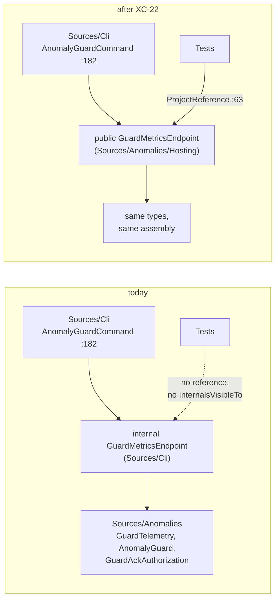

# XC-22 — move `GuardMetricsEndpoint` out of `Sources/Cli`

**Owner of this document: `overfit-architect`.** There was no analyst round for `XC-22`; the brief is the
row in `docs/TASKS.md`. Everything below is architecture: boundaries, visibility, arrival costs, the test
that justifies the move, and sequencing. Status lives in `docs/TASKS.md`, not here.

**Verdict: SIGNED — move it, but not as the row describes it.** The row's mechanics are right and its
central claim about visibility is wrong. Details in finding 1.

---

## 1. Review verdict on the task row

Every claim in the `XC-22` row was re-checked against the tree rather than taken from the row. Seven hold,
two do not, and one is a claim about the code's own documentation that turns out to be stale.

| # | claim in the row | verdict | evidence |
|---|---|---|---|
| a | `Tests.csproj` references Main, Extensions.AI, Mcp, Server, Server.AspNet, Anomalies, Analyzers, LocalAgent.AspNet — **not Cli** | **holds** | `Tests/Tests.csproj:58-73, 95` |
| b | Cli declares no `InternalsVisibleTo` | **holds** | `Sources/Cli/Cli.csproj` — no `InternalsVisibleTo` item anywhere in the file |
| c | every dependency already lives outside Cli | **holds** | usings are `System.Globalization`, `System.Net`, `System.Text`, `Anomalies.Contracts`, `Anomalies.Hosting`, `Anomalies.Incidents`, `Anomalies.Monitoring`, `DevOnBike.Overfit.Runtime`, `Microsoft.Extensions.Logging` — `GuardMetricsEndpoint.cs:6-14` |
| d | its usings name no Cli type | **holds** | same list; no `DevOnBike.Overfit.Cli.*` import, and no unqualified reference resolves into Cli |
| e | its only tie to Cli is its own namespace | **holds** | `namespace DevOnBike.Overfit.Cli` at `GuardMetricsEndpoint.cs:16` is the sole Cli-ism |
| f | its single caller is `Cli/AnomalyGuardCommand.cs:182` | **holds** | `find_references` on `GuardMetricsEndpoint` returns 4 hits: 3 inside its own file (`:87`, `:128`, `:131`) and **one** production call site, `AnomalyGuardCommand.cs:182`. Resolved, not grepped |
| g | `Anomalies.csproj:53` grants `InternalsVisibleTo` to the tests | **holds** | `Anomalies.csproj:53-54` — `DevOnBike.Overfit.Tests` and `Benchmarks` |
| h | Anomalies already carries the ASP.NET `FrameworkReference` | **holds**, and is irrelevant here | `Anomalies.csproj:64`. `GuardMetricsEndpoint` uses `System.Net.HttpListener`, which is in the **base** shared framework, not `Microsoft.AspNetCore.App`. The move would work with or without it |
| i | *"the type stays `internal` while becoming directly testable"* | **DOES NOT HOLD** | see finding 1 |
| j | *"one file move, one namespace line and one `using`"* | **DOES NOT HOLD** — it is one file move, one namespace line, **zero** usings and one visibility decision | see findings 1 and 2 |

### Finding 1 — the type cannot stay `internal` and keep its caller. The precedent is `public`, not `internal`.

`Sources/Anomalies` grants `InternalsVisibleTo` to `DevOnBike.Overfit.Tests` and `Benchmarks` only
(`Anomalies.csproj:53-54`). It does **not** grant it to Cli, whose assembly name is `overfit`
(`Cli.csproj:12`). So an `internal GuardMetricsEndpoint` in Anomalies is invisible to
`AnomalyGuardCommand.cs:182` and the solution does not compile.

The row cites `GuardAckAuthorization` as the precedent for staying internal. **`GuardAckAuthorization` is
`public`** (`Sources/Anomalies/Hosting/GuardAckAuthorization.cs:30`), and so is every other type in that
folder — checked, all five: `AnomalyGuardRegistration`, `AnomalyGuardService`, `AnomalyGuardServiceOptions`,
`GuardAckAuthorization`, `LoggerIncidentSink`. The precedent points the other way from the reading the row
gives it.

**Decision: `public sealed class GuardMetricsEndpoint` in `DevOnBike.Overfit.Anomalies.Hosting`.** Reasons,
in order of weight:

1. `Sources/Anomalies` is `IsPackable=false` and the reason is written into the csproj (`:40-46`): the guard
   ships as a container image, and a published package would be a promise about a surface nobody designed.
   **So `public` here is not a published contract** — it is assembly-level visibility inside a tree whose only
   consumer is one in-repo executable. `find_references` says that consumer is exactly one call site.
2. It matches the folder it lands in, so no new precedent is created and no reader has to work out why one
   type in `Hosting/` is shaped differently from the other five.
3. The alternative — keep `internal` and add `<InternalsVisibleTo Include="overfit" />` to `Anomalies.csproj`
   — is defensible and I am not calling it wrong. It is rejected because an IVT to a **shipped executable** is
   a stranger construct than a public type in a non-packable assembly, and it is the kind of thing that gets
   copied. **If the reviewer prefers it, take it; it is a one-line difference and reversible.**

**No seam, no interface, and this is the part to hold.** The row's instinct is right even though its reading
of the precedent is not: nothing here needs an `IGuardMetricsEndpoint`, an injected `IHttpListener` or a
extracted "request handler" type. The testability the task wants is already present in the constructor —
see finding 3 — and inventing a seam would be paying for a design that the existing `IClock` parameter
already bought.

### Finding 2 — arrival costs the row does not mention

Measured, not reasoned. Baseline: `dotnet build -c Release` of both projects today is clean —
`Sources/Cli` reports **zero** warnings, `Sources/Anomalies` reports **three**, all `OVERFIT006` in
`Sources/Main/Kernels/Conv2DGemmKernels.cs` and none in Anomalies itself.

| cost | verdict |
|---|---|
| **Public API surface of the shipped package** | **None.** `DevOnBike.Overfit` (Main) is unaffected; `Anomalies` is `IsPackable=false`; the `DevOnBike.Overfit.Cli` package is a `PackAsTool` executable, which exposes no compile-time surface. Nothing enters a NuGet contract |
| **AOT / trim reachability** | **Unchanged.** `Tests/AotSmokeTest` references **only** `Sources/Main` (`AotSmokeTest.csproj:44`), so neither Cli nor Anomalies is behind the AOT gate — the move cannot widen it. Both projects already run the trim/AOT analyzers (`Cli`: `PublishAot=true` + `IsTrimmable`; `Anomalies`: `IsAotCompatible` + `IsTrimmable`), and both are already in the `dotnet publish -r … -p:PublishAot=true` graph of the `overfit` binary, because Cli references Anomalies |
| **New trim/AOT diagnostics from `HttpListener` in an `IsAotCompatible` assembly** | **Zero — measured, with the lever proved live.** A throwaway probe project carrying Anomalies' exact property set (`IsAotCompatible`, `IsTrimmable`, `TreatWarningsAsErrors`) and the endpoint's full `HttpListener` surface (`Prefixes.Add`, `Start`, `GetContextAsync`, `Request.Headers`/`QueryString`/`RemoteEndPoint`, `Response.OutputStream.WriteAsync`, `Close`) builds **clean**. Negative control in the same project — `GetType().GetMethods(…)` and `Activator.CreateInstance` — produced `IL2075` and `IL2057` as **errors**, so the clean result is the code and not a silent analyzer. Probe deleted |
| **Analyzer ladder difference** | **Two rules differ and both are already satisfied.** `OVERFIT033` (jagged `float[][]`) and `OVERFIT034` (one top-level type per file) are `error` under `[Sources/Anomalies/**.cs]` (`.editorconfig:509-511`) and **not** under Cli. The file has no jagged arrays and declares exactly one top-level type. Everything else is identical: `OVERFIT022/023/025/026/027/028/029/030` are `error` for both under the shared `[Sources/{Anomalies,Server.AspNet,Mcp,Cli}/**.cs]` block (`.editorconfig:533-541`), and `OVERFIT040/043/044` are global (`.editorconfig:572-575`) |
| **Banned-API ladder difference** | **Anomalies bans 19 symbols to Cli's 7** — Anomalies adds `System.Linq` (namespace), `System.Reflection`, `Expression`, `Activator`, four `Array.Copy` overloads, `ArrayPool<T>.Shared`, `Buffer.BlockCopy`, `String.Intern`, `ReaderWriterLock`. **The file violates none**: no `using System.Linq`, no LINQ-shaped call (checked for 20 operator names, zero hits), no `Array.Copy`, no reflection, no `typeof`. It also survives `<Using Remove="System.Linq" />` (`Anomalies.csproj:80`), which Cli does not have |
| **CS1573 — a real new warning** | **Three, and the row does not mention it.** `Anomalies.csproj:38` sets `GenerateDocumentationFile=true` and `NoWarn` covers only `1591`; Cli sets neither. `TryStart` documents `port` and `guard` and **not** `telemetry`, `logger`, `clock`, so partial `<param>` coverage produces CS1573 on arrival. Not a build break (`WarningsAsErrors` in `Directory.Build.props:11` is `NU1901-1904` + `CS4014` only), but this repository is actively closing CS1573 — the `AN-D12` row was found while doing it. **Write the three `<param>` tags as part of the move** |
| **`Sources/Cli/BannedSymbols.txt` goes stale** | Five of its seven entries (`:3-7`, the `DateTime`/`DateTimeOffset` bans) argue their case by naming `GuardMetricsEndpoint` — *"GuardMetricsEndpoint takes one through TryStart -> TryBind -> ctor"*. After the move that prose describes a type in another assembly. **Do not delete the bans** (they bind everything else in Cli); rewrite the rationale, or point it at `HfDownloader`/`Commands.cs`. Prose that outruns its evidence is a defect here |
| **Namespace churn / CHANGELOG** | **None.** The type is `internal` today, so no published name changes. Nothing to write in `CHANGELOG.md` |
| **Call-site churn** | **Zero.** `AnomalyGuardCommand.cs` already carries `using DevOnBike.Overfit.Anomalies.Hosting;`. The row's *"one `using`"* overstates it — no using line changes at all |

### Finding 3 — the class's own remarks assert a race that the code no longer has

`GuardMetricsEndpoint.cs:185-193` justifies the catch-all by naming a concrete reachable case:
*"`Suppressions` and `Acknowledge` read the guard's own state from this thread while a cycle mutates it on
another … A `Collection was modified` is an `InvalidOperationException`, which matched neither filter.
`_guard.ActiveSuppressions` is not inside any `try` at all."*

**That case is not reachable.** All three `AnomalyGuard` members the endpoint touches take the same lock:
`RunCycleAsync` → `lock (_gate)` (`AnomalyGuard.cs:462`), `Acknowledge` → `lock (_gate)` (`:501`),
`ActiveSuppressions` → `lock (_gate)` (`:544`, whose own summary says *"copied out under the cycle lock"*).
A concurrent scrape **blocks**; it does not enumerate a mutating list. `/metrics` is not exposed either:
`GuardTelemetry.Render` walks a fixed `Catalog` array and reads scalars (`GuardTelemetry.cs:284-316`) — no
dictionary enumeration.

Dates, so this is not a guess about which came first: `ActiveSuppressions` was introduced **with** its lock in
`e9a5642` (2026-08-05), and the catch-all paragraph was written in `fc52686` (2026-08-11), six days later.
The comment describes a hazard that had already been closed.

**This does not undo the fix.** A backstop on a serve loop is correct regardless, and the second `catch` in
`ServeAsync` is the right shape. What it changes is the task: **the test cannot reproduce the defect the
comment describes, because that defect is not reachable.** It must pin the *property* instead — see §4.
Correcting the comment is a separate, small job and belongs to `overfit-reviewer`, not to this move.

**Not checked:** whether every other writer of `SuppressionStore` in the process takes `_gate` — I checked the
three entry points the endpoint calls, not the whole assembly. If a persistence path mutates suppressions off
the cycle thread, the comment's hazard could be real by a different route; nothing I read suggests it is.

---

## 2. System context and boundaries

| boundary question | answer |
|---|---|
| **Execution path** | **Neither inference nor training.** This is guard hosting — an HTTP serve loop that runs once per scrape, roughly every 15-60 s. No `InferenceEngine`, no `ComputationGraph`, no `AutogradNode` |
| **Allocation policy** | **Neither hot nor load path.** Per-request string building is correct here and stays; `GuardTelemetry.Render` allocating a `StringBuilder` per scrape is not a cost worth designing against. Do not "optimise" anything during the move — a move that also changes behaviour cannot be reverted cleanly |
| **Assembly** | `Sources/Anomalies`, folder `Hosting/`, namespace `DevOnBike.Overfit.Anomalies.Hosting`. It joins the five types that already constitute *"the hosting half: BackgroundService, DI, ILogger"* (`Anomalies.csproj:59-63`) |
| **Dependency direction** | Unchanged and still one-way: `Cli → Anomalies → Main`. The move **removes** a dependency edge rather than adding one — Cli stops owning a type that only ever talked to Anomalies |
| **Ownership / disposal** | `GuardMetricsEndpoint` owns `_listener` and `_stopping` and disposes both; `_telemetry` and `_guard` are **borrowed** from `AnomalyGuardService` and must not be disposed by it. That is already true and must stay true — the `using var` at `AnomalyGuardCommand.cs:182` scopes the endpoint to the command, not to the guard |
| **Public surface** | Becomes `public` in a **non-packable** assembly. `TryStart` and `Dispose` are the surface; everything else stays `private`. Do not widen `TryBind`, `RespondAsync` or `AckToken` to help a test |
| **AOT reach** | Not reachable from `Tests/AotSmokeTest` (which references Main only) before or after. It **is** in the `overfit` Native-AOT publish graph before and after, unchanged |
| **Moat side** | Open. The guard is AGPL; nothing here is near the Redaction Gateway line |
| **Source of truth for state** | None of its own. Every byte it serves is read from `GuardTelemetry` and `AnomalyGuard` at request time. It holds no durable state, so restart semantics are the guard's, not its |

---

## 3. Why move it rather than reference Cli from the tests

The alternative is two lines and no code motion: add `<ProjectReference Include="..\Sources\Cli\Cli.csproj" />`
to `Tests.csproj` and `<InternalsVisibleTo Include="DevOnBike.Overfit.Tests" />` to `Cli.csproj`. It is
smaller and it works. It is rejected for two reasons, stated so the choice is reviewable:

1. **Blast radius.** It puts an `Exe` with `PublishAot=true`, `InvariantGlobalization=true`,
   `IlcInstructionSet=avx2` and `System.CommandLine` into the test graph permanently, and opens every CLI
   internal to the suite. The move puts one file where the assembly already owns everything it touches.
2. **Responsibility, not just testability.** The endpoint serves *the guard's* state — telemetry,
   suppressions, acknowledgements. `Sources/Cli`'s job is to parse a command line and start a host; it has
   been holding this type only because that is where the `Main` happened to be. `GuardAckAuthorization`'s own
   remarks (`:14-17`) already made this argument for the decision half; this is the plumbing half catching up.

---

## 4. The test that would have caught the `ServeAsync` defect

**The move is only worth doing if it enables this test. It does.** Concretely, in
`Tests/Anomalies/GuardMetricsEndpointTests.cs`, modelled on `Tests/Redaction/RedactionGateway*Tests.cs`,
which already bind real `HttpListener`s on dynamic ports in this suite.

**The seam already exists and no new one is needed:** `TryStart(telemetry, logger, port, guard, clock)`
takes an `IClock` (`GuardMetricsEndpoint.cs:87-89`), and `_clock.UtcNow` is read **inside** `RespondAsync`'s
call tree at `:305` (`/suppressions`) and `:462` (`/ack`). A clock whose getter throws
`InvalidOperationException` therefore injects a **non-transport** exception at exactly the point the shipped
defect escaped from — deterministically, with no race, no interface extraction and no visibility widening.
`Tests/TestSupport/ManualClock.cs` is the healthy counterpart.

### Test 1 — `AnUnexpectedFailureOnOneRequestDoesNotKillTheMetricsChannel`

*Driven:* `var port = FreePort();` (the `TcpListener(IPAddress.Loopback, 0)` helper used in six gateway test
files); `new AnomalyGuard(new AnomalyGuardOptions(), sink, IncidentTrackingOptions.Balanced)` — the shape 49
existing tests use; a capturing `ILogger`; a `ThrowingClock : IClock` whose `UtcNow` throws
`InvalidOperationException("Collection was modified")`. Then, against `http://127.0.0.1:{port}` with an
`HttpClient { Timeout = TimeSpan.FromSeconds(5) }`:

1. `GET /metrics` → **200**. *This is the capability check and it is not optional*: without it, step 3 passing
   would be indistinguishable from an endpoint that never served at all.
2. `GET /suppressions` → the handler throws inside `RespondAsync`. Any status, including a dropped connection.
3. `GET /metrics` again → **must be 200, with a body containing `overfit_guard_last_cycle_timestamp_seconds`.**

*Asserted:* step 3 returns 200; the captured log contains exactly one `LogLevel.Error` record whose message
names it as not a transport fault.

*How it fails today, pre-fix:* with only the transport-filtered `catch`, the `InvalidOperationException`
escapes the `while`, faults `_serving` — which was `_ = ServeAsync()` — and the loop stops calling
`GetContextAsync`. Step 3 then never receives a response and the `HttpClient` timeout turns it into a
`TaskCanceledException` after 5 s. **Bounded failure, not a hang** — deliberate, given `XC-18`'s note that a
hanging test is the one shape this suite has no defence against.

*Mutation to run before calling this done (protocol step 7):* narrow the catch-all at `:228` back to
`catch (Exception ex) when (ex is HttpListenerException or ObjectDisposedException or IOException)`. The test
must go red. **If it stays green the test is not driving the serve loop and the task is not finished.**

### Test 2 — `AHealthyScrapeSequenceKeepsAnsweringAndLogsNoError` (the control)

Identical wiring with `ManualClock`. Three requests: `/metrics`, `/suppressions`, `/metrics` — all 200, and
**zero** `LogLevel.Error` records. Without this control, test 1 passes against an endpoint that answers 200 to
everything, including the path that was supposed to fail. This repository has been caught by exactly that
(`XC-9`, `XC-11`).

### Test 3 — `AckRefusesWith503AndSuppressesNothingWhenNoTokenIsConfigured`

`POST /ack?id=1&kind=noise` with no `Authorization` header → **503**, body naming `OVERFIT_GUARD_ACK_TOKEN`,
and `guard.ActiveSuppressions(now)` still empty afterwards. This is the fail-closed property, and the unset
state is the default in CI so nothing has to be arranged.

**Stated limitation, and it is not to be fixed with a seam:** `AckToken` (`:342-346`) is a static initialised
once per process from the environment, so within one test process the *configured*-token branches (401 on a
wrong token, 200 on a right one) are not controllable per test. They stay covered where the decision lives —
`GuardAckAuthorizationTests`, 14 tests. Making the token re-readable per request is a **behaviour** change
(it would let an operator rotate the secret without a restart) and belongs to the analyst as its own task,
not smuggled into a file move.

### Test 4 — `SuppressionsListsWhatIsMuted` (optional, cheap)

`ManualClock` at a fixed instant, one acknowledgement recorded, `GET /suppressions` → 200 and the body carries
the incident id, the signal and the expiry. Pins the transparency guarantee the class remarks argue for.

*Runtime:* all four are sub-second loopback round trips. **Plain `[Fact]`, not `[LongFact]`.** They bind real
sockets on ephemeral ports, matching the seven existing gateway test files, so xunit's class-level parallelism
is safe. On Windows the first bind (`http://+:{port}/`) will fail without a URL reservation and fall back to
loopback with a warning; on Linux CI it succeeds. **Dial `127.0.0.1` in both cases** so the test does not
depend on which arm won.

---

## 5. Quality requirements as parameters

Nothing here has a throughput or latency target, and inventing one would be the failure this repository
records. The measurable requirements are:

| requirement | parameter | how measured | baseline |
|---|---|---|---|
| The move introduces no new diagnostics | `dotnet build -c Release` of `Sources/Anomalies` and `Sources/Cli` reports the same set as today, **plus at most the three CS1573s**, which the move should close rather than carry | the build | measured today: Cli **0** warnings, Anomalies **3**, all `OVERFIT006` in `Sources/Main/Kernels/Conv2DGemmKernels.cs` |
| The move introduces no trim/AOT regression | zero new `IL2xxx`/`IL3xxx` | already measured by probe, with a live-analyzer control (`IL2075`, `IL2057`) | zero |
| The suite stays fast | the four new tests add well under a second | `dotnet test -c Release` wall time | suite policy is ~22 s (`Tests/Tests.csproj:15-36`) |
| The behaviour does not change | the diff is a namespace line, a visibility keyword, three `<param>` tags and a file path — **nothing else** | review of the diff | — |

---

## 6. Risks, and what retires each

| risk | retired by | order |
|---|---|---|
| The `internal`→`public` decision is contested | it is one keyword and reversible; `Anomalies` is non-packable so nothing external can bind to it. If contested, swap to `internal` + `<InternalsVisibleTo Include="overfit" />` — same one-line cost | before the move |
| The test proves nothing because the endpoint never served | step 1 of test 1 is the capability check, and test 2 is the control | inside the tests |
| The test passes against the broken code | the mutation in §4 — narrow the catch-all, watch it go red | after the tests, mandatory |
| Port flake under parallel runs | `FreePort()` + loopback, the pattern seven existing files already use; `HttpClient.Timeout` bounds every failure | inside the tests |
| A stale comment gets carried across unchanged | finding 3 — the `ServeAsync` remarks describe a race the lock closed on 2026-08-05. **Move the file as-is; hand the comment to `overfit-reviewer` separately.** A move that also rewrites reasoning cannot be reviewed as a move | after |

No spike is needed. The only two open technical questions — does `HttpListener` trip the trim analyzers in an
`IsAotCompatible` assembly, and does the file survive the stricter banned-API list — were both measured while
writing this, and both are clean.

---

## 7. Operability

Unchanged by the move, and worth restating because it is why the component matters: `/metrics` is how
*"this guard has stopped"* becomes visible from outside, and the alert written against
`overfit_guard_last_cycle_timestamp_seconds` **must** use `absent()` as well as a staleness comparison — when
the pod goes, the series goes with it and a bare `time()` comparison evaluates over an empty vector and reads
as healthy (`GuardMetricsEndpoint.cs:27-31`; rule in `k8s/lab/guard-alerts.yaml`). The defect this task exists
to cover is precisely the shape that alert cannot see: the guard keeps cycling and reporting healthy while its
own metrics channel is dead. **After the fix, that state is announced** — one `LogLevel.Error` per unexpected
request failure, and a second, louder one if the loop itself ends. Test 1 asserts the first of those.

---

## 8. Decisions

1. **`GuardMetricsEndpoint` moves to `Sources/Anomalies/Hosting/`, namespace
   `DevOnBike.Overfit.Anomalies.Hosting`.**
2. **It becomes `public sealed class`**, matching all five existing types in that folder. `Sources/Anomalies`
   is `IsPackable=false`, so this is not a published contract.
3. **No seam, no interface, no visibility widening beyond the type itself.** `TryBind`, `RespondAsync`,
   `AckToken` and `IsAuthorised` stay `private`.
4. **Three `<param>` tags added to `TryStart`** (`telemetry`, `logger`, `clock`) so the move does not import
   three CS1573s.
5. **`Sources/Cli/BannedSymbols.txt:3-7` rationale is rewritten** to stop citing a type that no longer lives
   in Cli. The bans themselves stay.
6. **Tests land in `Tests/Anomalies/GuardMetricsEndpointTests.cs`** per §4, with the mutation run.

**No ADR.** The criterion is irreversibility, and this is not: `Anomalies` publishes no package, the type has
exactly one call site (resolved, not grepped), and the visibility choice is one keyword. The reasoning for
*"guard decisions live in Anomalies, HTTP plumbing follows"* already has a home in
`GuardAckAuthorization`'s own remarks (`:14-17`), and a second document restating it would be a duplicate with
an expiry date.

---

## 9. Sequencing against `XC-25`

**Implementable independently — the file sets do not intersect.** `XC-25` edits `Sources/Analyzers`
(`OVERFIT040`'s `IsExcluded`) and the pragmas in `Cli/Commands.cs` and `Mcp`. `XC-22` touches
`Sources/Cli/GuardMetricsEndpoint.cs` (deleted), `Sources/Anomalies/Hosting/GuardMetricsEndpoint.cs` (added),
`Sources/Cli/BannedSymbols.txt` and a new test file. No shared file.

**One coupling, and it is about measurement rather than compilation.** `GuardMetricsEndpoint.cs:156-158`
carries a file-local `#pragma warning disable OVERFIT040` on `Dispose`. Moving the file moves that pragma from
Cli to Anomalies. `XC-25`'s row is explicit that the previous agent deferred the analyzer change because
*"two other agents were mid-run on this rule's counts, so changing the rule would have moved their numbers
underneath them"* — the same hazard in reverse. `.editorconfig:567` records a live-site census
(*"12 sites remain, Sources/Anomalies 4"*) that counts **reported** sites, not pragma'd ones, so the move
should not disturb it.

**So: work in parallel, but do not land `XC-22` while `XC-25` is taking an `OVERFIT040` census.** Serialise
the merge, not the work. I did **not** re-run that census myself.

---

## 10. Architecture sign-off

> **Architecture review:** reviewed 2026-08-12 against the code, not against the task row.
> **Execution path:** neither — guard hosting.
> **AOT-reachable (from `Tests/AotSmokeTest`):** no, before or after. In the `overfit` AOT publish graph both
> before and after, unchanged.
> **Allocation policy:** neither hot path nor load path; per-request allocation is correct and stays.
> **Visibility:** `public` in a non-packable assembly — see finding 1, which contradicts the task row.
> **Approved for implementation**, conditional on the mutation in §4 being run and reported.

---

## BLOCKING QUESTIONS

**For the client — none.** This is an internal structural change with no business consequence: no published
API, no package, no behaviour change, no effect on what the guard detects.

**For the analyst / task owner:**

1. **`public` in `Sources/Anomalies`, or `internal` + `<InternalsVisibleTo Include="overfit" />`?** The row
   assumed a third option — `internal` with no IVT — which does not compile (finding 1).
   *If unanswered I will proceed on `public`*, matching all five existing `Hosting/` types; it is one keyword
   and reversible.
2. **Does the stale `ServeAsync` comment (finding 3) get corrected in this task or its own?**
   *If unanswered I assume its own*, dispatched to `overfit-reviewer` — a move that also rewrites reasoning
   cannot be reviewed as a move.

Neither is blocking. **Implementation may start.**
